[TOC]

# 第一章：理解网络编程和套接字

## 理解网络编程和套接字


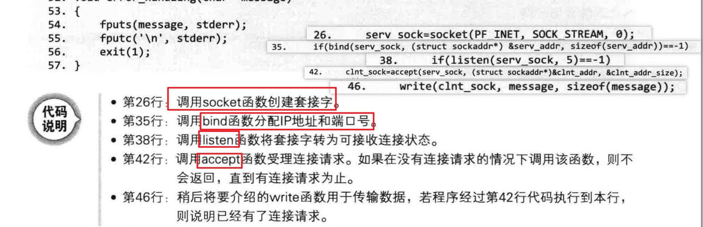

> 服务器端创建的套接字又称为`服务器端套接字或监听套接字`
>
> 客户端程序只有：
>
> - 调用socket函数创建套接字
> - 调用connect函数向服务器端发送链接请求两个步骤

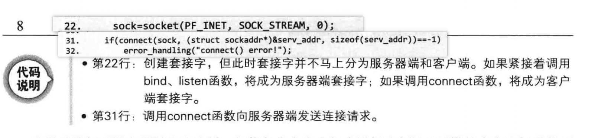

## linux文件操作

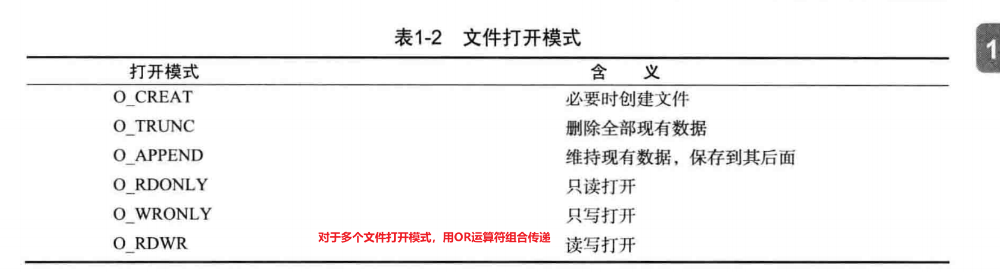

 

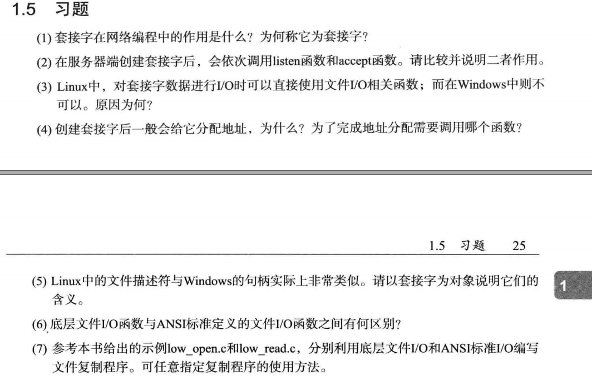

> 1. 套接字是网络数据传输用的软件设备，为了与远程计算机进行数据传输，需要连接到因特网，而编程中的“套接字”就是用来连接该网络的工具。本身就具有连接的意义
> 2. listen：将套接字转化成可接收连接的状态，accept：接受处理连接请求

# 第二章：套接字类型与协议设置

## 套接字协议及其数据传输特性

**创建套接字：**

> 套接字中实际采用的最终协议信息是通过`socket`函数的第三个参数传递的，在指定的协议族范围内通过第一个参数决定第三个参数

```c
#include <sys/socket.h>

int socket(int domain, int type, int protocol);
//domain: 套接字中使用的协议族信息
//type：套接字中数据传输类型信息
//Protocol: 计算机间通信中使用的协议信息
```

### 协议族

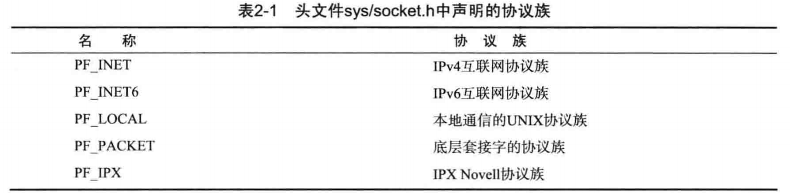

### 套接字类型Type

套接字类型指的是套接字的数据传输方式，通过socket的第二个参数传递。只有这样才能决定创建的套接字的数据传输方式。

因为socket的第一个参数`PF_INET`协议族中也存在多种数据传输方式

#### 套接字类型1：面向连接的套接字（SOCK_STREAM)`TCP`

如果向socket函数的第二个参数传递SOCK_STREAM，将创建面向连接的套接字。

<div align="left">
    
</div>

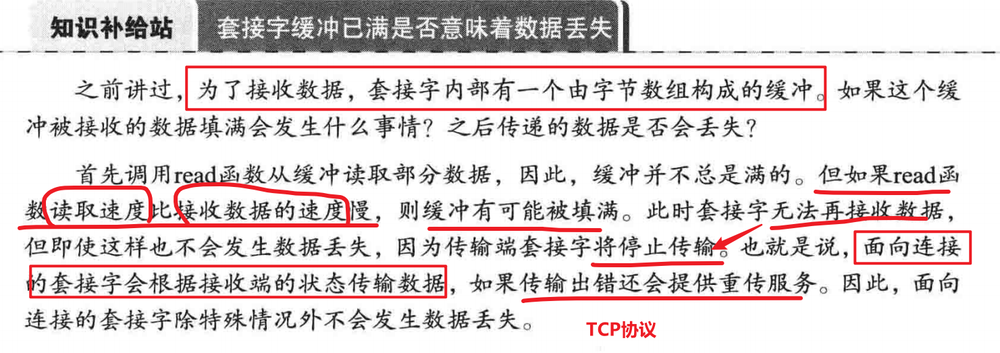

> 面向连接的套接字特点：
>
> 1. 套接字必须一一对应
> 2. 可靠的、按序传递的、基于字节的面向连接的数据传输方式的套接字
> 3. 传输的数据不存在数据边界

#### 面向消息的套接字(SOCK_DGRAM)`UDP`


> **总结：**不可靠的，不按顺序传递的，以数据的高速传输为目的的套接字

### 协议的最终选择

> socket的创建取决于三个参数：协议族，数据传输类型，计算机通信协议
>
> 通常情况下，只需要前两个参数就可以创建所需的套接字，所以大部分情况下第三个参数可以传值`0`
>
> 当"同一协议族中存在多个数据传输方式相同的协议"时，即数据传输方式相同，但`协议不同，此时需要通过第三个参数具体指定协议信息`


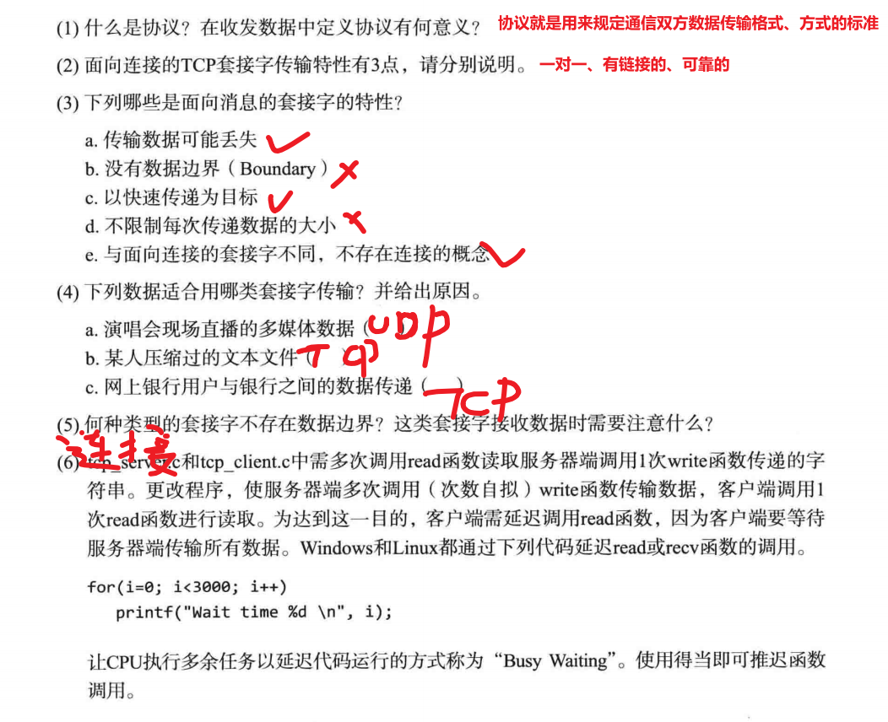

# 第三章：地址族与数据序列

> 套接字的创建相当于只安装了电话机，而通过地址族等才是给套接字分配IP地址和端口号
>
> **数据传输的目的地址应同时包含：1. IP地址2. 端口号**

## 分配给套接字的IP地址和端口号

1. IP(Internet Protocol)网络协议：为`了收发网络数据而分配给计算机的值`
2. 端口号：并非赋予计算机的值，而是为了`区分程序中创建的套接字`而分配给套接字的`序号`

### 网络地址

为了使计算机连接到网络并收发数据，必须向其分配IP地址。

- IPv4，4字节地址族
- IPv6，16字节地址族

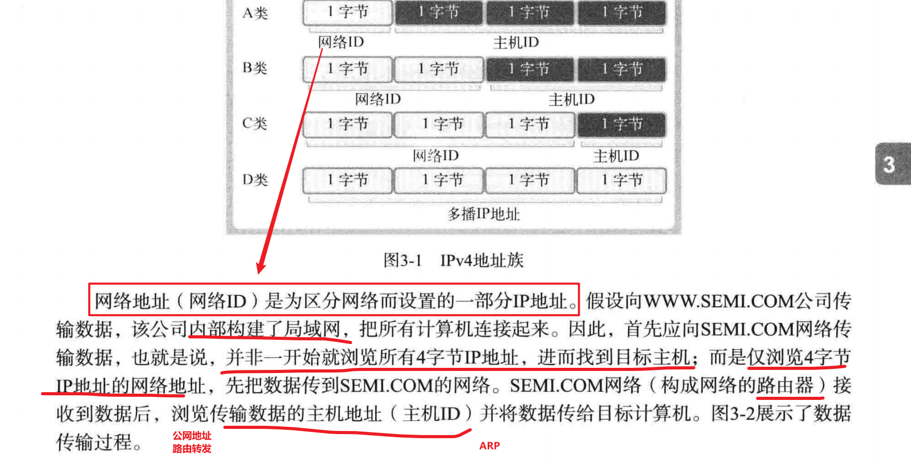

### 网络地址区分方法


### 用于区分套接字的端口号

> 计算机中一般配有NIC（network interface card，网络接口卡）数据传输设备，通过NIC像计算机内部传输数据
>
> 端口号是由16位构成，可分配的端口号范围是0-65535,但是0-1023是知名端口，一般分配给特定的应用程序。
>
> **虽然端口号不能重复，但是TCP套接字和UDP套接字不会共用端口号。所以允许重复。**
>
> 即：如果某tcp套接字使用9190端口号，则其他TCP套接字就无法使用该端口号，但UDP套接字可以使用

### 构建结构体来表示IPv4地址

<div align="left">
    
</div>

<div >

```c
struct sockaddr_in
{
   sa_family_t sin_family; //地址族
   uint16_t sin_pot; //16位TCP/UDP端口号
    struct in_addr sin_addr; //32位IP地址
    char sin_zero[8]; //为了使结构体sockaddr_in的大小与sockaddr结构体保持一致插入的成员，必须填充为0
};

struct in_addr{
    In_addr_t s_addr; //32位IPv4地址
};

//struct sockaddr定义
struct sockaddr
{
	sa_family_t sin_family; //地址族
    char sa_data[14]; //地址信息
};
/*
此结构体成员sa_data保存的地址信息中，需要包含IP地址和端口号。剩余部分应该填充为0
在这也是bind函数要求的，但这对于包含地址信息来讲非常麻烦，因此有了新的结构体sockaddr_in
通过将sockaddr_in的地址再转换为sockaddr型的结构体变量，传入bind
*/

//bind示例
if(bind(serv_sock, (struct sockaddr*)&serv_addr, sizeof(serv_addr)) == -1)
    error_handling("bind() error");
```


#### 结构体`sockaddr_in`的成员分析

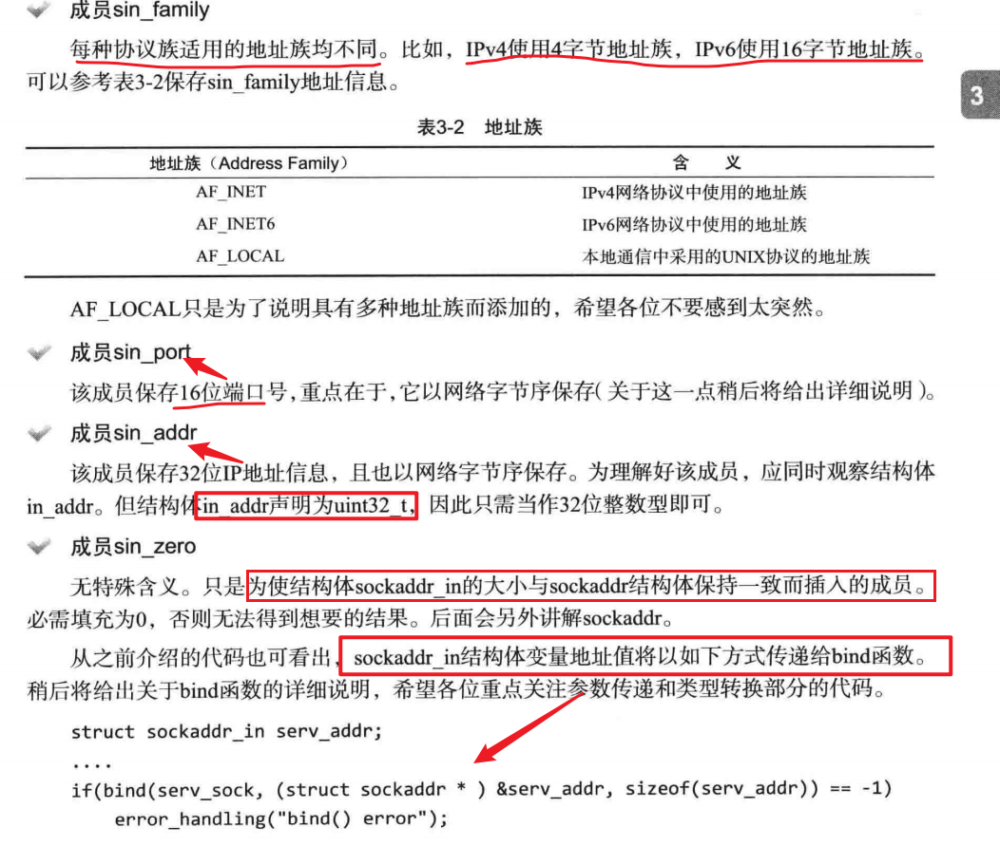

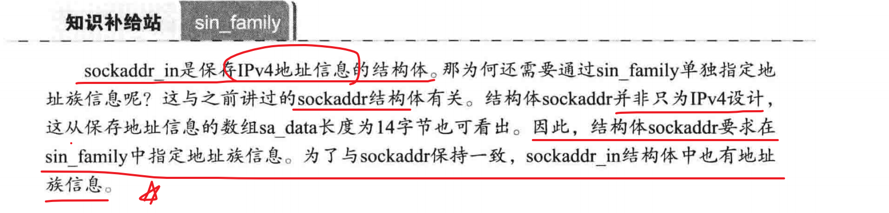


## 网络字节序与地址变换

### 字节序与网络字节序

**CPU向内存保存数据的方式有两种：**

- 大端序：高位字节存放到低位地址
- 小端序：高位字节存放到高位地址
- 目前主流的CPU以小端序方式保存数据

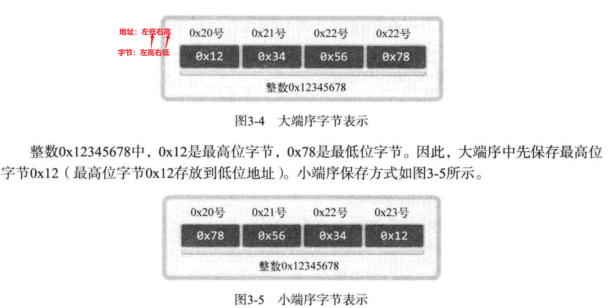

**网络字节序：为了解决接受方和发送方可能存在的字节序不同导致的数据传输问题（统一为大端序）**

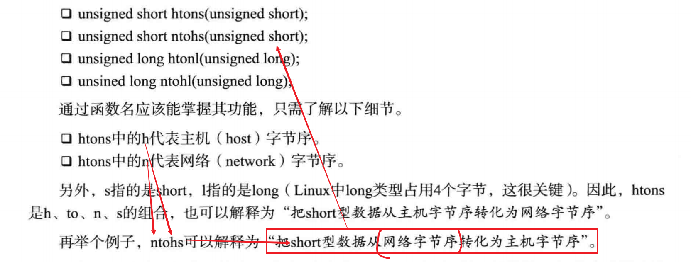

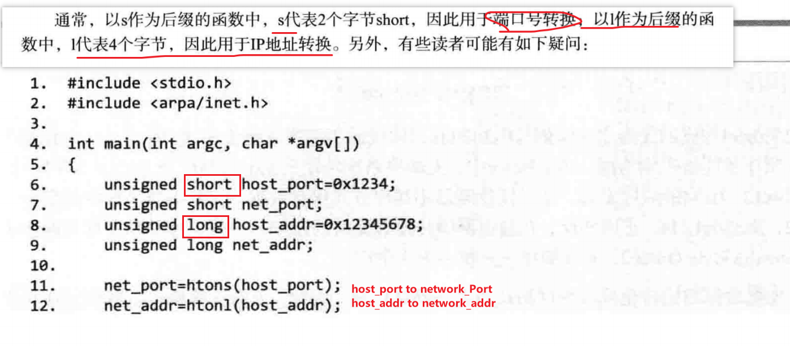

```c
#include <stdio.h>
#include <arpa/inet.h>

int main(int argc, char *argv[])
{
    unsigned short host_port = 0x1234;
    unsigned short net_port;
    unsigned long host_addr = 0x12345678;
    unsigned long net_addr;
    
    net_port = htons(host_port);
    net_addr = htonl(host_addr);
    
    printf("Host ordered port: %#x \n", host_port); //0x1234
    printf("Network ordered prot: %#x \n", net_port); 
    printf("Host ordered address: %#lx \n", host_addr);
    printf("Network ordered address: %#lx \n", net_addr);
    
    return 0;
}
```

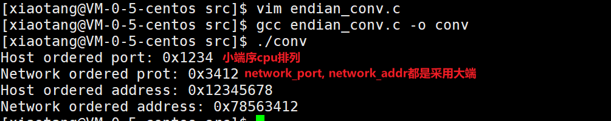

## 网络地址的初始化与分配

### 将字符串信息转换为网络字节序的整数型

`sockaddr_in`中保存地址信息的成员是32位整型，为了帮助我们将字符串形式的ip地址转换为32位整数型数据，因此需要通过`inet_addr`函数在转换类型的同时进行网络字节序转换

```c
#include <arpa/inet.h>

in_addr_t inet_addr(const char* string); //成功时返回32位大端序整数型值，失败时返回INADDR_NON

int inet_aton(const char* string, struct in_addr *addr); //成功时返回1，失败时返回0
//string:含有需要转换的IP地址信息的字符串地址
//addr：将保存转换结果的in_addr结构体变量的地址值

//测试代码
#include <stdio.h>
#include <arpa/inet.h>

int main(int argc, char *argv[])
{
        char *addr1 = "1.2.3.4"; //小端为0x01020304
        char *addr2 = "1.2.3.256";

        unsigned long conv_addr = inet_addr(addr1);

        if(conv_addr == INADDR_NONE) printf("Error occured!\n");
        else printf("Network ordered integer addr: %#lx \n", conv_addr);

        conv_addr = inet_addr(addr2);
        if(conv_addr == INADDR_NONE) printf("Error occured!\n");
        else printf("Network ordered integer addr: %#lx \n", conv_addr);

        return 0;
}
//显示结果为
```

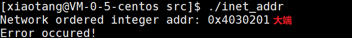

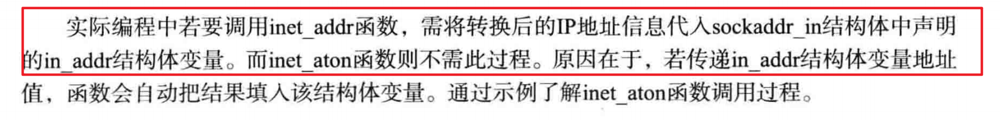

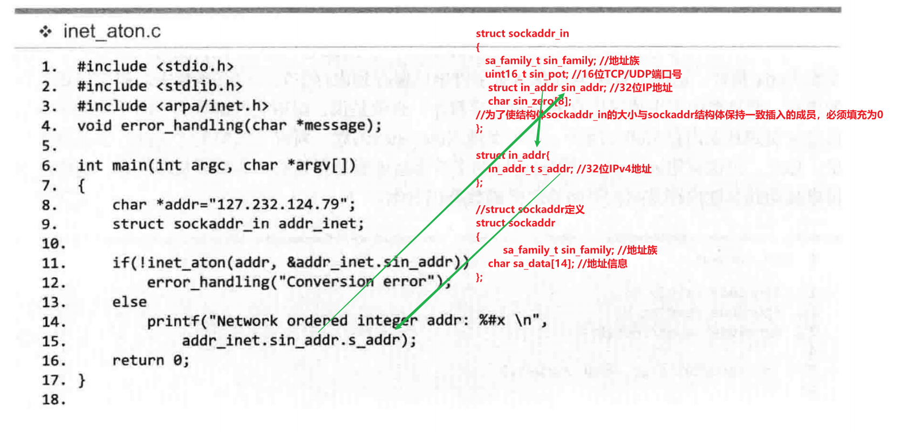

**总结：三种字符串和网络字节序转换的函数**

```c
#include <arpa/inet.h>

in_addr_t inet_addr(const char* string); //成功时返回32位大端序整数型值，失败时返回INADDR_NON

int inet_aton(const char* string, struct in_addr *addr); //成功时返回1，失败时返回0
//string:含有需要转换的IP地址信息的字符串地址
//addr：将保存转换结果的in_addr结构体变量的地址值

char* inet_ntoa(struct in_addr adr); //将网络字节序整数型IP地址转换成我们熟悉的字符串形式
//成功时返回转换的字符串地址值，失败返回-1
```

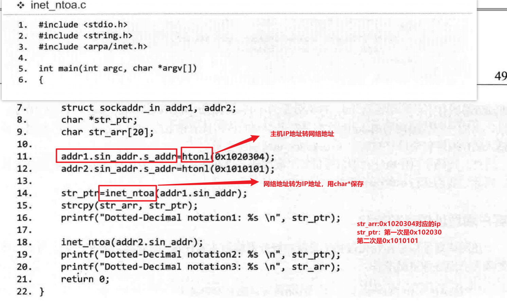

### 网络地址初始化

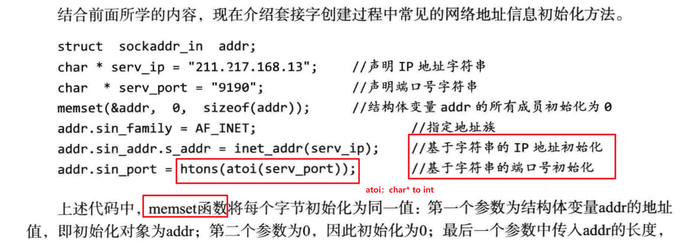


### 客户端地址信息初始化

在`3.3.2`节中的**网络地址信息初始化过程**主要针对服务器端而非客户端，给套接字分配IP地址和端口号主要是为了让服务器进入`listen并accept的状态`

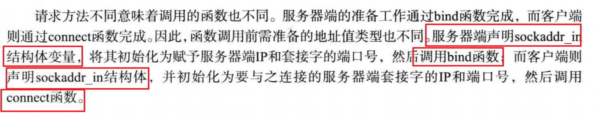

### INADDR_ANY

在3.3.2节中，每次创建服务器端套接字都要输入IP地址，因此可以通过如下方式初始化地址信息

```c
struct sockaddr_in addr;
char * serv_port = "9190";

memset(&addr, 0, sizeof(addr));
addr.sin_family = AF_INET; //协议族
addr.sin_addr.s_addr = htol(INADDR_ANY); //利用常数INADDR_ANY分配服务器端的IP地址
addr.sin_port = htons(atoi(serv_port)); //基于字符串的网络端口初始化
```

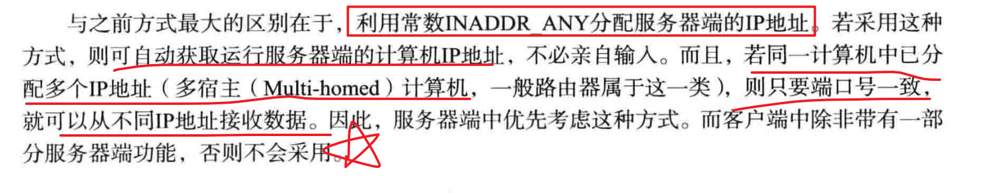

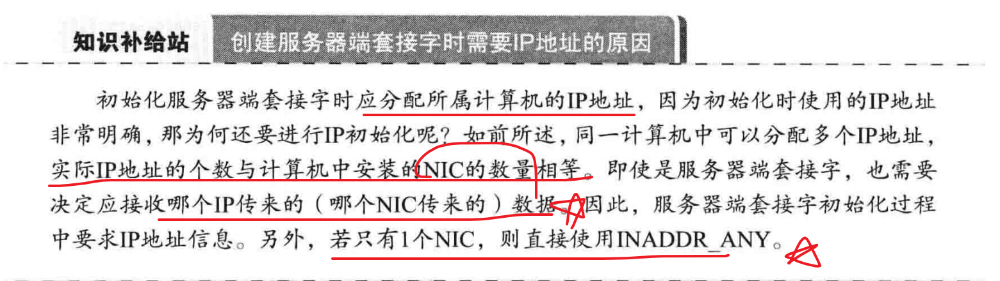

### 向套接字分配网络地址

在完成`sockaddr_in`结构体的初始化方法后，需要通过`bind函数`负责将初始化的地址信息分配给套接字

```c
#include <sys/socket.h>

int bind(int sockfd, struct sockaddr * myaddr, sockelent_t addrlen);
//sockfd: 要分配地址信息（IP地址和端口号）的套接字文件描述符
//myaddr：存有地址信息的结构体变量地址值
//addrlen：第二个结构体变量的长度
```


## 问题探讨

### IP地址族IPv4和IPv6有何区别？在何种背景下诞生了IPv6？

> IPv4和IPv6都是IP地址族，只是长度不一样。分别是四个字节和16个字节。
>
> 为了解决IP地址消耗的问题

### 套接字地址分为IP地址和端口号，为什么需要IP地址和端口号?

> IP地址可以用来区分网络上计算机，而端口号可以在一台计算上用来区分不同套接字而设置的。
>
> 知名端口是：0-1023

### 请是大端序、小端序、网络字节序，并说明为何需要网络字节序

1. 大端序：计算机cpu向内存写入数据时，高位数据放在低位地址
2. 小端序：
3. 网络字节序：为了解决通信双方因为端序不一致而导致的数据传输问题

### 怎样表示回送地址？其含义是什么？如果向会送地址传输数据会发生什么情况？

回送地址（127.x.x.x）是本机回送地址（Loopback Address）,即`主机IP堆栈内部的IP地址，主要用于网络软件测试以及本地机进程间通信，无论什么程序，一旦使用回送地址发送数据，协议软件立即返回之，不进行任何网络传输。` 属于保留测试地址,不能用，同时网络ID的第一个6位组也不能全置为“0”，全“0”表示本地网络。 

# 第四章：基于TCP的服务器端客户端（1）

> 根据数据传输方式的不同，基于网络协议的套接字一般分为`TCP套接字`和`UDP套接字`，因为TCP套接字是面向连接的，因此又称`基于流的套接字`（字节流）

## TCP/IP协议

1. 数据链路层
2. 网络层
3. 传输层
4. 应用层：将数据传输路径，数据确认过程都隐藏到套接字内部。这也是网络编程称为套接字编程的原因

### TCP服务器端的默认函数调用顺序

1. socket()创建套接字
2. bind()分配套接字地址
3. listen()等待连接请求状态
4. accept()允许连接
5. read()/write() 数据交换传输
6. close()断开链接

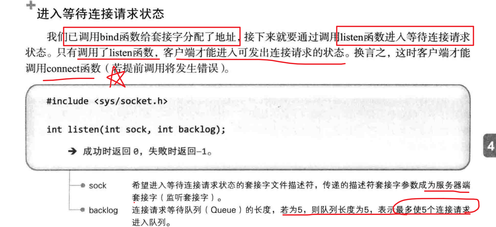

> **等待连接请求状态：**指客户端请求连接时，受理连接前一直处于等待状态
>
> **连接请求等待队列：**允许的等待序队列的长度
>
> 准备好服务器端套接字和连接请求等待队列后，这种可接受连接请求的状态称为`等待连接请求状态`

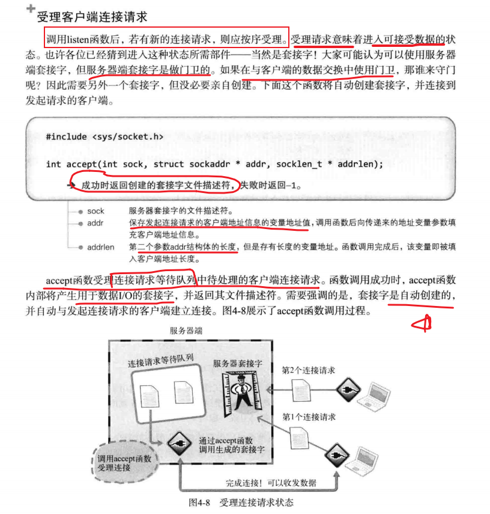

### TCP客户端的默认函数调用顺序

1. socket() 创建套接字
2. connect()请求连接
3. read() / write() 交换数据
4. close() 断开连接

> 与服务器端相比，区别就在于“请求连接”，在客户端创建套接字后向服务器端发起的连接请求。但必须在服务器端调用`listen函数后创建请求等待队列`,之后客户端才可请求连接
>
> ```c
> #include <sys/socket.h>
> 
> int connect(int sock, struct sockaddr * servaddr, socklen_t addrlen);
> //sock:客户端套接字文件描述符
> //servaddr：保存目标服务器端地址信息的变量地址值
> //addrlen：以字节为单位传递的地址变量长度
> ```
>
> 客户端在调用connect函数后，发生以下情况之一才会返回：
>
> 1. 服务器端接受连接请求（并不意味着服务器端调用accept函数，可以是进入到等待队列）**因此，connect函数返回后，并不立即进行数据交换**
> 2. 发生断网等异常情况而中断连接请求

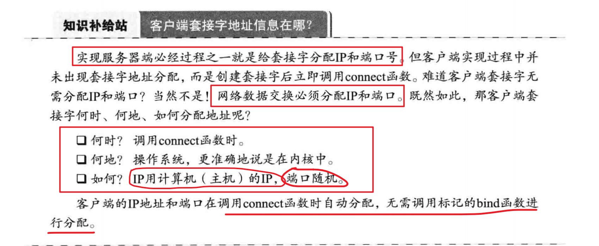

### 基于TCP的服务器端、客户端的函数调用关系

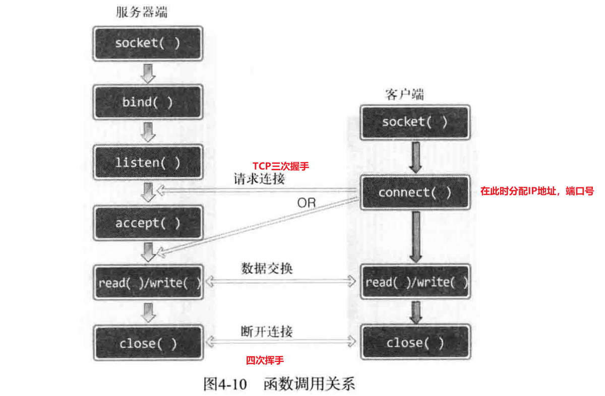


## 实现迭代服务器端/客户端

本节编写回声服务器端/客户端，即服务器端将客户端传输的字符串数据原封不动地传回给客户端

### 实现迭代服务器端

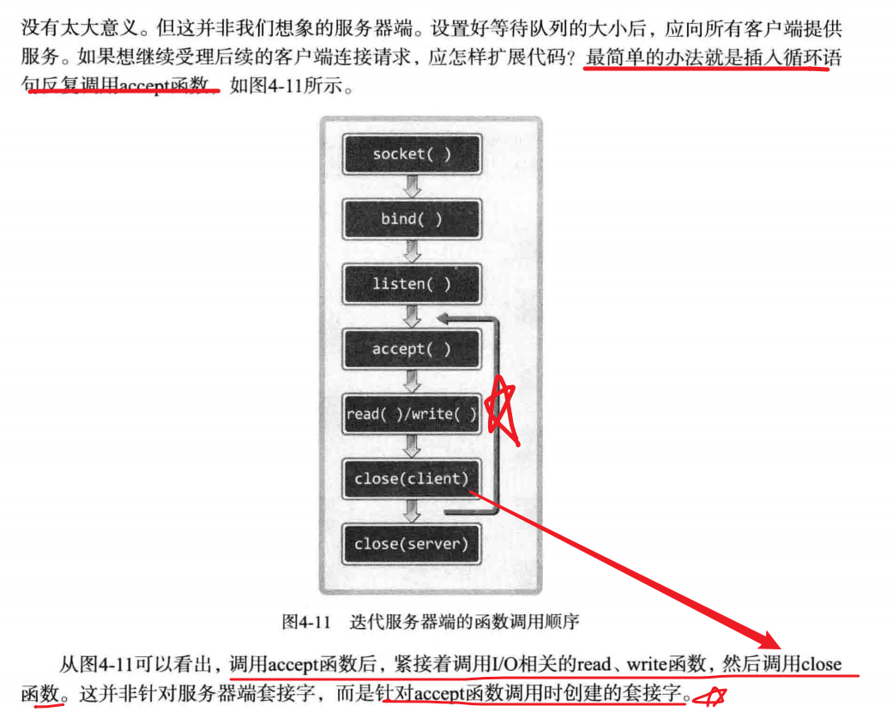

> 门卫还在，但是换了一批面试官


#### 迭代回声服务器端、客户端


> **存在的问题：**
>
> 每次调用write函数都会传递一个字符串，因此这种假设在某种程度上合理。
>
> 但是`TCP不存在数据边界`，而上述客户端是基于TCP的，因此多次调用write函数传递的字符串有可能一次性传递到服务端，此时客户端有可能从服务端收到多个字符串。
>
> 因此，还需要考虑服务器端的如下情况：字符串太长则分成两个数据包发送
>
> **解决办法：**可以提前确定接受数据的大小
>
> ****

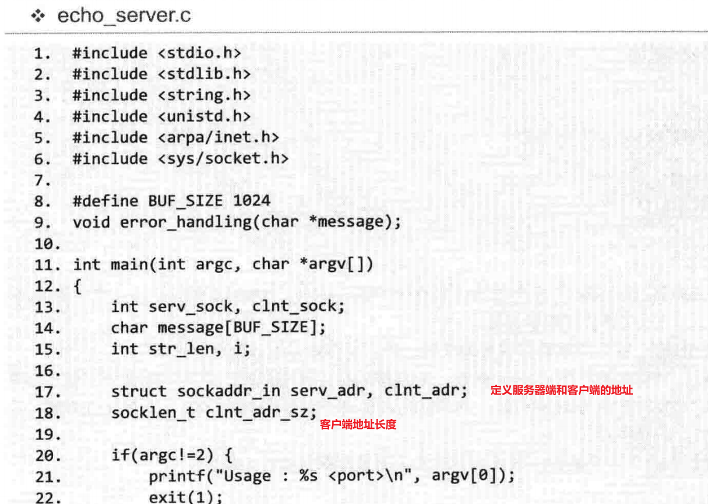

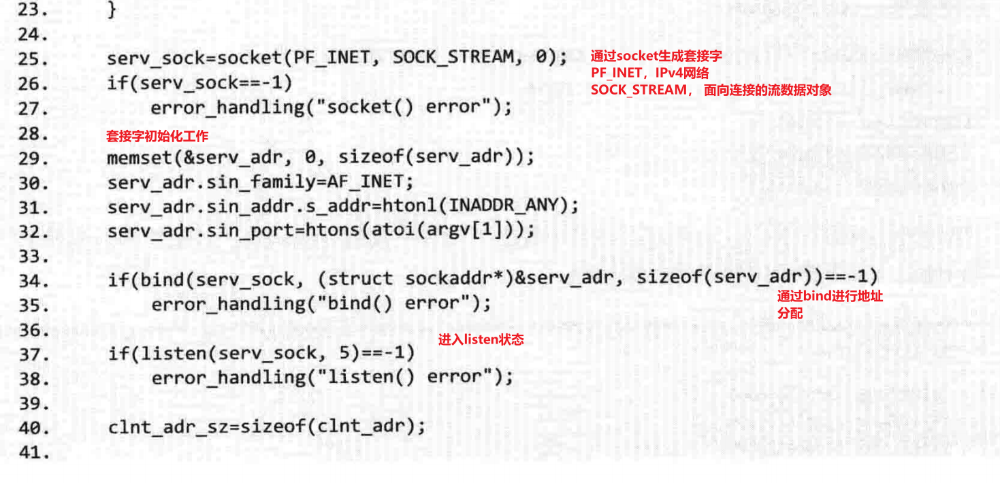


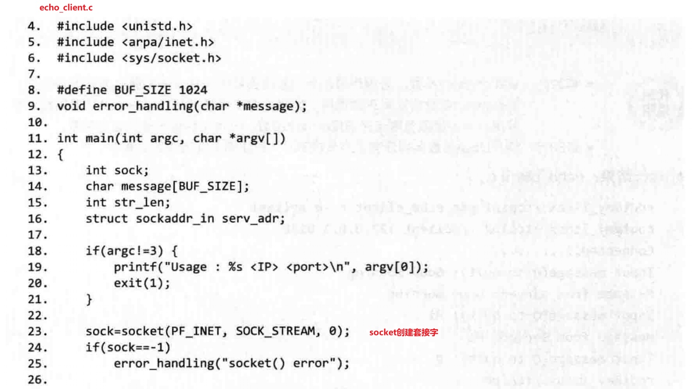

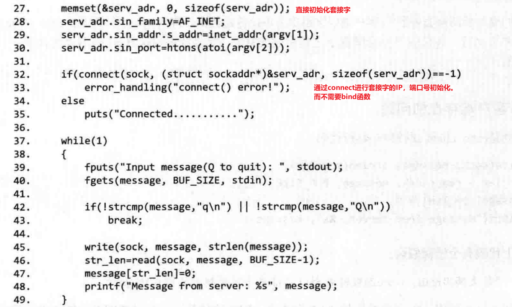


## 问题探讨

1. 客户端调用connect函数向服务器端发送连接请求，服务器端调用哪个函数后，客户端可以调用connect函数

   > 服务器端必须在socket(), bind(), listen()之后才能够接受connect()请求

2. 什么时候创建请求等待队列？它有何作用？与accept有什么关系？

   > 在服务器端套接字繁忙的时候，会创建一个请求等待序列，对于新的连接请求，按序处理
   >
   > 因此，客户端的connect成功，不一定就真正被服务器端accept，可能只是被listen的
   >
   > accept函数内部自动产生用于数据I/O的套接字，并自动与发起连接请求的客户端建立连接

3. 客户端中为何不需要调用bind函数分配地址？如果不调用bind函数，那么何时、如何向套接字分配IP地址和端口号？

   > 客户端也需要为套接字分配IP和端口，只是在调用connect函数的时候自动分配。无需调用标记的bind函数进行分配
   >
   > 何时？调用connect函数时
   >
   > 何地？系统内核中
   >
   > 如何？IP用计算机主机IP，端口随机

# 第五章：基于TCP的服务器端客户端（2）

## 回声客户端的完美实现

> **在第四章分析得到的回声客户端存在的问题：**
>
> 每次调用write函数都会传递一个字符串，因此这种假设在某种程度上合理。
>
> 但是`TCP不存在数据边界`，而上述客户端是基于TCP的，因此多次调用write函数传递的字符串有可能一次性传递到服务端，此时客户端有可能从服务端收到多个字符串。
>
> 因此，还需要考虑服务器端的如下情况：字符串太长则分成两个数据包发送

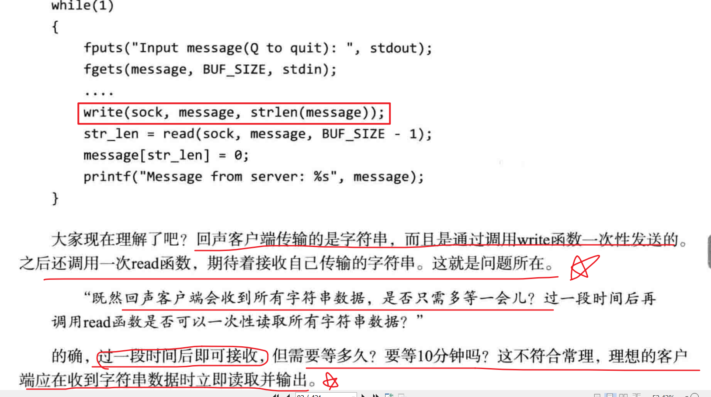

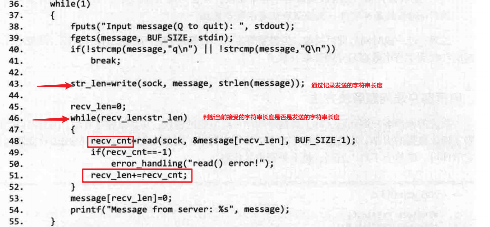

## 如果问题不在于回声客户端：定义应用层协议

> 回声客户端可以提前知道要接收的数据长度，但是在大多数情况下，这不太可能。
>
> 因此，需要通过`定义应用层协议:在收发数据过程中需要定好规则以表示数据的边界，或提前告知收发数据的大小`

### 计算器服务端、客户端

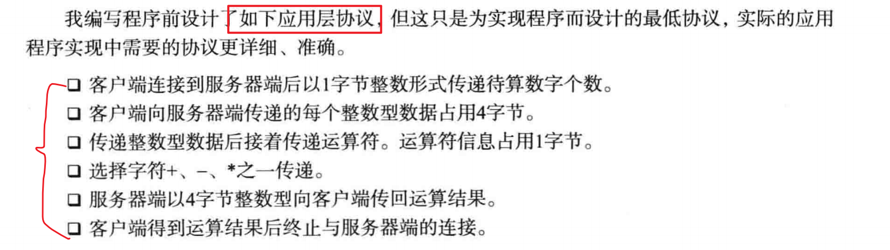

## TCP原理

### TCP套接字中的I/O缓冲

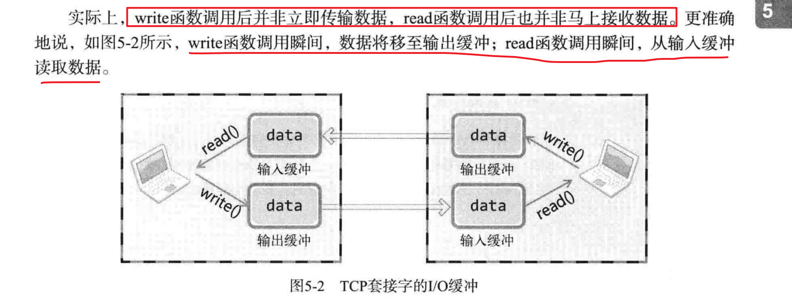

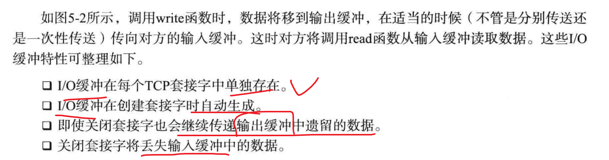


## 问题探讨

1. 请说明TCP套接字连接设置的三次握手过程，尤其是3次数据交换过程每次收发的数据内容

   > 首先：client向服务器端发送SEQ，并要求server返回一定格式的ACK
   >
   > Server：SEQ：告诉客户端应该以什么样的形式ACK，并且附加一个ACK对client的SEQ确认
   >
   > Client：发送server需要的SEQ，并对server的SEQ进行ACK

2. TCP是可靠的数据传输协议，但在通过网络通信的过程中可能丢失数据，请通过ACK和SEQ说明TCP通过何种机制保证丢失数据的可靠传输

3. 对方主机的输入缓冲剩余50字节空间时，若本方主机通过write函数请求传输70字节，请问tcp如何处理这种情况？

   > 通过流量控制


# 第六章：基于UDP的服务端、客户端

> TCP在不可靠的IP层进行流控制，进而实现提供可靠的数据传输服务
>
> 流控制是区分UDP和TCP的最重要标志

## UDP协议的有效性

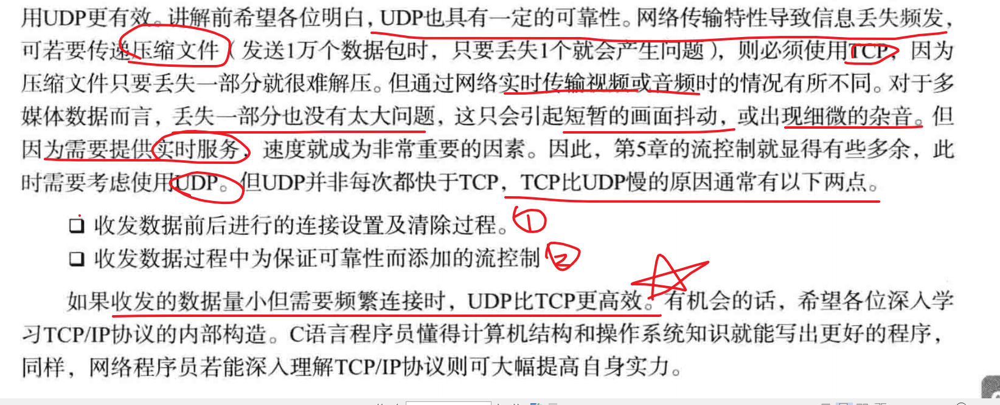

## 实现基于UDP的服务器端、客户端

> UDP服务器端、客户端不像TCP那样在连接状态下交换数据，因此与TCP不同，无需经过连接过程。
>
> 也就是不需要调用TCP连接过程中的`listen函数`和`accept函数`

**UDP服务器端和客户端均只需一个套接字，而TCP中服务器端需要N+1个套接字，其中N为相连客户端个数**

### 基于UDP的数据I/O函数

1. 创建好TCP套接字后，传输数据时无需再添加地址信息。因为TCP套接字将保持与对方套接字的连接。因此，`TCP套接字总是知道目的地址信息`
2. UDP套接字不会保持连接状态，因此每次传递数据都要添加目标地址信息。

```c
#include <sys/socket.h>

ssize_t sendto(int sock, void *buff, size_t nbytes, int flags, struct sockaddr *to, socklen_t addrlen); //成功时返回传输的字节数，失败时返回-1
/*
1. sock: 用于传输数据的UDP套接字文件描述符
2. buff: 保存待传输数据的缓冲地址值
3. nbytes: 待传输的数据长度，以字节为单位
4. flags: 可选参数，若没有则传递0
5. to: 存有目标地址信息的sockaddr结构体变量的地址值
6. addrlen: 传递给参数to的地址值结构体变量长度
*/

ssize_t recvfrom(int sock, void *buff, size_t nbytes, int flags, struct sockaddr *from, socklen_t *addrlen); //成功时返回接受的字节数，失败时返回-1
/*
1. sock: 用于接收数据的UDP套接字文件描述符
2. buff: 保存待接收数据的缓冲地址值
3. nbytes: 可接受的最大字节数，故无法超过参数buff所指的缓冲大小
4. flags: 可选参数，若没有则传递0
5. from: 存有发送端地址信息的sockaddr结构体变量的地址值
6. addrlen: 保存参数from的结构体变量长度的变量地址值
*/
```

## UDP客户端套接字的地址分配

在TCP客户端实现的时候，有一个通过connect同server相连接的过程。而在UDP客户端中则没有这一步骤。

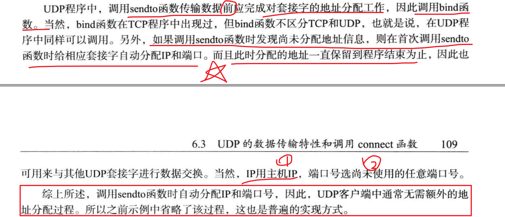

## UDP的数据传输特性和调用connect函数

>  TCP传输的数据不存在数据边界，而UDP数据传输中存在数据边界
>
> UDP是具有数据边界的协议，传输中调用I/O函数的次数非常重要。因此，输入函数的调用次数应和输出函数的调用次数完全一致。这样才能保证接收全部已发送数据
>
> 例如：调用三次输出函数发送的数据必须通过调用三次输入函数才能接收完

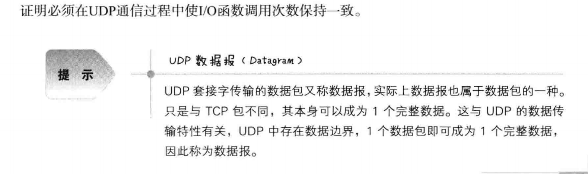


### 已连接UDP套接字与未连接UDP套接字

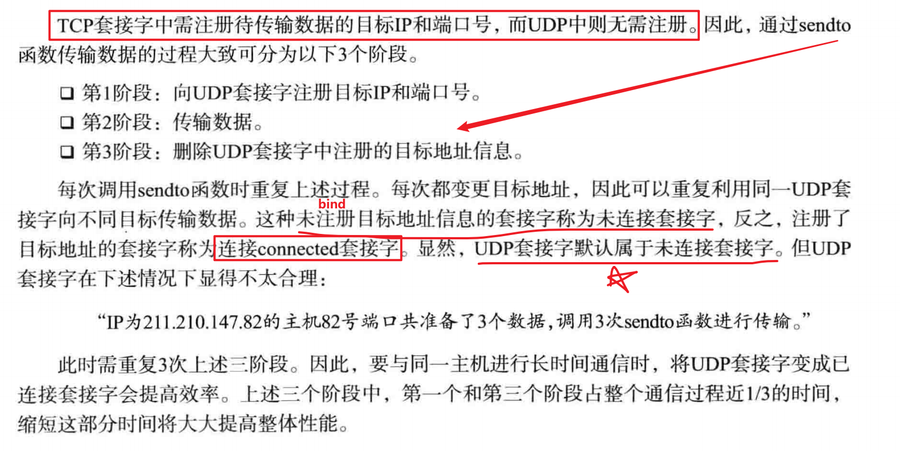

### 创建已连接UDP套接字

> 创建已连接UDP套接字的过程：只需要针对UDP套接字调用connect函数
>
> `connect(sock, (struct sockaddr*)&adr, sizeof(adr));`
>
> 针对UDP套接字调用connect函数并不意味着要与对方UDP套接字连接，只是向UDP套接字注册`目标IP和端口信息`
>
> **对于已连接UDP套接字，不仅可以通过`sendto(), recvfrom()`还可以使用TCP套接字的`write和read`进行通信**

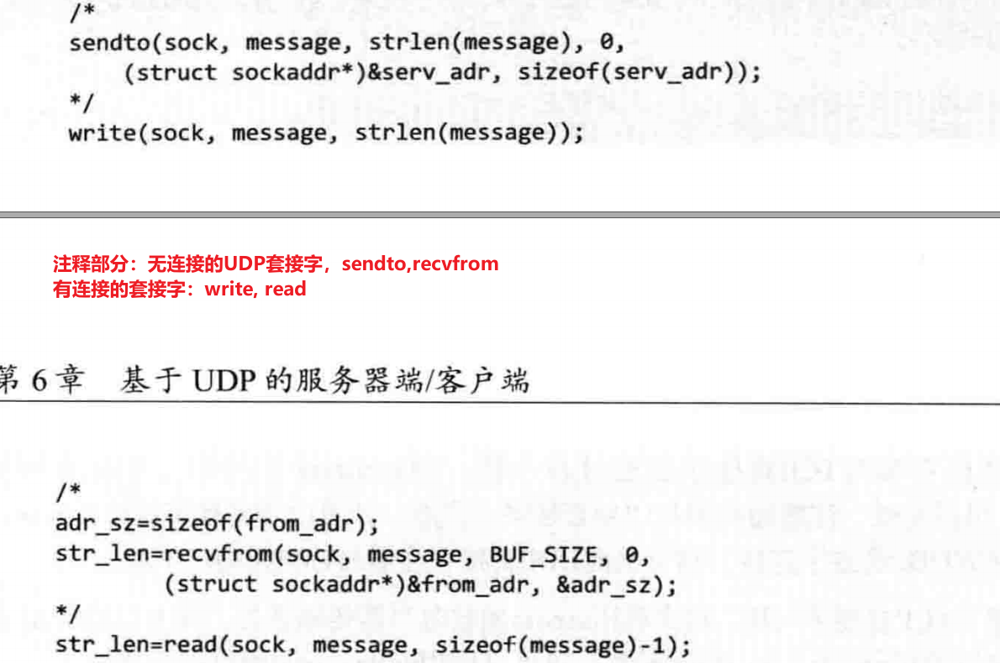

## 问题探讨

1. UDP为什么比TCP快？为什么TCP数据传输可靠而UDP数据传输不可靠？

   > UDP比TCP更快的原因是它不存在的确认支持连续的包流。由于TCP连接总是确认一组数据包(无论连接是否完全可靠)，当数据包丢失时，每一次否定确认都必须进行重传
   >
   > 这也是TCP比UDP数据传输可靠的依据。面向连接，重传，流量控制等

2. 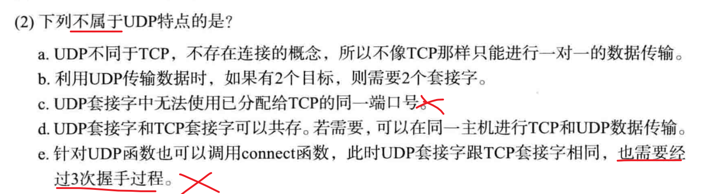

3. 何种情况下，UDP的性能优于TCP

   > 网络带宽需求较小，而实时性要求高，大部分应用无需维持连接，需要低功耗

4. 客户端TCP套接字调用connect函数时自动分配IP和端口号，UDP不调用bind函数，而是在sendto的时候自动分配IP和端口号

5. UDP中调用connect函数的好处

   - 节省在sendto()的时候，总是会自动分配IP和端口号的时间
   - 对于经常进行数据传输的双方，UDP通过connect函数获取对方IP和端口号，可以通过`write和read`更加高效地完成数据传输工作

# 优雅地断开套接字连接

> 在前面的示例中，我们总是调用`close`或`closesocket`函数单方面断开连接，同时断开两个I/O流
>
> 本章讨论的**优雅地断开连接方式**只断开其中一个流，而非同时断开两个流

## 基于TCP的半关闭

### 套接字和流

> 将建立套接字后可交换数据的状态看作一种流
>
> 一旦两台主机间建立了套接字连接，每个主机就会拥有独立的输入流和输出流

### 针对优雅断开的shutdown函数

```c
#include <sys/socket.h>

int shutdown(int sock, int howto); //成功时返回0， 失败时返回-1
//sock:需要断开的套接字文件描述符
//howto：传递断开方式信息,SHUT_RD 断开输入流，SHUT_WR，断开输出流，SHUT_RDWR
```

### 为什么要半关闭

**存在的问题：**对于数据传输的接收方，可能不知道要接收数据到何时。因此，只能无休止的调用输入函数，这有可能导致程序阻塞（调用的函数未返回）

**解决办法：**发送端在发送完数据以后传递一个EOF表示文件传输结束。

**服务器如何传递EOF：**

- 服务器端调用close函数可以同时关闭I/O流，但是有问题就是，这样可能无法再收到客户端想发送给服务器端的数据内容。
- 因此需要选择半关闭的`SHUT_WR`

# 域名及网络地址

## 常用的指令

1. ping 域名，得到某一个域名的ip
2. nslookup #查看默认的DNS服务器地址,linux下需要额外输入`server`

**使用域名的必要性：**

> 因为IP地址可能会经常改变，因此不能将程序设计成要求用户手动输入可变动的IP地址和端口信息。
>
> 因此，可以通过将变动几率更小的域名作为程序参数，让程序根据域名自动获取IP地址。
>
> **需要IP和域名之间的转换函数**

## 利用域名获取IP地址`gethostbyname`

```c++
#include <netdb.h>

struct hostent *gethostbyname(const char* hostname);//成功是返回hostent结构体指针，失败时返回NULL指针

//struct hostent定义
struct hostent{
  	char* h_name; //official name
    char** h_aliases; //alias list
    int h_addrtype; //host address type
    int h_length; //address length
    char ** h_addr_list; //address list
};
```

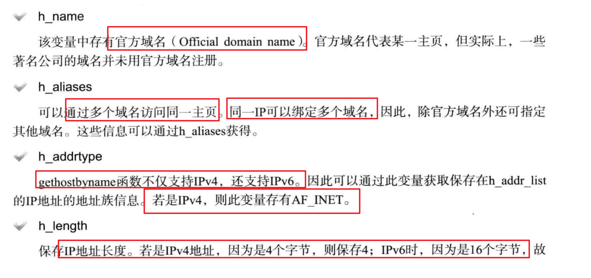

> 结构体成员中`h_addr_list`指向字符串指针数组（是由多个字符地址构成的数组），但字符串指针数组中的元素实际指向的是`in_addr(IPv4地址)`结构体变量地址值而非字符串。
>
> 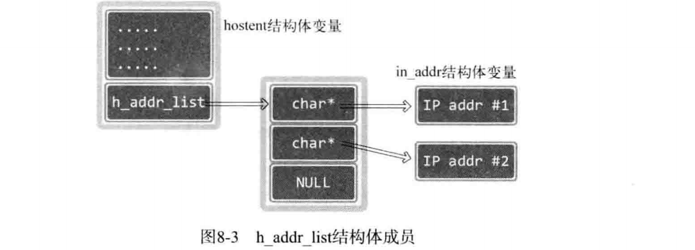
>
> **Q1:为什么是char*而不是in_addr\*:** 因为hostent结构体并非只为IPv4准备，h_addr_list指向的数组中也可以保存IPv6地址信息
>
> **Q2:声明为void指针类型是否更合理？** 从理论上来讲，当指针对象不明确时，更适合使用void指针类型，但是这个套接字相关函数是在void指针标准化之前定义的，所以只能采用char指针
>
> **因此需要进行类型转换**
>
> ```c++
> for(int i = 0; host->h_addr_list[i]; i++)
>     printf("IP addr %d : %s \n", i+1, inet_ntoa(*(struct in_addr*)host->h_addr_list[i]));
> ```

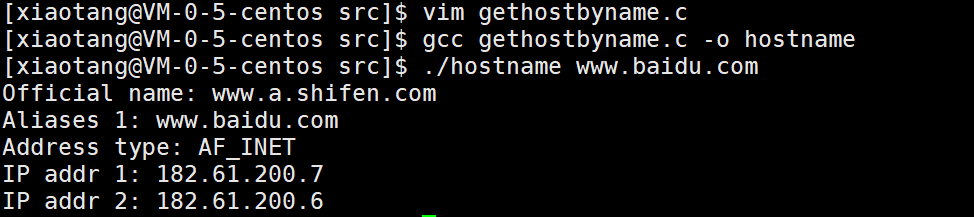

## 利用IP地址获取域名`gethostbyaddr`

```c++
#include <netdb.h>

struct hostent* gethostbyaddr*(const char* addr, socklen_t len, int family);
//成功时返回hostent结构体变量地址值，失败时返回NULL指针
/*
1. addr: 含有IP地址信息的in_addr结构体指针，为了同时传递IPv4地址之外的其他信息，该变量的类型声明为char指针
2. len: 向第一个参数传递的地址信息的字节数，IPv4为4个字节，IPv6为16个字节
3. family: 传递地址族信息，IPv4时为AF_INET， IPv6时为AF_INET6
*/
```

# 套接字的多种可选项

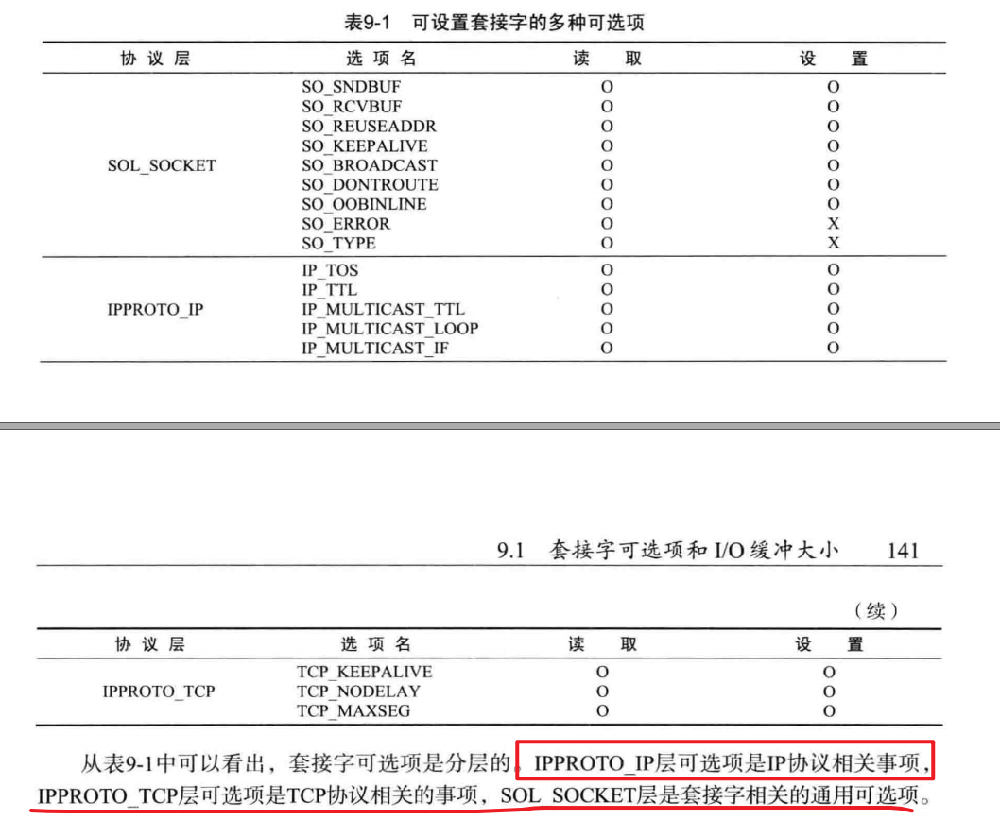

 

## getsockopt和setsockopt

```c++
#include <sys/socket.h>

int getsockopt(int sock, int level, int optname, void* optval, socklen_t* optlen); //成功时返回0，失败时返回-1
/*
sock 用于查看选项套接字文件描述符
level 要查看的可选项的协议层
optname 要查看的可选项名
optval 保存查看结果的缓冲地址值
optlen 向第四个参数optval传递的缓冲大小，调用函数后，该变量中保存通过第四个参数返回的可选项信息的字节数
*/

int setsockopt(int sock, int level, int optname, const void* optval, socklen_t* optlen); //成功时返回0， 失败时返回-1
/*
sock 用于更改选项套接字文件描述符
level 要更改的可选项的协议层
optname 要更改的可选项名
optval 保存更改结果的缓冲地址值
optlen 向第四个参数optval传递的可选项信息的字节数 len = sizeof(optval)
*/
```

**代码示例：**

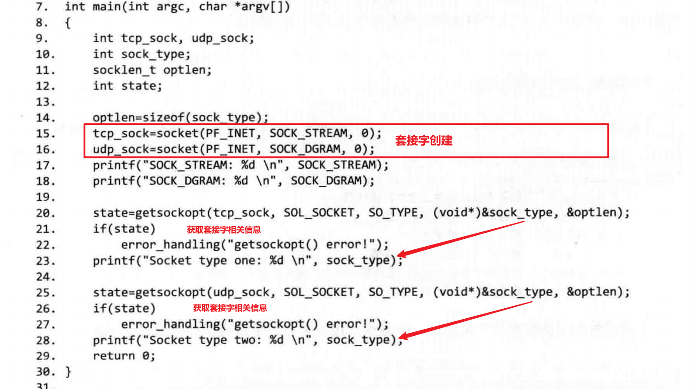

> 套接字类型的`SO_TYPE`是典型的只读可选项，即套接字类型只能在创建时设定，而不能通过`setsockopt`进行相关更改

## SO_SNDBUF & SO_RCVBUF


> SO_RCVBUF是输入缓冲大小相关可选项，SO_SNDBUF是输出缓冲大小相关可选项。可以通过这两个选项`读取或设定`当前I/O缓冲大小

**get_buf.c代码测试：**

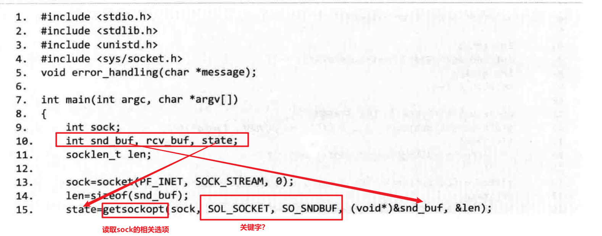

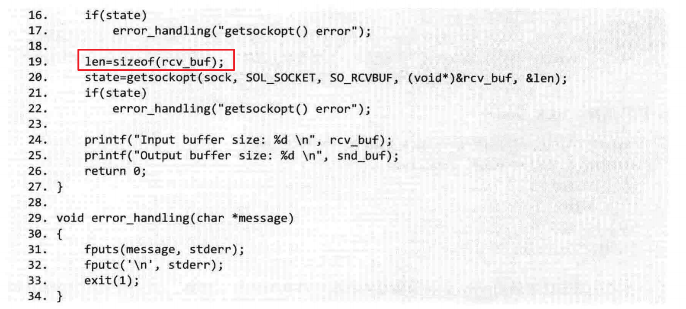

**setbuf.c代码测试**

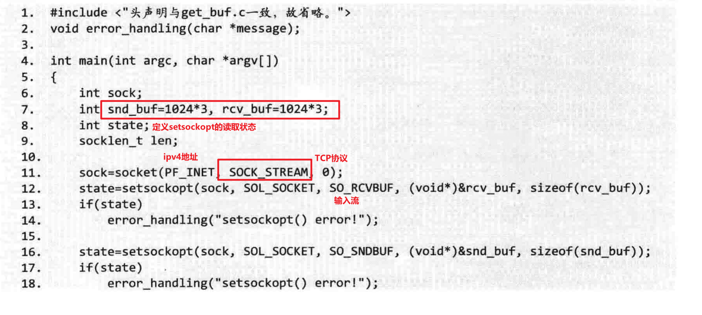

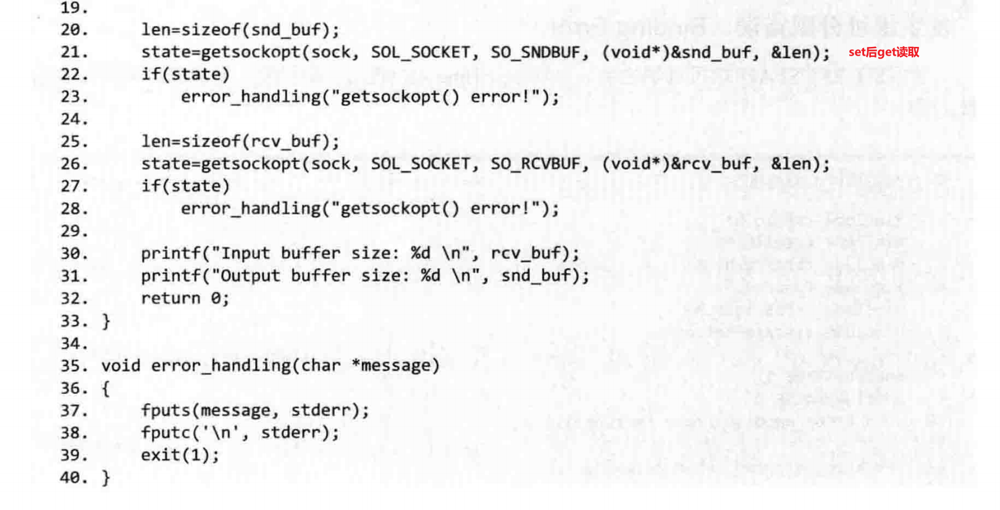

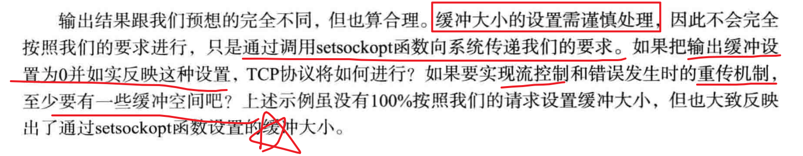

## SO_REUSEADDR

### 发生地址分配错误

1. 当服务器端向客户端发送FIN消息的时候，那么服务器端在重新运行时将产生问题，如果用同一端口还哦重新运行服务器端，会输出`bind() error`消息，并且无法再次运行。但是经过几分钟后，即可重新运行服务器端
2. 通过客户端通知服务器端断开TCP连接，那么可以及时地关闭文件及套接字。重新运行服务器端也不会出现上述问题。

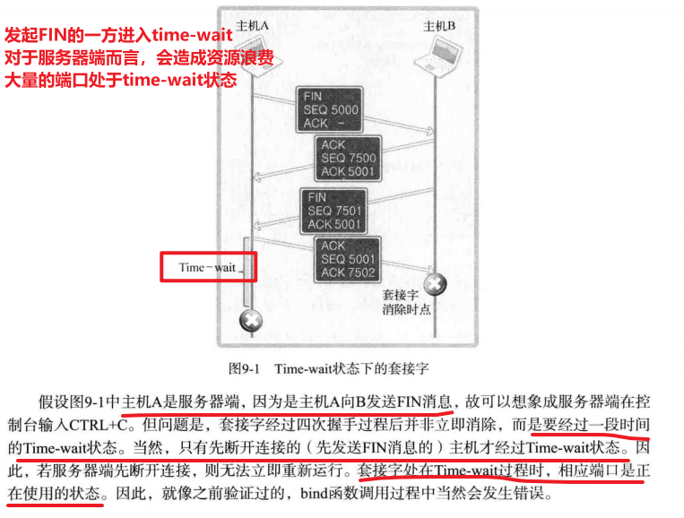

### 解决方案：地址再分配机制

> - 假设服务器端发生故障从而紧急停止，那么需要快速重启服务器端。而处于time-wait的服务器需要等待time-wait
>
> - 如果主动断开连接方最后的ACK没有传递成功，那么另一方会再次重传FIN消息，而收到FIN消息的主机将重启TIME-WAIT计时器。因此，可能会持续很久
>
> **解决方案：**在套接字的可选项参数中更改`SO_REUSEADDR`的状态，适当调整参数，将time-wait状态下的套接字端口号重新分配给新的套接字。
>
> `SO_REUSEADDR`的默认值为0，表示无法分配time-wait状态下的套接字端口号，因此，需要将这个值更改为1

```c++
setsockpot(serv_sock, SOL_SOCKET, SO_REUSEADDR, (void*)&option, optlen); //参考TCP/IP网络编程158页
```

## TCP_NODELAY

### Nagle算法（应用于TCP层）

为了防止因数据包过多而发生网络过载，TCP套接字默认使用Nagle算法交换数据，最大限度地进行缓冲。直到收到ACK

不使用Nagle算法将对网络流量产生负面影响，即使只传输1个字节的数据，因为数据报文的头部会包括许多信息，可能有几十个字节。

因此，为了提高网络传输效率，必须使用Nagle算法

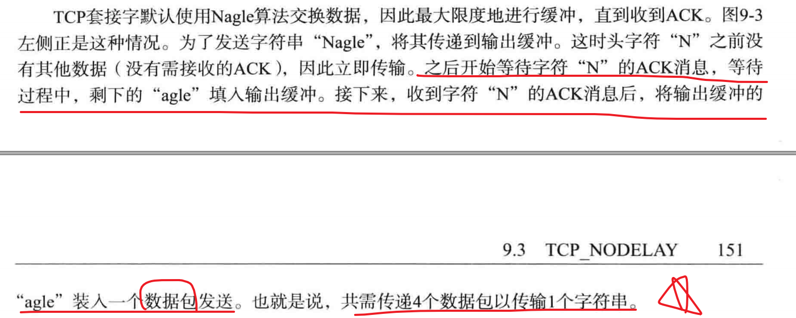

> 根据数据传输的特性，当网络流量未受太大影响时，不使用Nagle算法要比使用时传输速度快。
>
> **传输大文件数据：**将文件数据传入输出缓冲不会花太多时间，因此即使不使用Nagle算法，也会在装满输出缓冲时传输数据包。这不仅不会增加数据包的数量，反而会在无须等待ACK的前提下连续传输。因此可以大大提高传输速度
>
> `一般情况下，不使用Nagle算法可以提高传输速度，但是无条件放弃使用Nagle算法，就会增加过多的网络流量，反而影响传输。因此，在未准确判断数据特行时不应禁用Nagle算法`

### 禁用Nagle算法

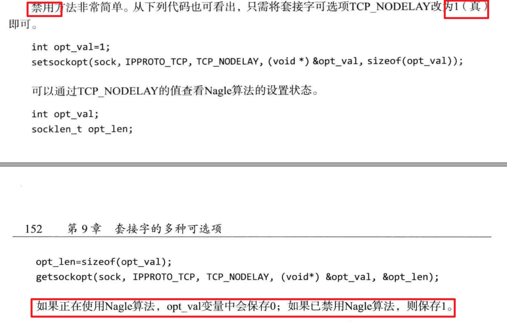

# 多进程服务器

## 并发服务器端的实现方法

> 即使有可能延长服务时间，也使其能够同时向所有发起请求的客户端提供服务
>
> 并且，网络程序中数据通信时间比cpu运算时间占比更大，因此，向多个客户端提供服务是一种有效利用CPU的方式

**具有代表性的并发服务器实现模式与方法：**

1. 多进程服务器：通过创建多个进程提供服务
2. 多路复用服务器：通过捆绑并统一管理I/O对象提供服务
3. 多线程服务器：通过生成与客户端等量的线程提供服务

## 多进程服务器

### 理解进程

**进程：占用内存空间的正在运行的程序**

> 从操作系统的角度来看，进程是程序流的基本单位，若创建多个进程，则操作系统将同时运行。
>
> **有时一个程序运行过程中也会产生多个进程**

### 通过程序创建进程的方法

1. 通过`ps`命令查看进程

2. 通过fork函数创建进程

   > ```c++
   > #include <unistd.h>
   > 
   > pid_t fork(void); //成功时返回进程ID，失败时返回-1，返回值类型pid_t
   > ```
   >
   > fork函数将创建调用的进程副本，即并非根据完全不同的程序创建进程，而是复制正在运行的，调用fork函数的进程。因为通过同一个进程、复制相同的内存空间。之后的程序流就需要根据fork函数的返回值区分
   >
   > 并且，两个进程都将执行fork函数调用后的语句。通过fork函数返回值加以区分。
   >
   > - 父进程（原进程，fork函数的主体）：fork函数返回子进程ID
   > - 子进程：fork函数返回0
   >
   > 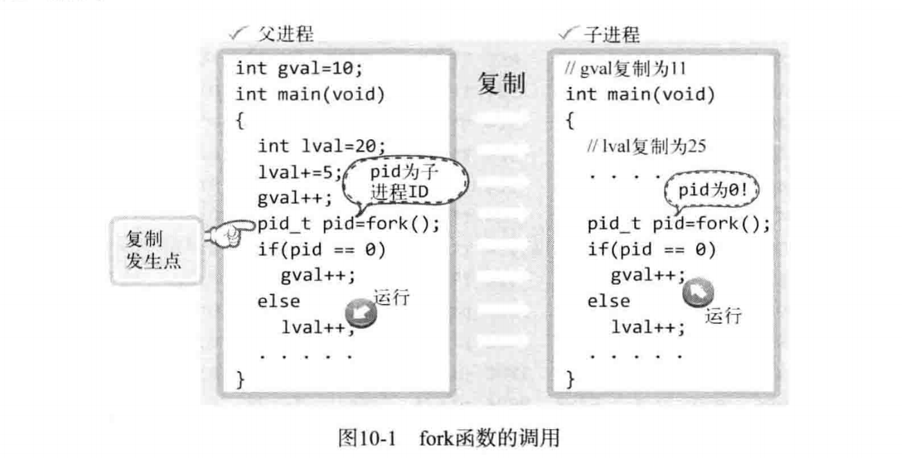
   >
   > 

## 进程和僵尸进程

进程完成工作后应被销毁，但有时候这些进程将变成僵尸进程，占用系统中的重要资源。这种状态下的进程称作“僵尸进程”

### 产生僵尸进程的原因

> 向exit函数传递的参数值和main函数的return语句返回的值都会传递给操作系统。而操作系统不会销毁子进程，直到把这些值传递给产生该子进程的父进程。处在这种状态下的进程就是僵尸进程。`将子进程变成僵尸进程的是操作系统`


### 销毁僵尸进程1：利用wait函数

为了销毁子进程，父进程应主动请求获取子进程的返回值

```c++
#include <sys/wait.h>

pid_t wait(int* statloc); //成功时返回终止的子进程ID，失败时返回-1
```

> 调用此函数时如果已有子进程终止，那么子进程终止时传递的返回值（exit函数的参数值，main函数的return返回值）将保存到该函数的参数所指内存空间。但函数参数指向的单元中还包含其他信息。因此需要通过下列宏进行分离：
>
> 1. `WIFEXITED`子进程正常终止时返回真
> 2. `WEXITSTATUS`返回子进程的返回值
>
> 因此，在向wait函数传递变量status的地址时，调用wait函数后应该通过下列形式调用
>
> ```c++
> if(WIFEXITED(status))
> {
> 	puts("Normal termination!");
>     printf("Child pass num: %d", WEXITSTATUS(status)); 
> }
> ```

**如果没有已终止的子进程，那么程序将阻塞直到有子进程终止。因此考虑使用`waitpid`函数**

### 通过`waitpid`函数销毁僵尸进程

wait函数会引起程序阻塞，因此可以考虑调用`waitpid`函数

```c++
#include <sys/wait.h>

pid_t waitpid(pid_t pid, int* statloc, int options); //成功时返回终止的子进程ID或0，失败时返回-1
/*
pid: 等待终止的目标子进程的id，若传递-1，则与wait函数相同，可以等待任一子进程终止
statloc：与wait函数的statloc参数具有相同含义
options: 传递头文件sys/wait.h中声明的常量WNOHANG,即使没有终止的子进程也不会进入阻塞状态，而是返回0并退出函数
*/
```

## 信号处理

### 信号与函数

```c++
#include <signal.h>

void (*signal(int signo, void (*func)(int)))(int); //为了在产生信号时调用，返回之前注册的函数指针
//在发生第一个参数的特殊情况信息时，要调用第二个传入的参数
/*
1. void (*func)(int) 作为函数参数传入的函数指针，要求返回类型void，参数类型int
2. 特殊情况信息
 - SIGALRM：已到通过调用alarm函数注册的时间
 - SIGINT： 输入ctrl + c
 - SIGCHLD: 子进程终止
3. signal函数名
4. 返回类型，参数为int型，，返回void型的函数指针
*/
```

> 因此，对于上述定义的信号注册函数，若要实现`子进程终止时调用mychild函数`
>
> 那么signal函数调用如下
>
> ```c++
> signal(SIGCHILD, mychild);  //signal已经声明为函数指针
> //函数指针调用参考
> #include <stdio.h>
>  
> int max(int x, int y)
> {
>     return x > y ? x : y;
> }
>  
> int main(void)
> {
>     /* p 是函数指针 */
>     int (* p)(int, int) = & max; // &可以省略
>     int a, b, c, d;
>  
>     printf("请输入三个数字:");
>     scanf("%d %d %d", & a, & b, & c);
>  
>     /* 与直接调用函数等价，d = max(max(a, b), c) */
>     d = p(p(a, b), c); 
>  
>     printf("最大的数字是: %d\n", d);
>  
>     return 0;
> }
> ```

### alarm函数

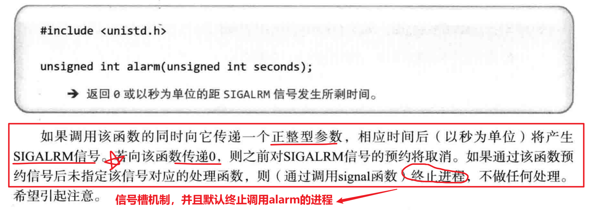

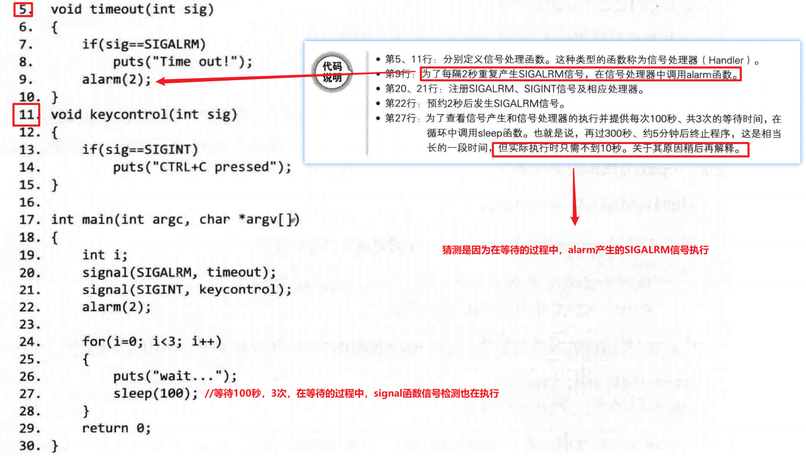

> **发生信号时，将唤醒由于调用sleep函数而进入阻塞状态的进程。**
>
> 调用函数的主体是操作系统，但进程处于睡眠状态时无法调用函数。因此，产生信号时，为了调用信号处理器，将唤醒由于调用sleep函数而进入阻塞状态的进程。而且进程一旦被唤醒，就不会再进入睡眠状态。

### 利用sigaction函数进行信号处理

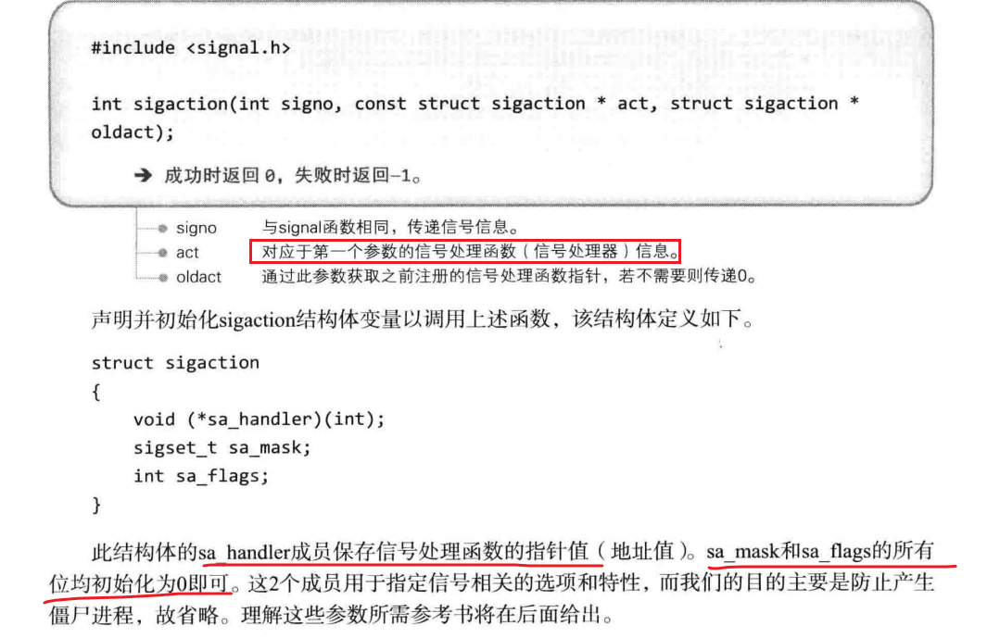

**sigaction代码示例**

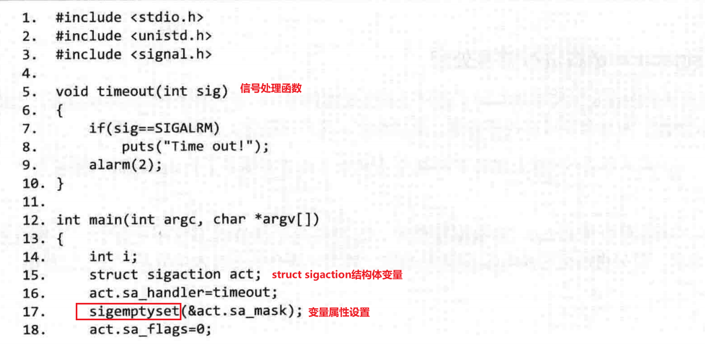

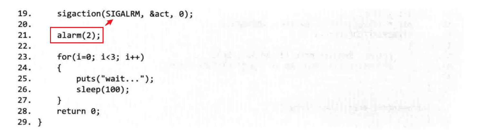

### 利用信号处理技术消灭僵尸进程

> 子进程终止时，将产生`SIGCHILD`信号，因此可以通过`sigaction`捕捉这一信号并执行响应的操作

## 实现并发服务器

```c++
#include <stdio.h>
#include <stdlib.h>
#include <string.h>
#include <unistd.h>
#include <signal.h>
#include <sys/wait.h>
#include <arpa/inet.h>
#include <sys/socket.h>

#define BUF_SIZE 30
void error_handling(char *message);
void read_childproc(int sig);

int main(int argc, char* argv[])
{
	int serv_sock, clnt_sock;
	struct sockaddr_in serv_adr, clnt_adr;
	
	pid_t pid;
	struct sigaction act;
	socklen_t adr_sz;
	int str_len, state;
	char buf[BUF_SIZE];
	if(argc!=2) {
		printf("Usage: %s <port>\n", argv[0]);
		exit(1);
	}
	act.sa_handler = read_childproc;
	sigemptyset(&act.sa_mask);
	act.sa_flags = 0;
	state = sigaction(SIGCHLD, &act, 0);
	serv_sock = socket(PF_INET, SOCK_STREAM, 0);
	memset(&serv_adr, 0, sizeof(serv_adr));
	serv_adr.sin_family = AF_INET;
	serv_adr.sin_addr.s_addr = htonl(INADDR_ANY);
	serv_adr.sin_port = htons(atoi(argv[1]));

	if(bind(serv_sock, (struct sockaddr*)&serv_adr, sizeof(serv_adr)) == -1)
		error_handling("bind() error");
	if(listen(serv_sock, 5) == -1) error_handling("listen() error");

	while(1)
	{
		adr_sz = sizeof(clnt_adr);
		clnt_sock = accept(serv_sock, (struct sockaddr*)&clnt_adr, &adr_sz);
		if(clnt_sock == -1) continue; //当前没有客户端连接
		else puts("new client connected...");
		
		//创建子进程来处理新的客户端
		pid = fork(); 
		if(pid == -1)
		{ close(clnt_sock); continue;}
		if(pid == 0)
		{
			close(serv_sock); //关闭子进程中的服务端套接字
			while((str_len == read(clnt_sock, buf, BUF_SIZE))!=0)
				write(clnt_sock, buf, str_len);

			close(clnt_sock);
			puts("client disconnected...");
			return 0;
		}		
		else close(clnt_sock); //关闭父进程中的客户端套接字
	}
	close(serv_sock);
	return 0;
}

void read_childproc(int sig)
{
	pid_t pid;
	int status;
	pid = waitpid(-1, &status, WNOHANG);
	printf("removed proc id: %d \n", pid);
}

void error_handling(char* message)
{
	fputs(message, stderr);
	fputc('\n', stderr);
	exit(1);
}
```

> `fork`函数复制文件描述符的时候，父进程会将所有套接字都复制给子进程。
>
> 因此会导致同一个端口对应多个套接字。而一个只有当这多个文件描述符都终止或销毁的时候，套接字才能够被销毁。进而端口关闭。因此， 调用fork函数后，要将无关的套接字文件描述符都关闭。
>
> 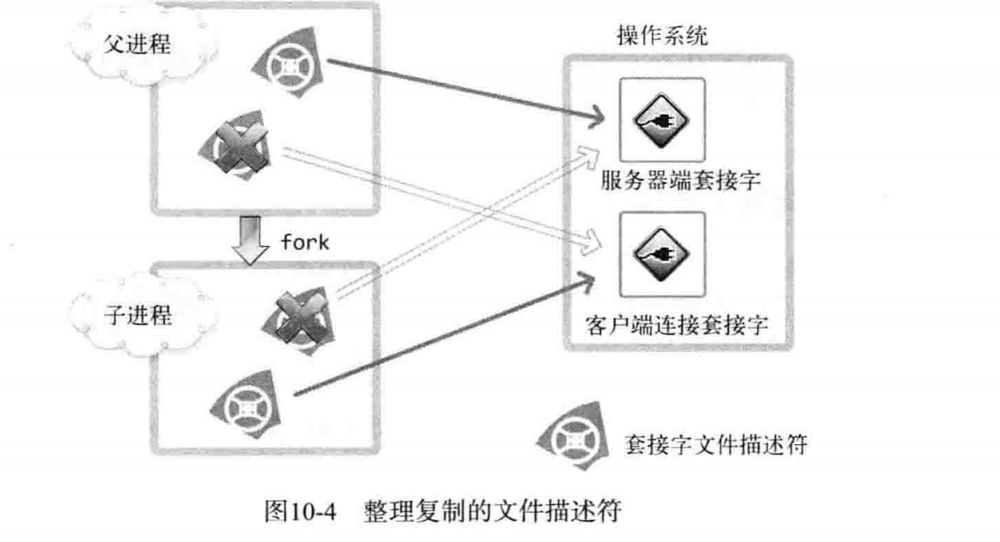

### 分割TCP的I/O程序

**优点：**通过创建多个进程，分割数据收发流程。另一个好处：可以提高频繁交换数据的程序性能

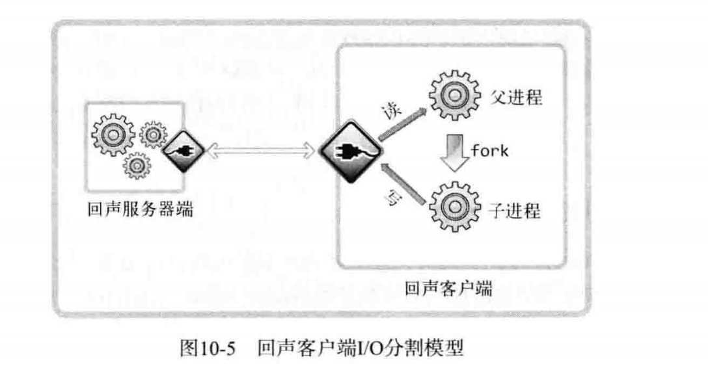

## 问题探讨

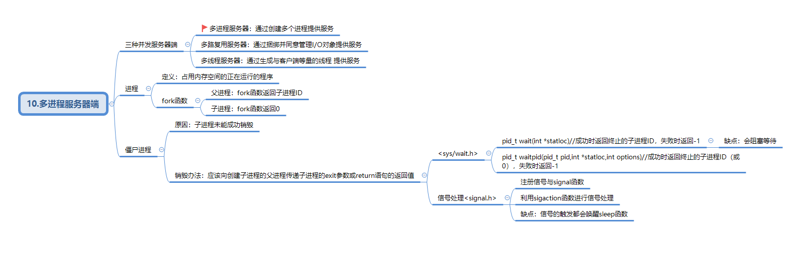

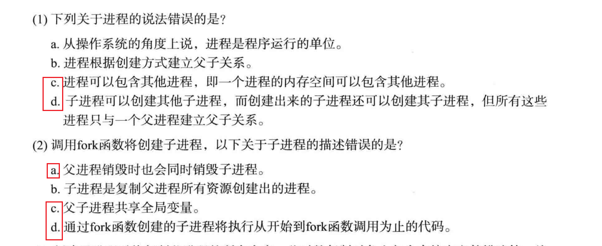

**请说明进程变为僵尸进程的过程及预防措施：**

> 在通过`fork`函数成功创建子进程以后，如果子进程任务执行完毕。那么会返回值给操作系统。直到返回值被其父进程接收为止，该（子）进程会一直作为僵尸进程存在。所以，为了防止这种情况的发生，父进程必须明确接收子进程结束时的返回值。
>
> **预防措施：**
>
> - wait和waitpid
> - sigaction函数


```c++
#include <stdio.h>
#include <stdlib.h>
#include <signal.h>

void ctrl_handler(int sig);

int main(int argc, char *argv[])
{
	struct sigaction act;
	act.sa_handler=ctrl_handler;
	sigemptyset(&act.sa_mask);
	act.sa_flags=0;
	sigaction(SIGINT, &act, 0);

	while(1)
	{
		sleep(1);
		puts("Have a nice day~");
	}

	return 0;
}


void ctrl_handler(int sig)
{
	char ex;
	fputs("Do you want exit(Y to exit)? ", stdout);
	scanf("%c", &ex);
	if(ex=='y' || ex=='Y')
		exit(1);
}
```

# 进程间通信

进程间通信指两个不同进程间可以交换数据，因此操作系统中应该提供两个进程可以同时访问的内存空间

**进程具有完全独立的内存结构，就连通过fork函数创建的子进程也不会与父进程共享内存空间。因此进程间通信只能通过其他特殊方法完成**

## 进程间通信方式1：通过管道实现进程间通信

两个进程通过操作系统提供的内存空间进行通信

```c++
#include <unistd.h>

int pipe(int filedes[2]); //成功时返回0，失败时返回-1
//filedes[0]通过管道接收数据时使用的文件描述符，即管道出口
//filedes[1]通过管道传输数据时使用的文件描述符，即管道入口

//pipe1.c
#include <stdio.h>
#include <unistd.h>
#define BUF_SIZE 30

int main(int argc, char* argv[])
{
 	int fds[2];
    char str[] = "who are you?";
    char buf[BUF_SIZE];
    pid_t pid;
    
    pipe(fds); //调用pipe函数创建管道，fds数组中保存用于I/O的文件描述符
    pid = fork();
    if(pid == 0)
    {
		write(fd[1], str, sizeof(str)); //管道入口，发送数据
    }
    else
    {
		read(fds[0], buf, BUF_SIZE);  //管道出口，接收数据
        puts(buf);
    }
    return 0;
}
```

### 通过管道进行进程间双向通信

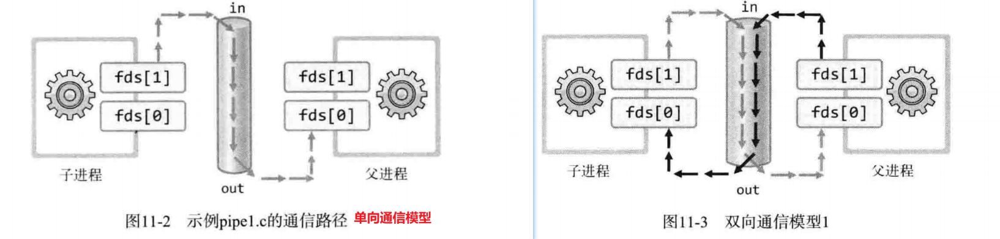

```c++
#include <stdio.h>
#include <unistd.h>
#define BUF_SIZE 30

int main(int argc, char* argv[])
{
 	int fds[2];
    char str1[] = "who are you?";
    char str2[] = "Thank you for your message";
    char buf[BUF_SIZE];
    pid_t pid;
    
    pipe(fds); //调用pipe函数创建管道，fds数组中保存用于I/O的文件描述符
    pid = fork();
    if(pid == 0)
    {
		write(fds[1], str1, sizeof(str1)); //管道入口，发送数据
        sleep(2); //注释掉之后会发生错误，因为数据进入管道之后会成为无主数据，也就是任何进程都可以将管道中的数据read出来。即子进程write之后也可以立即read自己所写数据
        read(fd[0], buf, BUF_SIZE);
        printf("Child proc output: %s \n", buf);
    }
    else
    {
		read(fds[0], buf, BUF_SIZE);  //管道出口，接收数据
        printf("Parent proc output: %s \n", buf);
        write(fds[1], str2, sizeof(str2)); //管道入口，发送数据
        sleep(3);
    }
    return 0;
}
```

> 通过一个管道进行双向通信会出现上述存在的问题。因此通常`创建两个管道来实现双向通信`

**双管道实现双向通信代码示例**

```c++
#include <stdio.h>
#include <unistd.h>
#define BUF_SIZE 30

int main(int argc, char* argv[])
{
 	int fds1[2], fds2[2];
    char str1[] = "who are you?";
    char str2[] = "I am the parent proc！";
    char buf[BUF_SIZE];
    pid_t pid;
    
    pipe(fds1); //调用pipe函数创建管道，fds数组中保存用于I/O的文件描述符
    pipe(fds2);
    pid = fork();
    if(pid == 0)
    {
		write(fds1[1], str1, sizeof(str1)); //管道入口，发送数据
        read(fds2[0], buf, BUF_SIZE);
        printf("Child proc output: %s \n", buf);
    }
    else
    {
		read(fds1[0], buf, BUF_SIZE);  //管道出口，接收数据
        printf("Parent proc output: %s \n", buf);
        write(fds2[1], str2, sizeof(str2)); //管道入口，发送数据
    }
    return 0;
}
```

## 问题探讨

1. 什么是进程间通信？分别从概念上和内存的角度进行说明

   > 进程间通信指的是两个不同进程间可以交换数据，
   >
   > 为了完成这一点，操作系统中应提供两个进程可以同时访问的内存空间

2. 进程间通信需要特殊的IPC机制，这是由操作系统提供的。进程间通信时，为何需要操作系统的帮助

   > 要想实现IPC机制，需要共享的内存，但由于两个进程之间不共享内存，因此需要操作系统的帮助，也就是说，两进程共享的内存空间必须由操作系统来提供

3. 为了完成进程间通信，2个进程需同时连接管道。那2个进程如何连接到同一管道？

   >  pipe函数通过输入参数返回管道的输入输出文件描述符。这个文件描述符在fork函数中复制到了其子进程，因此，父进程和子进程可以同时访问同一管道。

4. 管道允许进行2个进程间的双向通信。双向通信中需要注意哪些内容？

   > 管道并不管理进程间的数据通信。因此，如果数据流入管道，任何进程都可以读取数据。因此，`要合理安排共享空间的输入和读取`
   >
   > **更好的方法是通过两个管道实现双向通信**

# I/O复用

## 基于I/O复用的服务器端

**多进程服务器端的缺点和解决办法**

> 因为创建进程需要产生独立的内存空间，并且进程间也无法直接通信，只能通过管道通信。

**复用技术的优点**

1. 减少连线长度
2. 减少纸杯个数

**复用技术分类：**

1. 时分复用技术
2. 频分复用技术

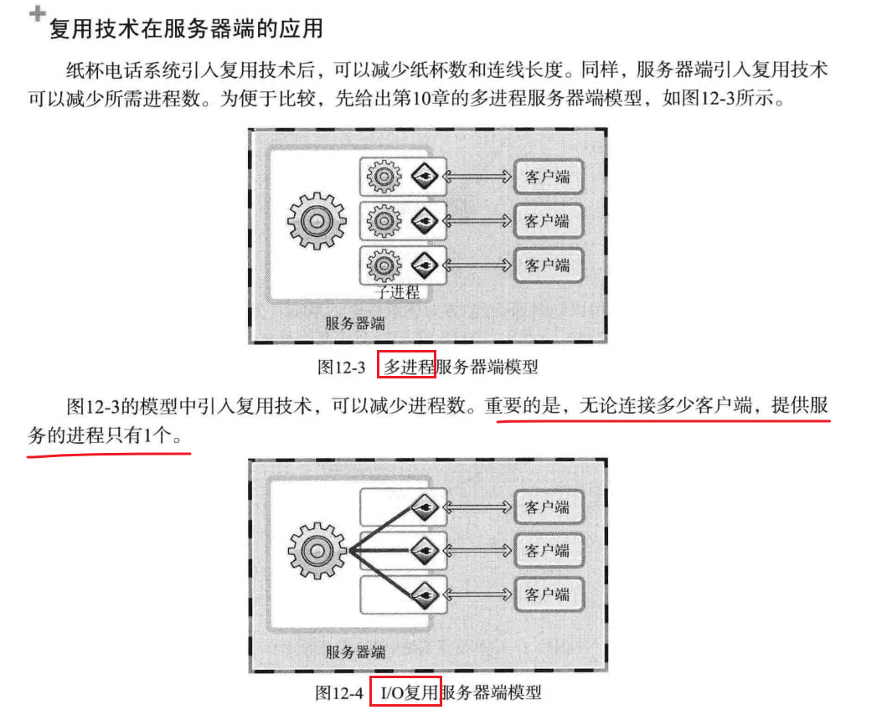

## 理解select函数并实现服务器端

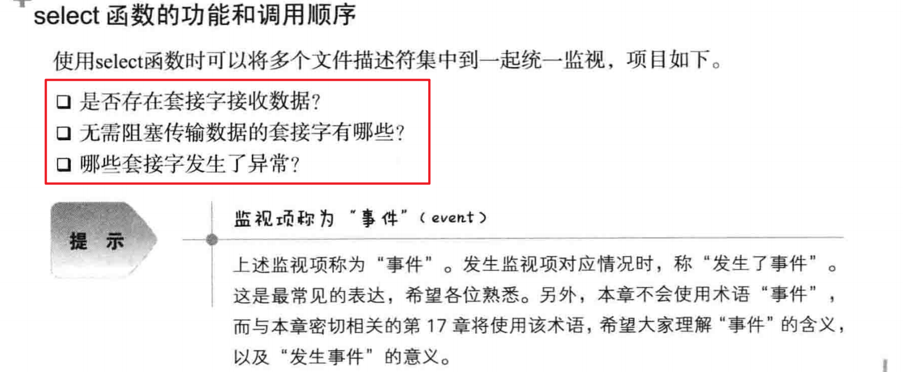

**select函数调用过程：**

1. 设置文件描述符
2. 指定监视范围
3. 设置超时
4. 调用select函数
5. 查看调用结果

### 设置文件描述符

使用`fd_set`可以将要监视的文件描述符集中到一起，并按照监视项（接收、传输、异常）分为三类

**在`fd_set`变量中注册或更改值的操作都是通过宏完成的**


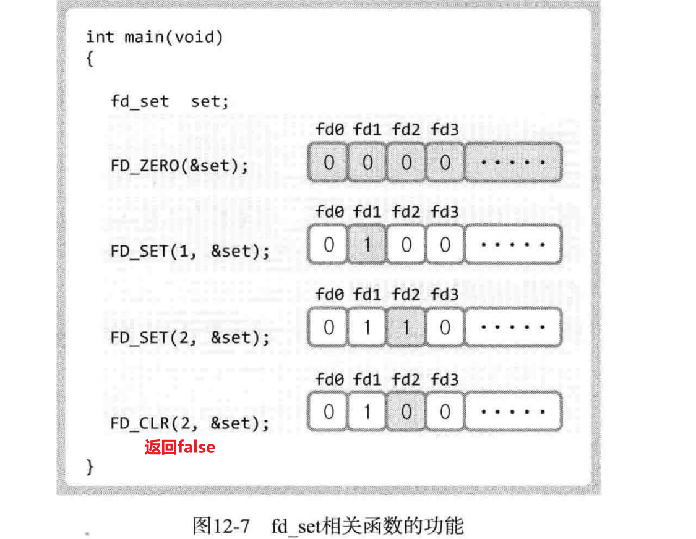

### 设置监视范围及超时

> select函数只有在监视的文件描述符发生变化时才返回，如果未发生变化，就会进入阻塞状态。
>
> 指定超时事件可以避免无限阻塞状态

```c
#include <sys/select.h>
#include <sys/time.h>

int select(int maxfd, fd_set* readset, fd_set* writeset, fd_set* exceptset, const struct timeval* timeout); //成功时返回大于0的值，失败时返回-1
/*
 maxfd: 监视对象文件描述符的数量（文件描述符的监视范围）
 readset:将所有关注“是否存在待读取数据”的文件描述符注册到fd_set型变量，并传递其地址值
 writeset: 将所有关注“是否可传输无阻塞数据”的文件描述符注册到fd_set型变量，并传递其地址值
 exceptset：将所有关注“是否发生异常”的文件描述符注册到fd_set型变量，并传递其地址值
 timeout：调用select函数后，为防止陷入无限阻塞的状态，传递超时（time-out）的信息。如果不想设置超时，则传递NULL参数
 返回值：发生错误返回-1，超时返回0，因发生关注的事件返回时，返回大于0的值，该值表示发生事件的文件描述符个数
*/

struct timeval
{
    long tv_sec; //seconds
    long tv_usec; //microseconds
}     
```

**文件描述符的变化：**

> 是指监视的文件描述符中发生了相应的监视事件，例如通过`select`的第二个参数传递的集合中存在需要读数据的描述符时，就意味着文件描述符发生了变化
>
> 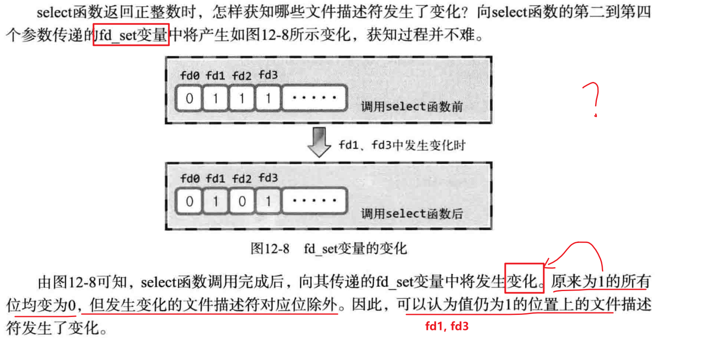

//select函数代码示例

```c++
#include <stdio.h>
#include <unistd.h>
#include <sys/time.h>
#include <sys/select.h>

#define BUF_SIZE 30

int main(int argc, char* argv[])
{
	fd_set reads, temps; //初始化fd_set变量
	int result, str_len;
	char buf[BUF_SIZE];
	
	struct timeval timeout;
	
	FD_ZERO(&reads);
	FD_SET(0, &reads); // 0 is standard input
	
	//timeout.tv_sec = 5;
	//timeout.tv_usec = 5000;
    //不能在此处设置超时，因为调用select函数后，结构体timeval的成员的值会被替换为超时前剩余时间。
	while(1)
	{
		temps = reads;	//将准备好的fd_set变量的内容复制到temps变量
        //因为调用select函数后，除发生变化的文件描述符对应位外，剩下的所有位都将初始化为0
        //因此为了记住初始值，必须经过这种复制过程。这也是select函数的通用方法
		timeout.tv_sec = 5;
		timeout.tv_usec = 0;
		result = select(1, &temps, 0, 0, &timeout);
		if(result == -1)
		{puts("select() error"); break;}	
		else if(result == 0) puts("time out!");
		else
		{
			if(FD_ISSET(0, &temps))
			{

				str_len = read(0, buf, BUF_SIZE);
				buf[str_len] = 0;
				printf("message from console: %s", buf);
			}
		}
	}
	return 0;
}          
```

## 基于I/O复用的回声服务端

**代码示例**

```c
#include <stdio.h>
#include <sys/socket.h>
#include <unistd.h>
#include <arpa/inet.h>
#include <stdlib.h>
#include <string.h>
#include <sys/time.h>
#include <sys/select.h>

#define BUF_SIZE 100
void error_handling(char* buf);

int main(int argc, char* argv[])
{
	int serv_sock, clnt_sock; //服务器端和客户端套接字
	struct sockaddr_in serv_adr, clnt_adr; //套接字地址
	struct timeval timeout;
	fd_set reads, cpy_reads; //cpy_reads应该始终定义来保存初始状态
	
	socklen_t adr_sz;
	int fd_max, str_len, fd_num, i;
	
	char buf[BUF_SIZE];
	if(argc != 2){
		printf("Usage: %s <port> \n", argv[0]);
		exit(1);
	}
	serv_sock = socket(PF_INET, SOCK_STREAM, 0); //服务器端套接字
	memset(&serv_adr, 0, sizeof(serv_adr));
	serv_adr.sin_family = AF_INET;
	serv_adr.sin_addr.s_addr = htonl(INADDR_ANY);
	serv_adr.sin_port = htons(atoi(argv[1]));
	
	if(bind(serv_sock, (struct sockaddr*)& serv_adr, sizeof(serv_adr)) == -1)
		error_handling("Bind() error");
	
	if(listen(serv_sock, 5) == -1)
		error_handling("Listen() error");
	//设置初始监控范围	
	FD_ZERO(&reads);
	FD_SET(serv_sock, &reads); //监听serv_sock的状态
	fd_max = serv_sock;

	while(1)
	{
		cpy_reads = reads;
		timeout.tv_sec = 5;
		timeout.tv_usec = 5000;
		
		if((fd_num = select(fd_max+1, &cpy_reads, 0, 0, &timeout)) == -1)
			break;
		if(fd_num == 0) continue; //监听超时
		for(i = 0; i < fd_max + 1; i++)
		{
			if(FD_ISSET(i, &cpy_reads)) //读取对应文件描述符的状态
			{
				if(i == serv_sock) //connection request
				{
					adr_sz = sizeof(clnt_adr);
					clnt_sock = accept(serv_sock, (struct sockaddr*)&clnt_adr, &adr_sz);
					FD_SET(clnt_sock, &reads);
					if(fd_max < clnt_sock) fd_max = clnt_sock; //这里保证fd_set不会冲突
					printf("connected client: %d \n", clnt_sock);
				}
				else
				{
					str_len = read(i, buf, BUF_SIZE);
					if(str_len == 0) //close request
					{
						FD_CLR(i, &reads);
						close(i);
						printf("closed client: %d \n", i);
					}
					else
					{
						write(i, buf, str_len); //echo!
					}
				}
			}
		}
	}	
	close(serv_sock);
	return 0;
}

void error_handling(char *buf)
{
	fputs(buf, stderr);
	fputc('\n', stderr);
	exit(1);
}
```

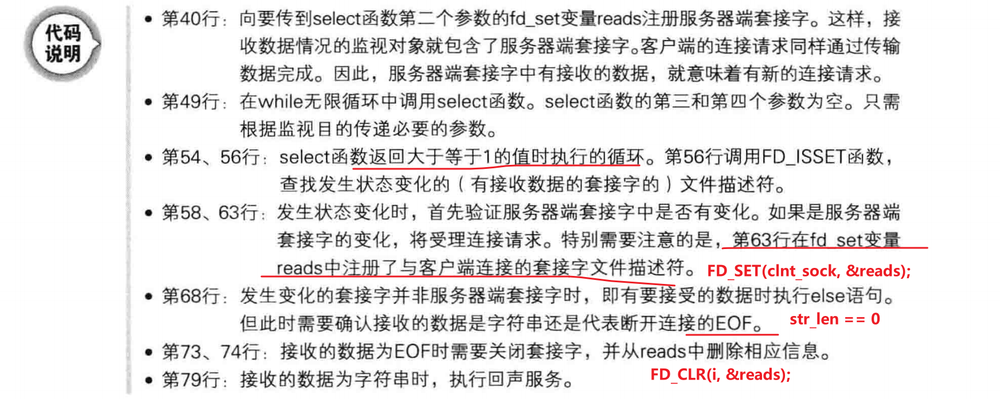


## 问题探究

1. 关于`fd_set`

   > fd_set数组变量，用来表示文件描述符的监视状态。如果对应位为1，那么则表示该文件描述符时监视对象

2. 请解释复用技术的通用含义，并说明何为I/O复用

   > 复用技术指为了提高物理设备的效率，用最少的物理要素传递最多数据时使用的技术。同样，I/O复用是指将需要I/O的套接字捆绑在一起，利用最少限度的资源来收发数据的技术

3. 多进程并发服务器的缺点有哪些？如何在I/O复用服务器端中弥补？

   > 多进程并发服务器的服务方式是，每当客户端提出连接要求时，就会追加生成进程。但构建进程是一项非常有负担的工作，因此，向众多客户端提供服务存在一定的局限性。并且进程间通信，也比较困难。需要通过管道等方式
   >
   > 而复用服务器则是将套接字的文件描述符捆绑在一起管理的方式，因此可以一个进程管理所有的I/O操作

4. select函数的观察对象中应包含服务器端套接字（监听套接字），那么应将其包含到哪一类监听对象集合？

   > 服务器套接字的作用是监听有无连接请求，即判断接收的连接请求是否存在？应该将其包含到“读”类监听对象的集合中

# 多种I/O函数

1. read()和write()
2. send()与recv()
3. readv()和writev()

## linux中的send和recv函数

```c
#include <sys/socket.h>
//和write相比，多了个可选项信息
ssize_t send(int sockfd, const void* buf, size_t nbytes, int flags);//成功时返回发送的字节数，失败时返回-1
/*
sockfd：表示与数据传输对象相连接的套接字文件描述符
buf：保存待传输数据的缓冲地址值
nbytes：待传输的字节数
flags：传输数据时指定的可选项信息
*/

ssize_t recv(int sockfd, void *buf, size_t nbytes, int flags); //成功时返回接收到的字节数（收到EOF返回0）失败时返回-1

//示例
str_len = recv(recv_sock, buf, sizeof(buf) - 1, 0); //因为C风格字符串末尾有个'\0'
buf[str_len] = 0; //又添上末尾的0
```

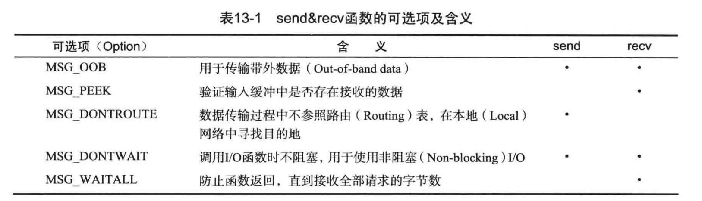

### MSG_OOB：发送紧急消息

`MSG_OOB`可选项可用于创建特殊发送方法和通道以发送紧急消息。

```c
write(sock, "123", strlen("123"));
send(sock, "4", strlen("4"), MSG_OOB); //调用send函数时指定MSG_OOB可选项即可

//MSG_OOB的消息接收:当收到MSG_OOB紧急消息时，操作系统将产生SIGURG信号
void urg_handler(int signo)
{
    int str_len;
    char buf[BUF_SIZE];
    str_len = recv(recv_sock, buf, sizeof(buf)-1, MSG_OOB);
    buf[str_len] = 0;
    printf("Urgent Message: %s \n", buf);
}

struct sigaction act; //注册紧急信号处理函数
act.sa_handler = urg_handler;
sigemptyset(&act.sa_mask);
act.sa_flags = 0;

state = sigaction(SIGURG, &act, 0); //检测是否有MSG_OOB
```

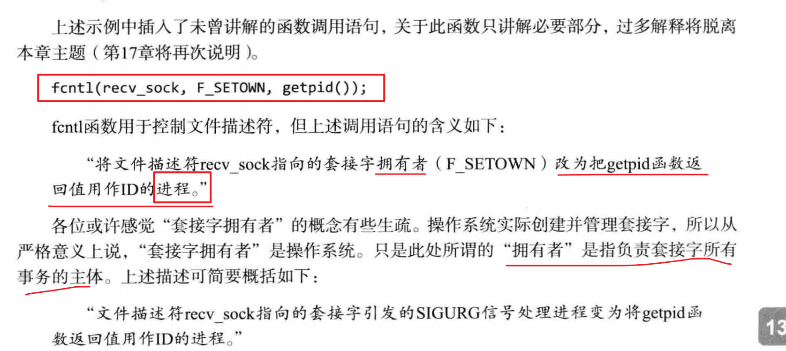

> 处理SIGURG信号时必须指定处理信号的进程，通过getpid函数返回调用次函数的进程ID

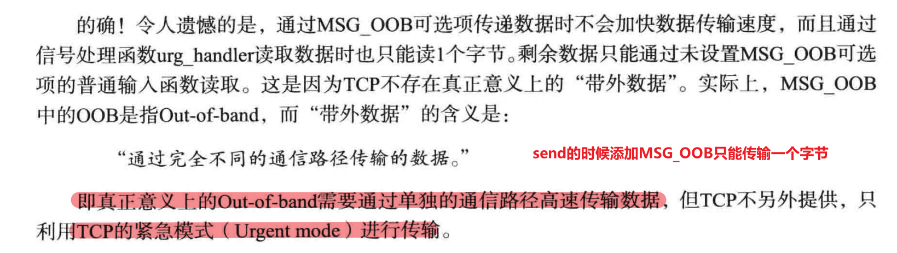

### TCP紧急模式

`MSG_OOB`的真正意义在于督促数据接受对象尽快处理数据。但TCP的“保持传输顺序”的特性依然成立

指定`MSG_OOB`选项的数据包本身就是紧急数据包，并通过紧急指针表示紧急消息所在位置

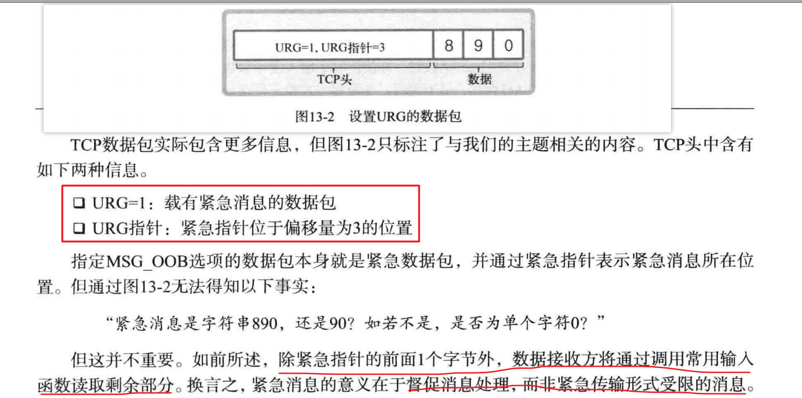

### 检查输入缓冲

**通过同时设置`MSG_PEEK`和`MSG_DONTWAIT`选项，来验证输入缓冲中是否存在接收的数据**

- 设置了MSG_PEEK的recv函数，会读取输入缓冲数据，但不会删除输入缓冲数据

**PEEK收发验证代码示例：**

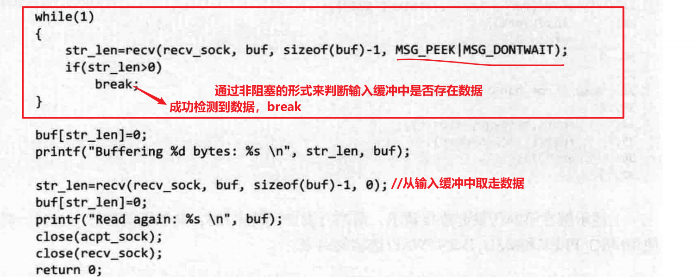

## readv和writev函数

```c
//可以通过readv和writev函数调用来减少I/O函数的调用次数
#include <sys/uio.h>
struct iovec
{
    void* iov_base; //缓冲地址
    size_t iov_len; //缓冲大小
}

ssize_t writev(int filedes, const struct iovec* iov, int iovcnt);//成功时返回发送的字节数，失败时返回-1
/*
filedes:表示数据传输对象的套接字文件描述符。也可以像read函数一样向其传递文件或标准输出描述符
iov:iovec结构体数组的地址，包含待发送数据的位置和大小信息
iovcnt:向第二参数传递的数组长度
*/

ssize_t readv(int filedes, const struct iovec* iov, int iovcnt); //成功时返回接受的字节数，失败时返回-1
```

> **文件描述符:**
>
> - 1：向控制台输出数据
> - 0：获取控制台输入数据

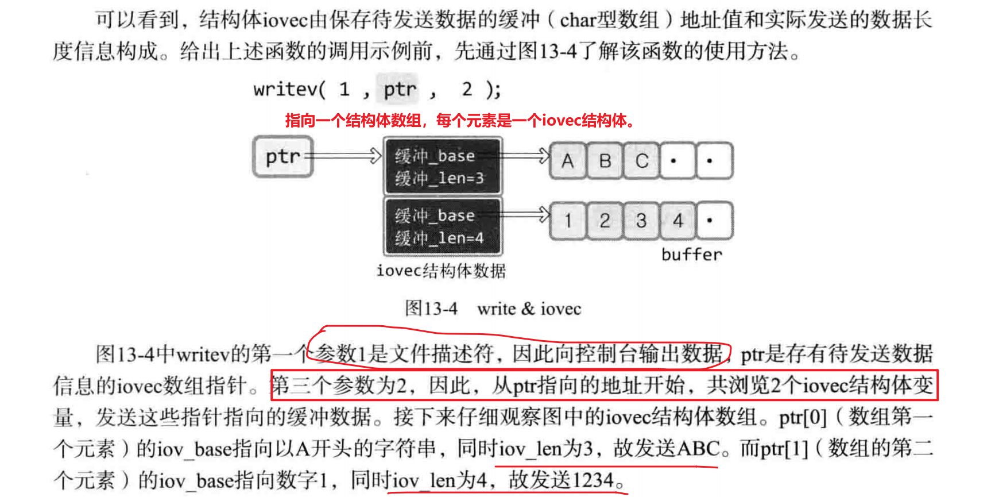

## 问题探讨

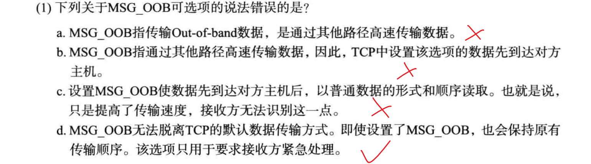

2. 利用readv和writev函数收发数据有何优点？分别从函数调用次数和I/O缓冲的角度给出说明

   > 通过readv和writev来收发数据，可以减少函数调用次数。并且可以将不同缓冲（数组）中的数据同时进行收发。
   >
   > 此外，还可以根据需要，将缓冲中的数据进行分段读取

3. 通过recv函数验证输入缓冲是否存在数据时（确认后立即返回），如何设置recv函数最后一个参数中的可选项？并说明其他可选项的意义

   > 
   >
   > **通常将MSG_PEEK和MSG_DONTWAIT一起使用，用来检测缓冲中的是否存在数据**

# 多播和广播

## 多播的数据传输方式及流量方面的优点

**数据特点**

- 多播服务器端针对特定多播组，只发送一次数据
- 即使只发送一次数据，但该组内的所有客户端都会接收数据
- 多播组数可在IP地址范围内任意增加
- 加入特定组即可接收发往该多播组的数据
- **多播组是D类IP地址**

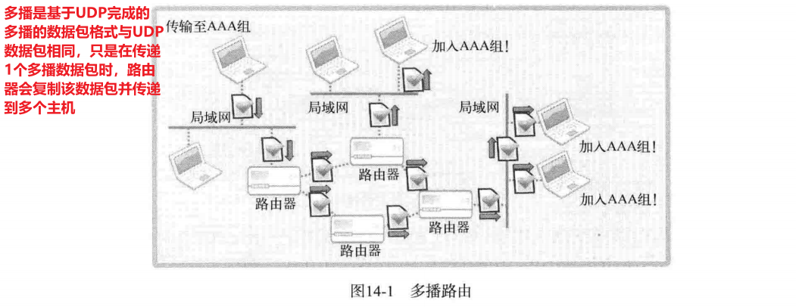

> **多播的作用：**多播并没有减少网络上的数据包个数。但是能够减少发送次数。其他的文件由路由器负责复制并传递到对应的主机。
>
> 但不是所有路由器都支持多播，对于不支持多播的路由器，可以使用`隧道技术`完成多播通信

### 路由（routing）和TTL（Time to Live，生存时间）以及加入组的方法

> TTL是决定“数据包传输距离“的主要因素。TTL用整数表示，并且没经过一个路由器就减1；当TTL变为0时，该数据包无法再被传递，只能销毁。
>
> **TTL的值设置的过大将影响网络流量，过小则会导致无法传递到目标主机**

**TTL设置代码示例：**

```c
int send_sock;
int time_live = 64;

//设置TTL
send_sock = socket(PF_INET, SOCK_DGRAM, 0); //采用UDP协议
setsockopt(send_sock, IPPROTO_IP, IP_MULTICAST_TTL, (void*)&time_live, sizeof(time_live)); //相关协议层为IPPROTO_IP，协议参数为IP_MULTICAST_TTL

//加入多播组
int recv_sock;
struct ip_mreq join_adr; 

recv_sock = socket(PF_INET, SOCK_DGRAM, 0);

join_adr.imr_multiaddr.s_addr  = "多播组地址信息";
join_adr.imr_interface.s_addr = "加入多播组的主机地址信息";
setsockopt(recv_sock, IPPROTO_IP, IP_ADD_MEMBERSHIP, (void*)&join_adr, sizeof(join_adr));

//关于结构体ip_mreq
struct ip_mreq
{
    struct in_addr imr_multiaddr; //写入加入的组IP地址
    struct in_addr imr_interface; //加入该组的套接字所属主机的IP地址，也可以使用INADDR_ANY
}

struct in_addr{
    In_addr_t s_addr; //32位IPv4地址
};
```

> `INADDR_ANY:如果bind绑定的是INADDR_ANY，即表示所有发送到服务器的这个端口，
> 不管是哪个网卡/哪个IP地址接收到的数据，都由这个服务端进程进行处理。`

## 实现多播Sender和Receiver

多播中用发送者和接受者替代服务器端和客户端。

```c
//sender.c
#include <stdio.h>
#include <stdlib.h>
#include <string.h>
#include <unistd.h>
#include <arpa/inet.h>
#include <sys/socket.h>

#define TTL 64
#define BUF_SIZE 30

void error_handling(char* message);

int main(int argc, char* argv[])
{
	int send_sock;
	struct sockaddr_in mul_adr;
	int time_live = TTL;
	FILE* fp;
	char buf[BUF_SIZE];
	
	if(argc != 3) //接受三个参数。因为不像服务端可以指定IP地址为INADDR_ANY
	{
		printf("Usage: %s <GroupIP> <PORT>\n", argv[0]);
		exit(1);
	}
	
	send_sock = socket(PF_INET, SOCK_DGRAM, 0); //使用UDP协议
	memset(&mul_adr, 0, sizeof(mul_adr));
	mul_adr.sin_family = AF_INET;
	mul_adr.sin_addr.s_addr = inet_addr(argv[1]); //multicast IP
	mul_adr.sin_port = htons(atoi(argv[2])); //Port

	setsockopt(send_sock, IPPROTO_IP, IP_MULTICAST_TTL, (void*)&time_live, sizeof(time_live)); //设置TTL
	
	if((fp = fopen("news.txt", "r")) == NULL) 
		error_handling("fopen() error");
	while(!feof(fp)) //Broadcasting
	{
		fgets(buf, BUF_SIZE, fp);
		sendto(send_sock, buf, strlen(buf), 0, (struct sockaddr*)&mul_adr, sizeof(mul_adr)); //因为是通过UDP套接字传输数据，因此使用sendto函数。
        //send(clnt_sock, buf, sizeof(buf));
        //write(clnt_sock, buf, str_len ); tcp的write不需要提供IP地址等
		sleep(2);
	}	
	fclose(fp); //关闭打开的文件
	close(send_sock);
	return 0;
}

void error_handling(char* message)
{
	fputs(message, stderr);
	fputc('\n', stderr);
	exit(1);
}


//receiver.c
#include <stdio.h>
#include <stdlib.h>
#include <string.h>
#include <unistd.h>
#include <arpa/inet.h>
#include <sys/socket.h>

#define BUF_SIZE 30
void error_handling(char* message);

int main(int argc, char* argv[])
{
	int recv_sock;
	int str_len;
	char buf[BUF_SIZE];
	struct sockaddr_in adr;
	
	struct ip_mreq join_adr;
	if(argc !=3 )
	{
		printf("Usage: %s <GroupIP> <PORT>\n", argv[0]);
		exit(1);
	}
	
	recv_sock = socket(PF_INET, SOCK_DGRAM, 0);
	memset(&adr, 0, sizeof(adr));
	adr.sin_family = AF_INET; //IPv4地址
	adr.sin_addr.s_addr = htonl(INADDR_ANY); //设定主机的任一IP都可以接受
	adr.sin_port = htons(atoi(argv[2])); //设置主机的端口号
	
	if(bind(recv_sock, (struct sockaddr*)&adr, sizeof(adr)) == -1)
		error_handling("bind() error"); //创建有链接的UDP
	
	join_adr.imr_multiaddr.s_addr = inet_addr(argv[1]);
	join_adr.imr_interface.s_addr = htonl(INADDR_ANY); //设定多播组的地址以及待加入多播组的IP地址
	
	setsockopt(recv_sock, IPPROTO_IP, IP_ADD_MEMBERSHIP, (void*)&join_adr, sizeof(join_adr));
	while(1)
	{
		str_len = recvfrom(recv_sock, buf, BUF_SIZE - 1, 0, NULL, 0);
		if(str_len < 0) break;
		buf[str_len] = 0;
		fputs(buf, stdout);
	}	
	
	close(recv_sock);
	return 0;
}

void error_handling(char* message)
{
	fputs(message, stderr);
	fputc('\n', stderr);
	exit(1);
}
```

> **代码分析：**
>
> 1. 要求sender和receiver的传入参数一致。即sender要给定传递给的多播组IP地址，而receiver需要设置需要加入的多播组IP地址。
>
> **TCP和UDP的数据传输**
>
> 1. UDP套接字发送数据是采用`sendto()`，因为没有建立连接，所以需要加上接收方的IP地址，端口号等信息
>
> 2. TCP可以通过`read/write, send()/recv()以及writev/readv`

## 广播

**广播vs多播：**多播即使在跨越不同网络的情况下，只要加入多播组就能接收数据。相反，广播只能在同一网络中的主机传输数据

### 广播的理解及实现方法

广播是向同一网络中的所有主机传输数据的方法，也是基于UDP完成的。

根据传输数据时使用的IP地址形式，广播可分为

1. 直接广播
2. 本地广播

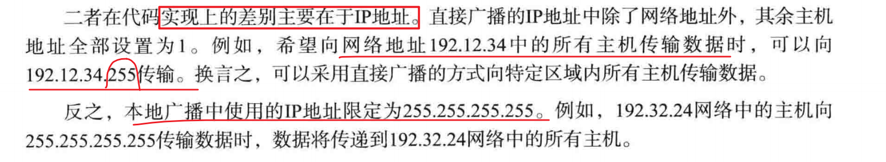

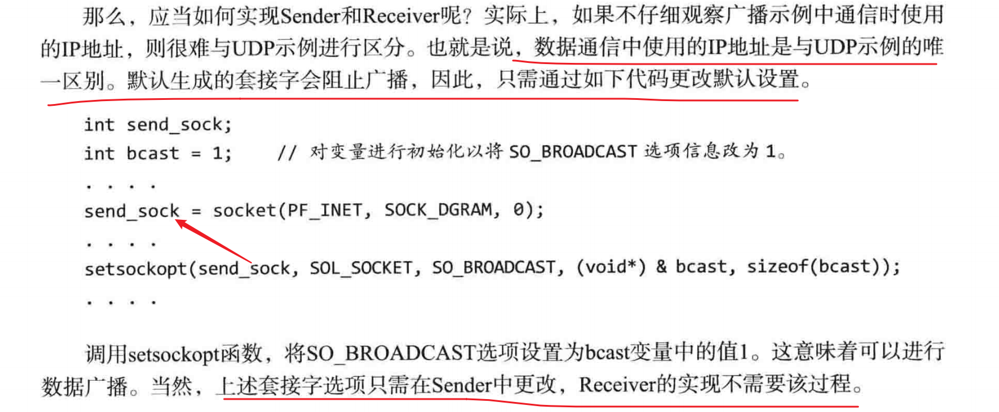

```c
//sender.c
#include <stdio.h>
#include <stdlib.h>
#include <string.h>
#include <unistd.h>
#include <arpa/inet.h>
#include <sys/socket.h>

#define TTL 64 //因为没有经过理由转发就不需要TTL
#define BUF_SIZE 30

void error_handling(char* message);

int main(int argc, char* argv[])
{
	int send_sock;
	struct sockaddr_in broad_adr;
    int brd_tag = 1;
	int time_live = TTL;
	FILE* fp;
	char buf[BUF_SIZE];
	
	if(argc != 3) //接受三个参数。因为不像服务端可以指定IP地址为INADDR_ANY
	{
		printf("Usage: %s <GroupIP> <PORT>\n", argv[0]);
		exit(1);
	}
	
	send_sock = socket(PF_INET, SOCK_DGRAM, 0); //使用UDP协议
	memset(&broad_adr, 0, sizeof(broad_adr));
	broad_adr.sin_family = AF_INET;
	broad_adr.sin_addr.s_addr = inet_addr(argv[1]); //broadcast IP
	broad_adr.sin_port = htons(atoi(argv[2])); //Port
    
    setsockopt(send_sock, SOL_SOCKET, SO_BROADCAST, (void*)&brd_tag, sizeof(brd_tag));//但是需要打开广播
	//setsockopt(send_sock, IPPROTO_IP, IP_MULTICAST_TTL, (void*)&time_live, sizeof(time_live)); //不需要设置TTL
	
	if((fp = fopen("news.txt", "r")) == NULL) 
		error_handling("fopen() error");
	while(!feof(fp)) //Broadcasting
	{
		fgets(buf, BUF_SIZE, fp);
		sendto(send_sock, buf, strlen(buf), 0, (struct sockaddr*)&broad_adr, sizeof(broad_adr)); //因为是通过UDP套接字传输数据，因此使用sendto函数。
        //send(clnt_sock, buf, sizeof(buf));
        //write(clnt_sock, buf, str_len ); tcp的write不需要提供IP地址等
		sleep(2);
	}	
	fclose(fp); //关闭打开的文件
	close(send_sock);
	return 0;
}

void error_handling(char* message)
{
	fputs(message, stderr);
	fputc('\n', stderr);
	exit(1);
}


//receiver.c
#include <stdio.h>
#include <stdlib.h>
#include <string.h>
#include <unistd.h>
#include <arpa/inet.h>
#include <sys/socket.h>

#define BUF_SIZE 30
void error_handling(char* message);

int main(int argc, char* argv[])
{
	int recv_sock;
	int str_len;
	char buf[BUF_SIZE];
	struct sockaddr_in adr;
	
	if(argc != 2 )
	{
		printf("Usage: %s <PORT>\n", argv[0]);
		exit(1);
	}
	
	recv_sock = socket(PF_INET, SOCK_DGRAM, 0);
	memset(&adr, 0, sizeof(adr));
	adr.sin_family = AF_INET; //IPv4地址
	adr.sin_addr.s_addr = htonl(INADDR_ANY); //设定主机的任一IP都可以接受
	adr.sin_port = htons(atoi(argv[1])); //设置主机的端口号
	
	if(bind(recv_sock, (struct sockaddr*)&adr, sizeof(adr)) == -1)
		error_handling("bind() error"); //创建有链接的UDP
		
	//setsockopt(recv_sock, IPPROTO_IP, IP_ADD_MEMBERSHIP, (void*)&join_adr, sizeof(join_adr)); //不需要加入多播组
	while(1)
	{
		str_len = recvfrom(recv_sock, buf, BUF_SIZE - 1, 0, NULL, 0);
		if(str_len < 0) break;
		buf[str_len] = 0;
		fputs(buf, stdout);
	}	
	
	close(recv_sock);
	return 0;
}

void error_handling(char* message)
{
	fputs(message, stderr);
	fputc('\n', stderr);
	exit(1);
}
```

**代码运行结果：**

1. 本地广播 `./broadsender 255.255.255.255 9191`

2. 直接广播`./broadsender 172.30.15.255 9191`

   > 这里的直接广播地址是通过ifconfig得到的
   >
   > 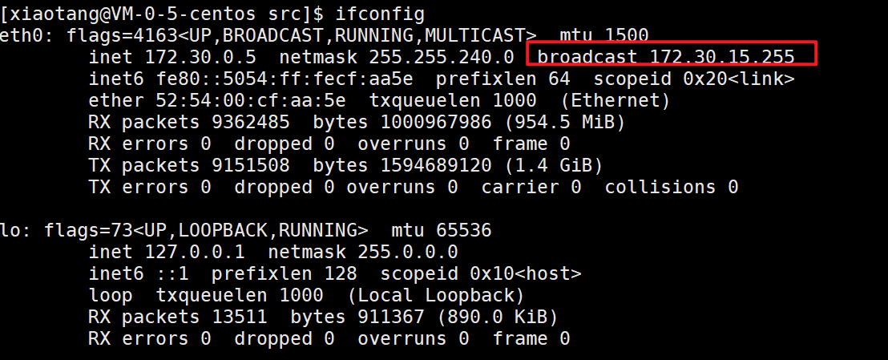

## 问题探讨

1. TTL的含义是什么？请从路由器的角度说明较大的TTL值与较小的TTL值之间的区别及问题

   > TTL指的是数据包生存周期，决定数据包的传输距离。当数据包经过一个一个路由器转发会TTL减1，当TTL等于0时则销毁数据包
   >
   > 在数据传输过程中，过大的TTL值会导致网络中数据包数量增加，可能会造成网路阻塞
   >
   > 而较小的TTL值又可能会导致数据包无法到达目的主机

2. 多播和广播的异同点是什么？

   > 多播和广播的相同点是，两者都是以UDP形式传输数据。一次传输数据，可以向两个以上主机传送数据。但传送的范围是不同的：广播是对局域网的广播；而多播是对网络注册机器的多播

3. 多播也对网络流量有利，请比较TCP数据交换方式解释其原因。

   > 多播数据在路由器进行复制。因此，即使主机数量很多，如果各主机存在的相同路径，也可以通过一次数据传输到多台主机上。但TCP无论路径如何，都要根据主机数量进行数据传输。

# 套接字和标准I/O

## 使用标准I/O函数的两个优点

1. 标准I/O函数具有良好的移植性

2. 标准I/O函数可以利用缓冲提高性能

   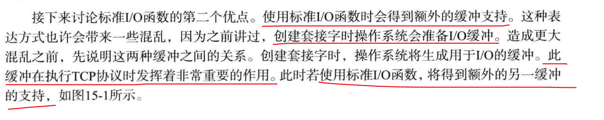

   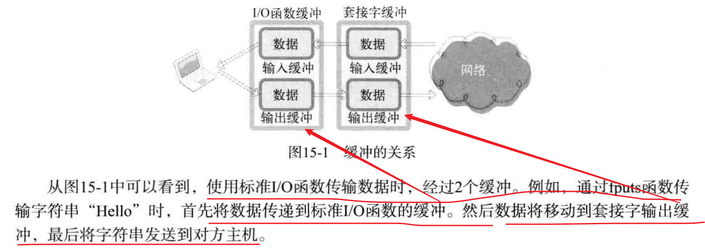

   **设置缓冲的用途：**

   1. 设置缓冲的主要目的是为了提高性能（针对标准I/O函数缓冲而言）

      > 标准I/O函数为了提高性能，内部提供额外的缓冲。因此，若不调用`fflush`函数则无法保证立即将数据传输到客户端
      >
      > ```c
      > while(!feof(readfp))
      > {
      >     fgets(message, BUF_SIZE, readfp);
      >     fputs(message, writefp);
      >     fflush(writefp);
      > }
      > ```

   2. 套接字的缓冲主要是为了TCP协议而设立的，为的是能够实现再次重传。因此，在套接字的输出缓冲中保存了已经发送的数据

   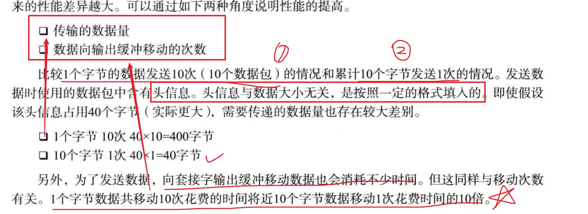

### 标准I/O函数的几个缺点

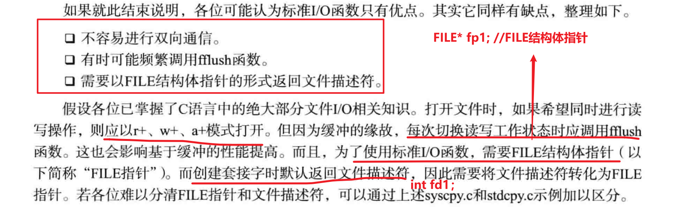

### 使用标准I/O函数

对于创建套接字时返回的文件描述符`fd`，需要通过`fdopen()`函数将其转换为`FILE结构体指针`才能使用标准I/O函数

```c
#include <stdio.h>

FILE* fdopen(int fildes, const char* mode); //成功时返回转换的FILE结构体指针，失败时返回NULL
//fildes: 需要转换的文件描述符
//mode：将要创建的FILE结构体指针的模式信息
// 1. "r"读模式
// 2. "w"写模式

//fdopen代码示例
#include <stdio.h>
#include <fcntl.h>

int main(void)
{
    FILE *fp;
    int fd = open("data.dat", O_WRONLY | O_CREAT | O_TRUNC); //创建文件描述符
    if(fd == -1)
    {
        fputs("file open error", stdout);
        return -1;
    }
  	fp = fdopen(fd, "w"); //将文件描述符fd通过fdopen转换为FILE*,并且打开模式为w
    fputs("Network C progamming \n", fp); //通过标准I/O的fputs写入字符串"Network C programming"
    	
    fclose(fp);
    
    return 0;
}
```

**利用fileno函数转换为文件描述符**

```c
#include <stdio.h>

int fileno(FILE* stream); //成功时返回转换后的文件描述符，失败时返回-1
```

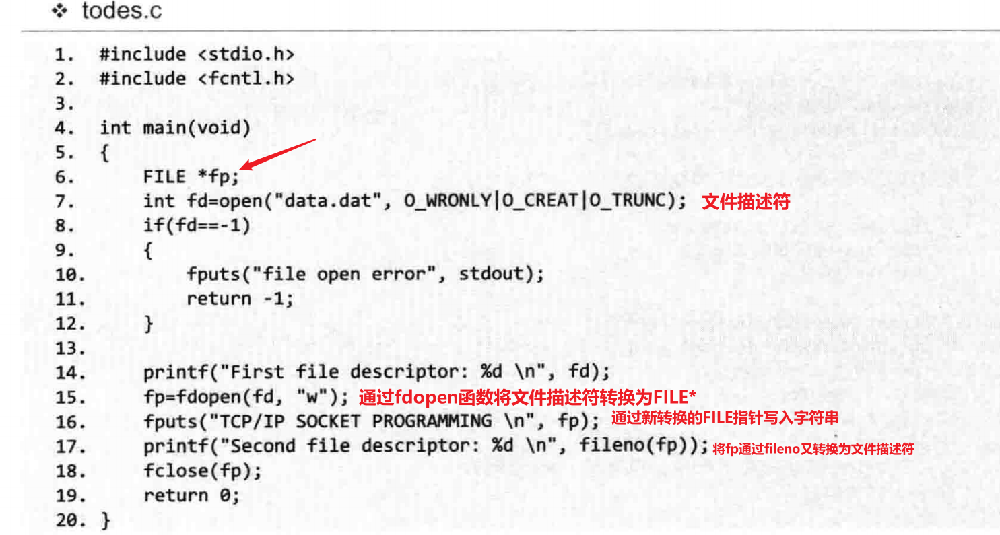

## 基于套接字的标准I/O函数使用

在第四章的基础上，将文件描述符通过`fdopen`函数转为`FILE*`并使用标准I/O函数

**1. echo_server.c的两种实现方式**

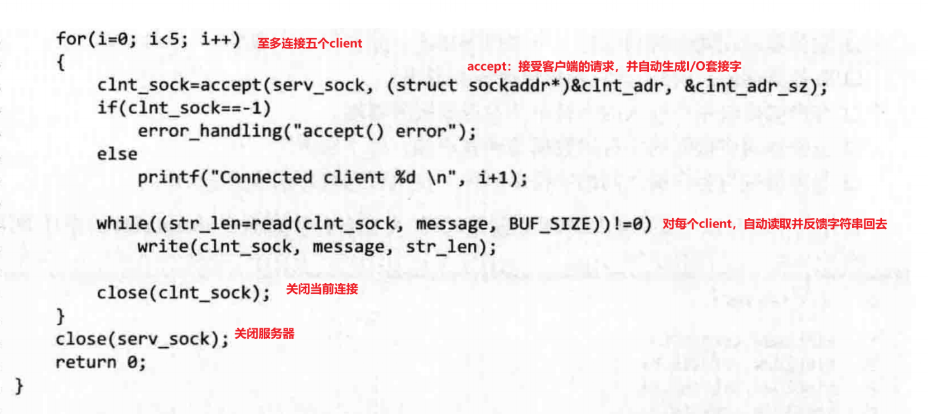

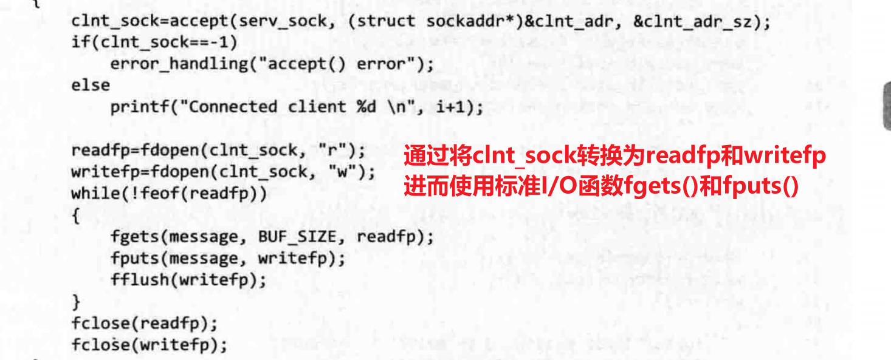

> 标准I/O函数为了提高性能，内部提供额外的缓冲。因此，若不调用`fflush`函数则无法保证立即将数据传输到客户端

**2. echo_client.c的两种实现方式**

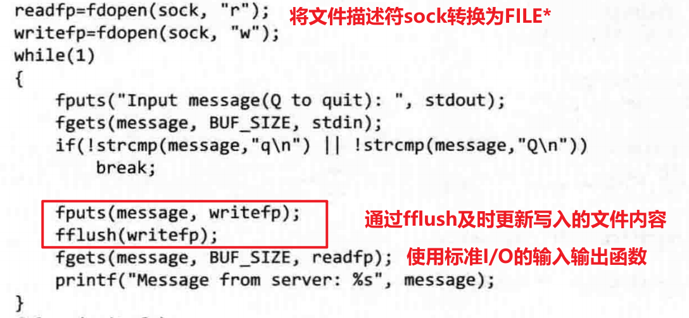

## 问题探讨

1. 标准I/O函数的两个优点？为什么具有这两个优点

   - 基于ANSIX标准具有良好的一致性
   - 可以利用缓冲提高性能

2. 标准IO中，“调用fputs函数传输数据时，调用后应立即开始发送！”，为何这种想法是错误的？为了达到这种效果应添加哪些处理过程？

   > 通过标准输出函数的传输的数据不直接通过套接字的输出缓冲区发送，而是保存在标准输出函数的缓冲中，然后再用`fflush`函数进行输出。因此，即使调用`fputs`函数，也不能立即发送数据。如果想保障数据传输的时效性，必须经过`fflush`函数的调用过程

# 关于I/O流分离的其他内容

## 分离I/O

**流：**指数据流动，但通常可以比喻为“以数据收发为目的的一种桥梁“

**分离I/O的两种方法：**

1. 通过创建多个进程，分割数据收发流程。另一个好处：可以提高频繁交换数据的程序性能

   

   **目的：**

   - 通过分开输入过程和输出过程降低实现难度
   - 与输入无关的输出操作可以提高速度

2. 通过对`fdopen`函数的调用，创建读模式和写模式的FILE指针，即分离了输入工具和输出工具

   **目的：**

   - 为了将FILE指针按照读模式和写模式加以区分
   - 可以通过区分读写模式降低实现难度
   - **通过区分I/O缓冲提高缓冲性能**

> **流分离带来的EOF问题：** 参考第七章：优雅地断开套接字连接中提到的`半关闭:shutdown(sock, SHUT_WR)`
>
> 但是对于`FILE指针`的输出模式

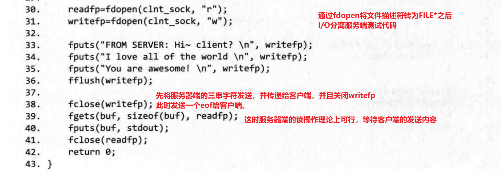

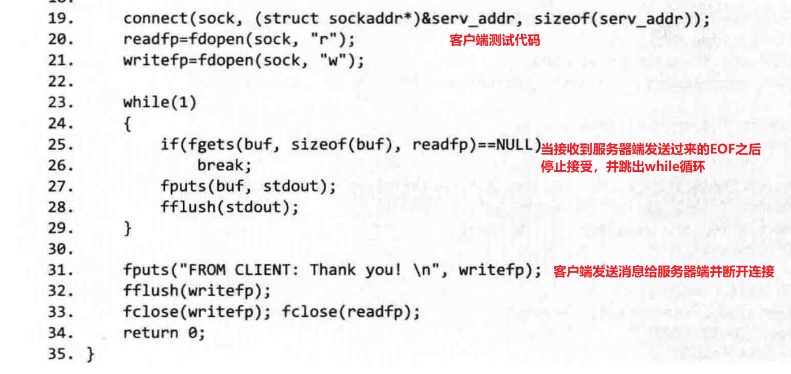

> 在上述代码中，当服务器端关闭输出缓冲writefp的时候，这时候，`套接字创建的tcp连接已经关闭。而不是半关闭`
>
> 因此，本章需要实现**文件描述符的复制和半关闭**，`即针对fdopen函数调用时生成的FILE指针进行半关闭操作`

## 文件描述符的复制和半关闭

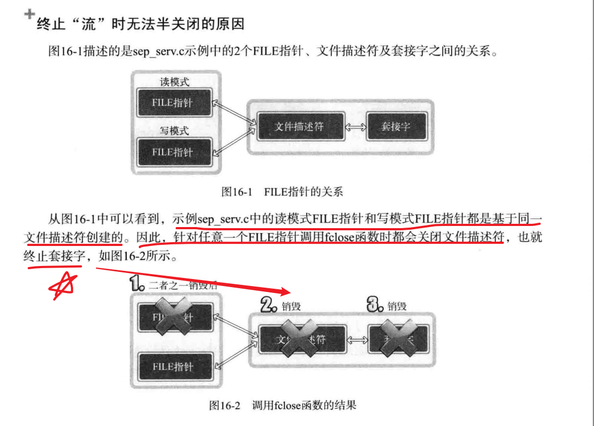

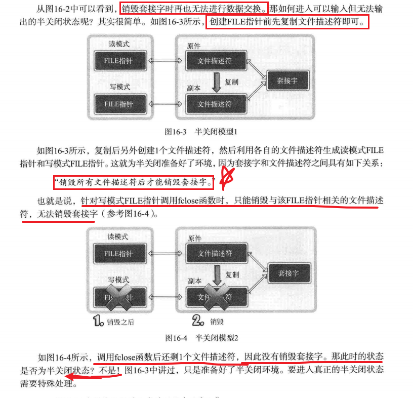

### 复制文件描述符

这里的文件描述符的复制与fork函数中进行的复制有所区别，调用fork函数时将复制整个进程。因此同一进程内不能同时有原件和副本

```c
#include <inistd.h>

int dup(int fildes);
int dup2(int fildes, int fildes2); //成功时返回复制的文件描述符，失败时返回-1
/*
fildes: 需要复制的文件描述符
fildes2: 明确指定的文件描述符整数值，即指定复制出的文件描述符的数值。要求大于0且小于进程能生成的最大文件描述符值
*/

//代码示例
#include <stdio.h>
#include <unistd.h>

int main(int argc, char* argv[])
{
	int cfd1, cfd2;
	char str1[] = "Hi~ \n";
	char str2[] = "It's a nice day~ \n";

	cfd1 = dup(1);
	cfd2 = dup2(cfd1, 7);

	printf("fd1 = %d, fd2 = %d \n", cfd1, cfd2);
	write(cfd1, str1, sizeof(str1)); 
	write(cfd2, str2, sizeof(str2));

	close(cfd1);
	close(cfd2);

	write(1, str1, sizeof(str1));
	close(1);
	write(1, str2, sizeof(str2));
	
	return 0;
}
```

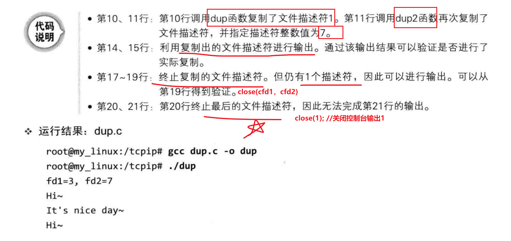

### 复制文件描述符后”流“的分离

> 之前，在将`fdopen()`建立的读写FILE指针关闭其一之后，这时候便会发送`EOF`使得另一个指针无法正常工作。因为文件描述符只有一个，被关闭之后建立的套接字也随之关闭。
>
> 因此需要通过`dup`或者`dup2`函数将文件描述符进行复制
>
> **进而实现文件描述符或FILE*的半关闭**

**sep_serv2.c代码示例：**

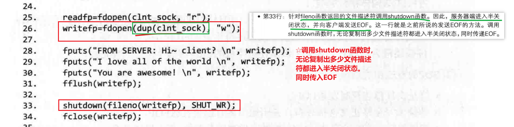

## 问题探讨

1. **下列关于 FILE 结构体指针和文件描述符的说法错误的是**？

   答：以下加粗内容代表说法正确。

   1. 与 FILE 结构体指针相同，文件描述符也分输入描述符和输出描述符
   2. 复制文件描述符时将生成相同值的描述符，可以通过这 2 个描述符进行 I/O
   3. **可以利用创建套接字时返回的文件描述符进行 I/O ，也可以不通过文件描述符，直接通过 FILE 结构体指针完成**
   4. **可以从文件描述符生成 FILE 结构体指针，而且可以利用这种 FILE 结构体指针进行套接字 I/O**
   5. 若文件描述符为读模式，则基于该描述符生成的 FILE 结构体指针同样是读模式；若文件描述符为写模式，则基于该描述符生成的 FILE 结构体指针同样是写模式

2. **EOF 的发送相关描述中错误的是**？

   答：以下加粗内容代表说法正确。

   1. 终止文件描述符时发送 EOF
   2. **即使未完成终止文件描述符，关闭输出流时也会发送 EOF**
   3. 如果复制文件描述符，则包括复制的文件描述符在内，所有文件描述符都终止时才会发送 EOF
   4. **即使复制文件描述符，也可以通过调用 shutdown 函数进入半关闭状态并发送 EOF**

# 优于select的epoll

> 实现I/O复用的传统方法有`select函数`和`poll函数`，但是各种原因导致这些方法无法得到令人满意的性能。因此有了`linux下的epoll，BSD的kqueue，Solaris的/dev/poll和windows下的IOCP等复用技术`
>
> **select方式并不适合以`web服务器端开发`为主流的现代开发环境，所以要学习linux平台下的epoll**

## 基于select的I/O复用技术速度慢的原因

### select的缺点

- 调用select函数后常见的针对所有文件描述符的循环语句
- 每次调用select函数时都需要向该函数传递监视对象信息

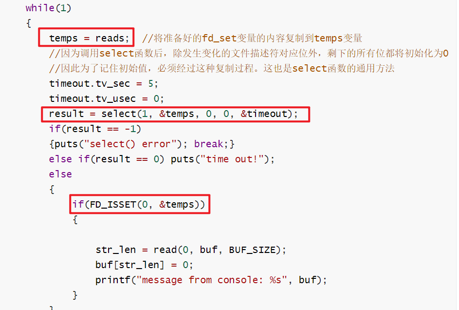

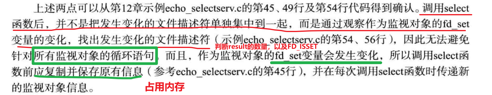

> 只看代码的话，循环体是对提高性能的大障碍，而**更大的障碍是每次传递监视对象的信息**
>
> 应用程序向操作系统传递数据时，将对程序造成很大的负担。而且无法通过代码优化解决。因此将造成性能上的致命弱点
>
> 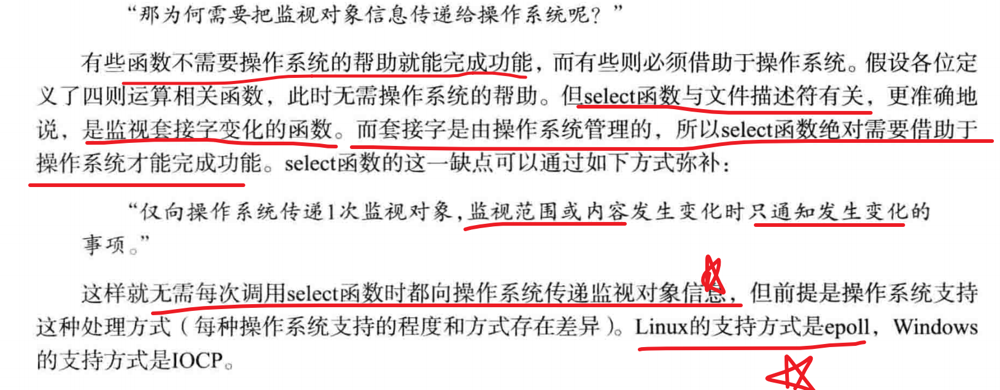

### select函数的优点

> epoll方式只在linux下提供支持，即改进的I/O复用模式不具有兼容性。而大多数操作系统都支持select函数。

## 实现epoll时必要的函数和结构体

能够克服select函数缺点的epoll函数具有如下优点（与select函数的缺点相反）

1. 无需编写以监视状态变化为目的的针对所有文件描述符的`循环语句`
2. 调用对应于epoll函数的`epoll_wait函数时无需每次传递监视对象信息`

**epoll服务器端实现中需要的三个函数**

1. `epoll_create`:创建保存epoll文件描述符的空间
2. `epoll_ctl`:向空间注册并销毁文件描述符
3. `epoll_wait`:与select函数类型，等待文件描述符发生变化

### select VS epoll

1. select方式中为了保存监视对象文件描述符，直接通过`fd_set`变量来设置文件描述符.而`epoll方式下由操作系统负责保存监视对象文件描述符`。因此需要通过`epoll_create`函数向操作系统请求创建`保存文件描述符的空间`

2. **为了添加和删除监视对象文件描述符**

   - select通过`FD_SET,FD_CLR`函数
   - 在epoll中，通过epoll_ctl函数请求操作系统完成

3. select通过`select`函数等待文件描述符的变化，而epoll中调用`epoll_wait`函数

4. select通过`FD_ISSET`查看fd_set变量查看监视对象的状态变化。而epoll方式中通过`epoll_event`将发生变化的文件描述符单独集中在一起

   ```c
   struct epoll_event
   {
       __uint32_t events;
       epoll_data_t data;
   }
   
   typedef union epoll_data
   {
       void* ptr;
       int fd;
       __uint32_t u32;
       __uint64_t u64;
   } epoll_data_t;
   //声明足够大的epoll_event结构体数组后，传递给epoll_wait函数时，发生变化的文件描述符信息将被填入该数组。因此无需像select函数那样针对所有文件描述符进行循环

### epoll_create

> 注：需要linux内核2.6以上
>
> `uname -srm`查看内核版本
>
> `cat /proc/sys/kernel/osrelease`

```c
#include <sys/epoll.h>

int epoll_create(int size); //成功时返回epoll文件描述符，失败时返回-1
// size：epoll实例的大小，决定epoll例程的大小，但是该值只是向操作系统提的建议。
// 因此，size并非用来决定epoll例程的大小，仅供操作系统参考
// 实际上，linux2.6.8之后的内核将完全忽略传入的size参数，并根据情况调整epoll实例的大小
```

**通过epoll_create函数创建的`文件描述符保存空间`称为"epoll例程"**


### epoll_ctl

生成epoll例程后，应通过`epoll_ctl函数`在其内部注册监视对象文件描述符

```c
#include <sys/epoll.h>

int epoll_ctl(int epfd, int op, int fd, struct epoll_event* event); //成功时返回0，失败时返回-1
/*
epfd:用于注册监视对象的epoll例程的文件描述符
op:用于指定监视对象的添加、删除或更改等操作
  - EPOLL_CTL_ADD:将文件描述符注册到epoll例程
  - EPOLL_CTL_DEL:从epoll例程中删除文件描述符
  - EPOLL_CTL_MOD:更改注册的文件描述符的关注事件发生情况
fd:需要注册的监视对象文件描述符
event:监视对象的事件类型,从监视对象中删除文件描述符时，不需要监视类型（事件信息）
*/

//函数调用
epoll_ctl(A, EPOLL_CTL_ADD, B, C); //向epoll例程A中注册文件描述符B，主要目的是监视参数C中的事件
epoll_ctl(A, EPOLL_CTL_DEL, B, NULL); //从epoll例程A中删除文件描述符B
```


```c
//epoll_event
struct epoll_event
{
    __uint32_t events;
    epoll_data_t data;
}
typedef union epoll_data
{
    void* ptr;
    int fd;
    __uint32_t u32;
    __uint64_t u64;
} epoll_data_t;

//代码示例：
struct epoll_event event;
event.events = EPOLLIN; //发生需要读取数据的情况时
event.data.fd = sockfd; 
epoll_ctl(epfd, EPOLL_CTL_ADD, sockfd, &event);
```

> **epoll_event的成员events可以保存的常量及所指的事件类型**
>
> 1. EPOLLIN:需要读取数据的情况
> 2. EPOLLOUT:输出缓冲为空，可以立即发送数据的情况
> 3. EPOLLPRI:收到OOB数据的情况（OOB紧急信息)
> 4. EPOLLRDHUP:断开连接或半关闭的情况，这在边缘触发方式下非常有用
> 5. EPOLLERR:发生错误的情况
> 6. EPOLLET:以边缘触发的方式得到事件通知
> 7. EPOLLONESHOT:发生一次事件后，相应文件描述符不再收到事件通知，因此需要向epoll_ctl函数的第二个参数传递EPOLL_CTL_MOD,再次设置事件
> 可以通过位或运算同时传递多个参数

### epoll_wait

与select机制中select函数对应的`epoll_wait`函数，epoll相关函数中默认最后调用该函数

```c
#include <sys/epoll.h>

int epoll_wait(int epfd, struct epoll_event* events, int maxevents, int timeout); //成功时返回发生事件的文件描述符数，失败时返回-1
/*
epfd:表示事件发生监视范围的epoll例程的文件描述符
events:保存发生事件的文件描述符集合的结构体地址值
maxevents:第二个参数中可以保存的最大事件数
timeout:以1/1000秒为单位的等待时间，传递-1时，一直等待直到发生事件
*/

//调用格式
int event_cnt;
struct epoll_event* ep_events;

ep_events = malloc(sizeof(struct epoll_event)*EPOLL_SIZE); //宏常量EPOLL_SIZE
//申请EPOLL_SIZE个epoll_event的内存空间
event_cnt = epoll_wait(epfd, ep_events, EPOLL_SIZE, -1);
//调用函数后，返回发生事件的文件描述符数，同时在第二参数指向的缓冲中保存发生事件的文件描述符集合。因此，无需像select那样插入针对所有文件描述符的循环
```

## 基于epoll的回声服务器端

```c
#include <stdio.h>
#include <stdlib.h>
#include <string.h>
#include <unistd.h>
#include <arpa/inet.h>
#include <sys/socket.h>
#include <sys/epoll.h>

#define BUF_SIZE 100
#define EPOLL_SIZE 50

void error_handling(char* message);

int main(int argc, char* argv[])
{
	int serv_sock, clnt_sock;
	struct sockaddr_in serv_adr, clnt_adr;
	socklen_t adr_sz;
	int str_len, i;
 	char buf[BUF_SIZE];

	struct epoll_event* ep_events; //创建一个ep_event数组
	struct epoll_event event;
	
	int epfd, event_cnt; //epfd是通过epoll_create创建的epoll例程

	if(argc!=2)
	{

		printf("Usage: %s <port> \n", argv[0]);
		exit(1);
	}
	//创建sock套接字
	serv_sock = socket(PF_INET, SOCK_STREAM, 0);
	memset(&serv_adr, 0, sizeof(serv_adr));
	serv_adr.sin_family = AF_INET;
	serv_adr.sin_addr.s_addr = htonl(INADDR_ANY);
	serv_adr.sin_port = htons(atoi(argv[1]));

	if(bind(serv_sock, (struct sockaddr*)&serv_adr, sizeof(serv_adr)) == -1)
		error_handling("Bind() error");
	if(listen(serv_sock, 5) == -1) 
		error_handling("listen() error");
	//创建epoll例程
	epfd = epoll_create(EPOLL_SIZE);
	ep_events = malloc(sizeof(struct epoll_event)*EPOLL_SIZE); //分配内存
	
	event.events = EPOLLIN; //用来保存服务器发生变化的文件描述符
	event.data.fd = serv_sock;
	epoll_ctl(epfd, EPOLL_CTL_ADD, serv_sock, &event); //epoll例程epfd中注册文件描述符serv_sock，主要目的是监视参数event的事件EPOLLIN

	while(1)
	{
		event_cnt = epoll_wait(epfd, ep_events, EPOLL_SIZE, -1); 
        //成功时返回发生事件的文件描述符数，失败时返回-1
        //通过ep_events保存发生事件的文件描述符集合
		if(event_cnt == -1)
		{
			puts("epoll_wait() error");
			break;
		}
		for(i = 0; i < event_cnt; i++)
		{
			if(ep_events[i].data.fd == serv_sock) //检测到新的连接请求
			{
				adr_sz = sizeof(clnt_adr);
				clnt_sock = accept(serv_sock, (struct sockaddr*)&clnt_adr, &adr_sz);
				event.events = EPOLLIN;
				event.data.fd = clnt_sock;
				epoll_ctl(epfd, EPOLL_CTL_ADD, clnt_sock, &event);
				printf("connected client: %d \n", clnt_sock);
			}
			else //已经连接的其他client有数据需要发送，则read并echo
			{
				str_len = read(ep_events[i].data.fd, buf, BUF_SIZE);
				if(str_len == 0) //收到连接断开的情形,EPOLLRDHUP
				{
					epoll_ctl(epfd, EPOLL_CTL_DEL, ep_events[i].data.fd, NULL);
					close(ep_events[i].data.fd);
					printf("closed client: %d \n", ep_events[i].data.fd);
				}
				else
				{
					write(ep_events[i].data.fd, buf, str_len); //echo!
				}
			}
		}
	}	
	close(serv_sock);
	close(epfd);
	return 0;
}

void error_handling(char* message)
{
	fputs(message, stderr);
	fputc('\n', stderr);
	exit(1);
}
```

## 条件触发(Level Trigger)和边缘触发(Edge Trigger)

**两者区别在于发生事件的时间点**

1. 条件触发方式中，只要输入缓冲有数据就会一直通知该事件
2. 边缘触发方式：在输入缓冲收到数据时仅注册1次该事件，即使输入缓冲中还留有数据，也不会再进行注册

**epoll默认以条件触发方式工作**

## 实现边缘触发的回声服务器端


> **select模式是条件触发还是边缘触发：**
>
> select模式是以**条件触发**的方式工作的，输入缓冲中如果还剩有数据，肯定会注册事件

### 边缘触发的服务器端实现中必知的两点

1. **通过`errno`变量验证错误原因**

   > linux声明了全局变量`int errno`，为了访问该变量，需要引入`error.h`头文件。每种套接字相关函数发生错误时，保存到errno变量中的值都不同。
   >
   > 1. read函数发现缓冲中没有数据可读时返回-1，同时在errno中保存`EAGAIN`常量

2. **为了完成非阻塞I/O，更改套接字特性**

   > linux提供更改或读取文件属性的方法`fcntl`
   >
   > ```c++
   > #include <fcntl.h>
   > 
   > int fcntl(int filedes, int cmd, ...); //成功时返回cmd参数相关值，失败时返回-1
   > 
   > /*
   > filedes：属性更改目标的文件描述符
   > cmd：表明函数调用的目的
   > 	1. F_GETFL:可以获得第一个参数所指的文件描述符类型（int）
   > 	2. F_SETFL:可以更改文件描述符属性
   > */
   > 
   > int flag = fcntl(fd, F_GETFL, 0); //获取之前设置的属性信息
   > fcntl(fd, F_SETFL, flag|O_NONBLOCK); //将文件（套接字）更改为非阻塞模式
   > ```

> 边缘触发的服务器端实现与`读取错误原因`和`非阻塞模式的套接字创建`有着密切联系。
>
> 1. 首先需要通过`errno`确认错误原因。因为在边缘触发方式中，接受数据时仅注册1次该事件。因此，需要验证输入缓冲是否为空。`read函数返回-1且变量errno中的值为EAGAIN时，说明没有数据可读`
> 2. 在边缘触发方式下，阻塞方式工作的read和write函数有可能引起服务器端的长时间停顿。因此，边缘触发方式中一定要采用非阻塞的read和write函数

```c
#include <stdio.h>
#include <stdlib.h>
#include <string.h>
#include <unistd.h>
#include <arpa/inet.h>
#include <sys/socket.h>
#include <sys/epoll.h>
#include <errno.h>
#include <fcntl.h>

#define BUF_SIZE 4 //为了验证边缘触发的工作方式，将缓冲设置为4个字节
#define EPOLL_SIZE 50

void setnonblockingmode(int fd);
void error_handling(char* message);

int main(int argc, char* argv[])
{
	int serv_sock, clnt_sock;
	struct sockaddr_in serv_adr, clnt_adr;
	socklen_t adr_sz;
	int str_len, i;
 	char buf[BUF_SIZE];

	struct epoll_event* ep_events;
	struct epoll_event event;
	
	int epfd, event_cnt; //epfd是通过epoll_create创建的epoll例程

	if(argc!=2)
	{

		printf("Usage: %s <port> \n", argv[0]);
		exit(1);
	}
	
	serv_sock = socket(PF_INET, SOCK_STREAM, 0);
	memset(&serv_adr, 0, sizeof(serv_adr));
	serv_adr.sin_family = AF_INET;
	serv_adr.sin_addr.s_addr = htonl(INADDR_ANY);
	serv_adr.sin_port = htons(atoi(argv[1]));

	if(bind(serv_sock, (struct sockaddr*)&serv_adr, sizeof(serv_adr)) == -1)
		error_handling("Bind() error");
	if(listen(serv_sock, 5) == -1) 
		error_handling("listen() error");

	epfd = epoll_create(EPOLL_SIZE);
	ep_events = malloc(sizeof(struct epoll_event)*EPOLL_SIZE);
	
	event.events = EPOLLIN; //设置边缘触发
	event.data.fd = serv_sock;
	epoll_ctl(epfd, EPOLL_CTL_ADD, serv_sock, &event);

	while(1)
	{
		event_cnt = epoll_wait(epfd, ep_events, EPOLL_SIZE, -1); //通过epoll_wait等待判断文件描述符的事件变化
		if(event_cnt == -1)
		{
			puts("epoll_wait() error");
			break;
		}
		
		puts("return epoll_wait");
		for(i = 0; i < event_cnt; i++)
		{
			if(ep_events[i].data.fd == serv_sock) //检测到新的连接请求
			{
				adr_sz = sizeof(clnt_adr);
				clnt_sock = accept(serv_sock, (struct sockaddr*)&clnt_adr, &adr_sz);
				setnonblockingmode(clnt_sock); //设置套接字的非阻塞模式
				event.events = EPOLLIN| EPOLLET;//设置边缘触发
				event.data.fd = clnt_sock;
				epoll_ctl(epfd, EPOLL_CTL_ADD, clnt_sock, &event);
				printf("connected client: %d \n", clnt_sock);
			}
			else
			{	while(1)
				{//反复读取数据
				str_len = read(ep_events[i].data.fd, buf, BUF_SIZE);
				if(str_len == 0)
				{
					epoll_ctl(epfd, EPOLL_CTL_DEL, ep_events[i].data.fd, NULL);
					close(ep_events[i].data.fd);
					printf("closed client: %d \n", ep_events[i].data.fd);
				}
				else if(str_len < 0)
				{

					if(errno == EAGAIN) break; //当前输入缓冲无数据
				}
				else
				{
					write(ep_events[i].data.fd, buf, str_len); //echo!
				}
				}
			}
		}
	}	
	close(serv_sock);
	close(epfd);
	return 0;
}
void setnonblockingmode(int fd)
{
	int flag = fcntl(fd, F_GETFL, 0);
	fcntl(fd, F_SETFL, flag|O_NONBLOCK);
}
void error_handling(char* message)
{
	fputs(message, stderr);
	fputc('\n', stderr);
	exit(1);
}
```

## 问题探讨

1. 边缘触发vs条件触发

   > 边缘触发的优点：**可以分离接收数据和处理数据的时间点**
   >
   > 条件触发也能够区分数据接收和处理，但在输入缓冲收到数据的情况下，如果不读取（延迟处理），则每次调用`epoll_wait`函数时都会产生响应的时间，而且事件数也会累加

2. 利用select函数实现服务器端时，代码层面存在的两个缺点是？

   - 调用select函数后常见的针对所有文件描述符的循环语句
   - 每次调用select函数时都需要向该函数传递监视对象信息

   **优点：** epoll方式只在linux下提供支持，即改进的I/O复用模式不具有兼容性。而大多数操作系统都支持select函数。

3. 无论是select方式还是epoll方式，都需要将监视对象文件描述符信息通过函数调用传递给操作系统。请解释传递该信息的原因

   

   > 即select函数与文件描述符有关，是监视套接字变化的函数。而`套接字是由操作系统管理的`。所以select函数绝对需要借助于操作系统才能完成功能

4. select方式和epoll方式的最大差异在于监视对象文件描述符传递给操作系统的方式。请说明具体的差异，并解释为何存在这种差异。

   > epoll不同于select的地方是`只要将监视对象文件描述符的信息传递一个给操作系统就可以了`。因此epoll方式克服了select方式的缺点，体现在linux内核上保存监视对象信息的方式。

5. 虽然epoll是select的改进方案，但是select也有自己的优点。在何种情况下使用select方式更合理？

   > 如果连接服务器的人数不多（不需要高性能），而且需要在多种操作系统（windows和linux）下进行操作，在兼容性方面，使用select会比epoll更合理

6. epoll以条件触发或边缘触发方式工作，二者有何区别？从输入缓冲的角度说明这两种方式通知事件的时间点差异

   > 1. 条件触发方式中，只要输入缓冲有数据就会一直通知该事件
   > 2. 边缘触发方式：在输入缓冲收到数据时仅注册1次该事件，即使输入缓冲中还留有数据，也不会再进行注册

7. 采用边缘触发时可以分离数据的接收和处理时间点，说明其原因和优点

   > 如果使用边缘触发方式，`在输入缓冲中接收数据时，只会发生一次事件通知`，而且输入缓冲中仍有数据时，不会进行通知，因此`可以在数据被接收后，在想要的时间内处理数据`。而且，如果分离数据的接收和处理时间点，在服务器中会有更大的灵活性

# 多线程服务器端的实现

**多进程模型存在的问题：**创建进程（复制）的工作本身会给操作系统带来相当沉重的负担。每个进程具有独立的内存空间，因此进程间通信难度也比较高。

- 创建进程的过程会带来一定的开销

- 为了完成进程间数据交换，需要特殊的IPC技术（管道通信）

- **每秒少则数十次，多则数千次的“上下文切换”是创建进程时最大的开销**

  > **上下文切换：**为了进程能够实现分时使用CPU。运行程序前需要将相应进程信息读入内存，如果运行进程A后紧接着运行进程B，就应该将进程A相关信息移出内存。并读入进程B相关信息。
  >
  > 但此时进程A的数据将被移动到硬盘，所以`上下文切换需要很长时间`

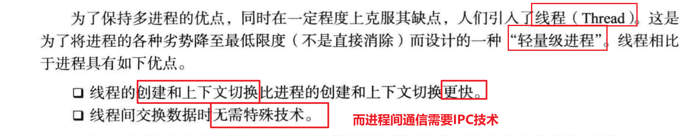

## 线程和进程的差异


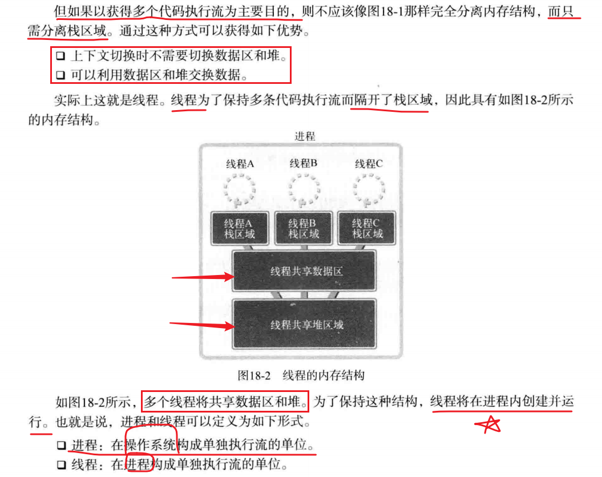

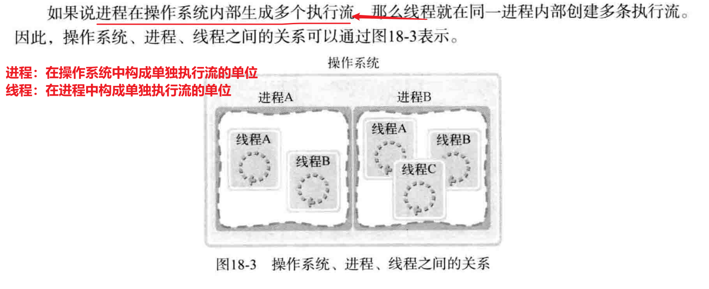

## 线程创建及运行

Portable Operating System Interface for Computer Environment（**POSIX**）是为了提高UNIX系列操作系统间的移植性而制定的API规范。

### 线程的创建和执行流程

线程具有单独的执行流，因此需要单独定义线程的main函数，还需要请求操作系统在单独的执行流中执行该函数。

```c
#include <pthread.h>

int pthread_create(pthread_t* restrict thread, const pthread_attr_t* restrict attr, void*(*start_routine)(void*), void* restrict arg); //成功时返回0，失败时返回其他值
/*
thread:保存新创建线程ID的变量地址值，线程与进程相同，也需要用于区分不同线程的ID
attr:用于传递线程属性的参数，传递NULL时，创建默认属性的线程
start_routing:相当于线程main函数的，在单独执行流中执行的函数地址值（函数指针）
arg:通过第三个参数传递调用函数时包含传递参数信息的变量地址值
*/
```

**对于pthread_create函数，关键在于熟练掌握restrict关键字和函数指针相关语法**

**thread1.c代码示例**

```c
#include <stdio.h>
#include <pthread.h>

void* thread_main(void* arg);

int main(int argc, char* argv[])
{
	pthread_t t_id;
	int thread_param = 5;
	
	if(pthread_create(&t_id, NULL, thread_main, (void*)&thread_param)!=0)
	{
		//失败时返回其他值，成功时返回0
		puts("pthread_create() error");
		return -1;
	}
	
	sleep(10); //调用sleep函数使main函数停顿10s，为了延迟进程的终止时间。因为main函数在return以后，会终止进程，同时终止内部创建的进程。
	puts("end of main");
	
	return 0;
}

void* thread_main(void* arg) //传入参数为pthread_create函数的第四个参数
{
	int i;
	int cnt = *((int*)arg);
	for(i = 0; i < cnt; i++)
	{
		sleep(1); puts("running thread");
	}
	return NULL;
}
```

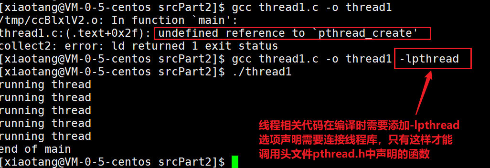

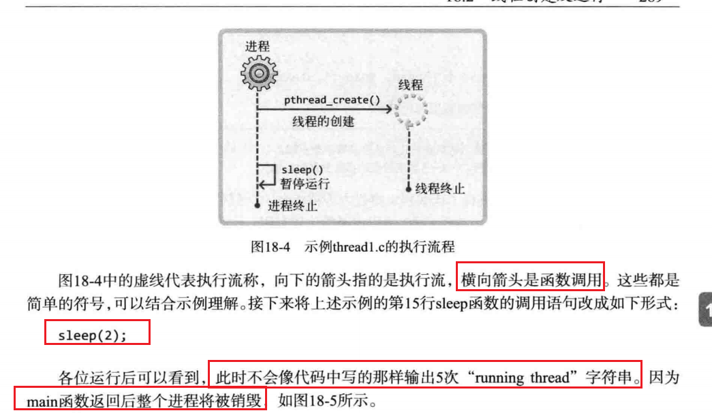

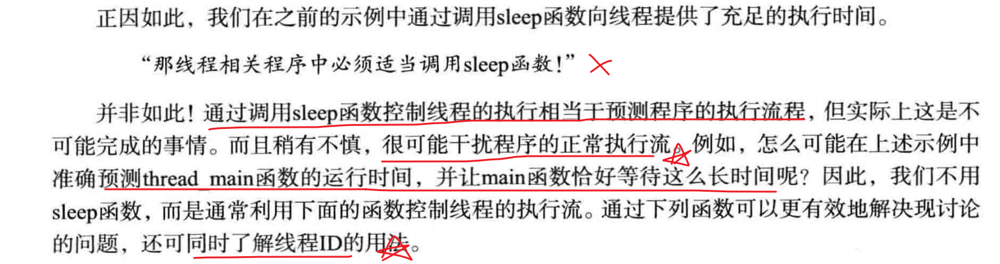

### 通过`pthread_join`函数控制线程的执行流

```c
#include <pthread.h>

int pthread_join(pthread_t thread, void** status); //成功时返回0，失败时返回其他值
/*
thread:该参数值ID的线程终止时才会从该函数返回
status:保存线程的main函数返回值的指针变量地址值
*/
```

> 调用该函数的进程（或线程）将进入等待状态，直到第一个参数ID对应的线程终止为止，而且可以得到线程的main函数返回值。所以该函数比较有用

```c
#include <stdio.h>
#include <stdlib.h>
#include <pthread.h>
#include <string.h>

void* thread_main(void* arg);

int main(int argc, char* argv[])
{
	pthread_t t_id;
	int thread_param = 5;
	
	void* thr_ret; //thread的main函数返回值
	
	if(pthread_create(&t_id, NULL, thread_main, (void*)&thread_param)!= 0)
	{
		puts("pthread_create() error");
		return -1;
	}
	
	if(pthread_join(t_id, &thr_ret) != 0)  //main函数将等待ID保存在t_id变量中的线程终止
	{
		puts("pthread_join() error");
		return -1;

	}
	
	printf("Thread return message: %s \n", (char*)thr_ret);

	free(thr_ret);
	return 0;
}

void* thread_main(void* arg)
{
	int i;
	int cnt = *((int*)arg);
	char* msg = (char*)malloc(sizeof(char)*50);
	
	strcpy(msg, "hello, I am a thread!\n");
	
	for(i = 0; i < cnt; ++i)
	{
		sleep(1); puts("running thread");
	}
	
	return (void*)msg; //返回线程内部动态分配的内存空间的地址值。
    //容易内存泄露哈
}

int pthread_join(pthread_t thread, void** status); //成功时返回0，失败时返回其他值
/*
thread:该参数值ID的线程终止时才会从该函数返回
status:保存线程的main函数返回值的指针变量地址值

线程返回值的获取方法：
1. 因为线程的主函数是void* thread_main(void* arg);因此通过
void* thr_ret来接受返回值,并将thr_ret传入pthread_join函数的第二个参数
if(pthread_join(t_id, &thr_ret) != 0); //第二个参数为void**
*/
```

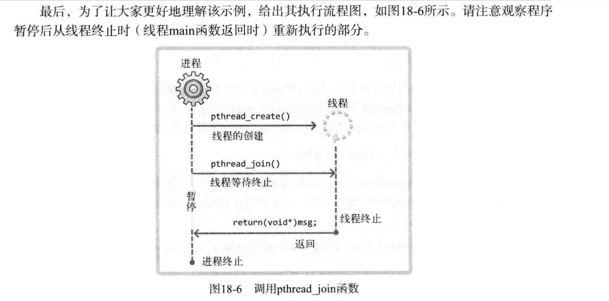

### 可在临界区内调用的函数

关于线程的运行需要考虑：多个线程同时调用函数时（执行时），这类函数内部存在临界区。即多个线程同时执行这部分代码时，可能引起问题，临界区中至少存在一条这类代码

**根据临界区是否引起问题，函数可分为**

1. 线程安全函数（Thread-safe function）

   > 被多个线程同时调用时也不会引发问题，线程安全函数中同样可能存在临界区，只是在线程安全函数中，同时被多个线程调用时可通过一些措施避免问题

2. 非~

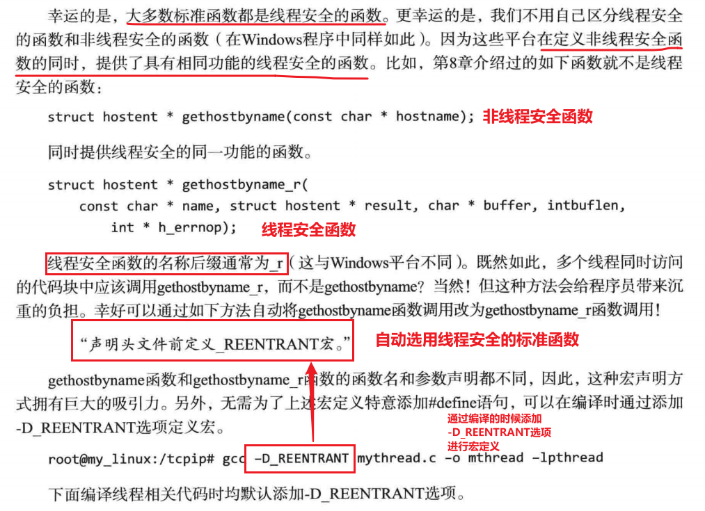

### 工作线程模型

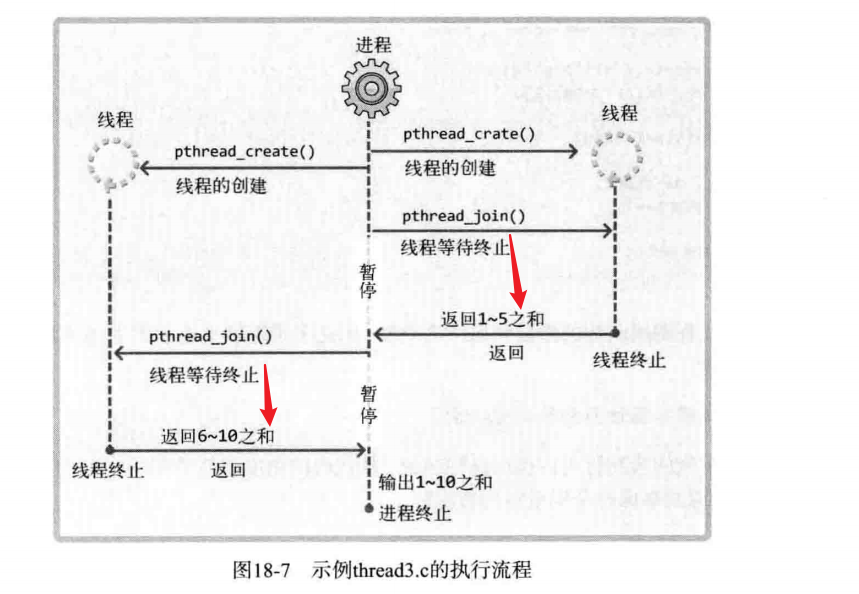

**thread3.c代码示例**

```c
#include <stdio.h>
#include <pthread.h>

void* thread_summation(void* arg);

int sum = 0; //全局变量区

int main(int argc, char* argv[])
{
	pthread_t id_t1, id_t2;
	int range1[] = {1, 5};
	int range2[] = {6, 10};

	pthread_create(&id_t1, NULL, thread_summation, (void*)range1);
	pthread_create(&id_t2, NULL, thread_summation, (void*)range2);

	pthread_join(id_t1, NULL);
	pthread_join(id_t2, NULL);

	printf("result: %d\n", sum);

	return 0;
}

void* thread_summation(void* arg)
{
	int start = ((int*)arg)[0];
	int end = ((int*)arg)[1];

	while(start <= end)
	{ 
		sum+=start; //线程共享全局变量的数据区
		start++;
	}
	
	return NULL;
}
```

**具有更高发生临界区错误可能性的样例**


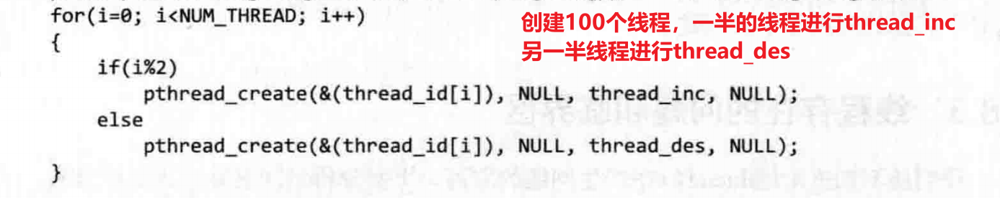

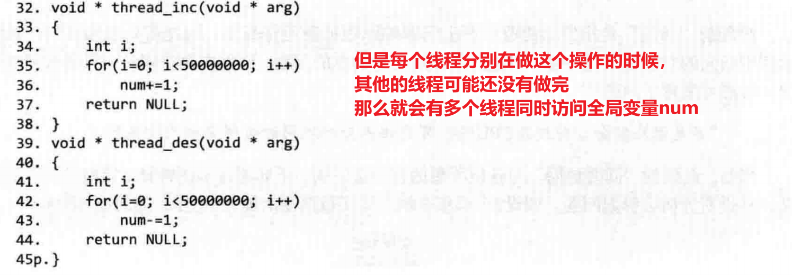

## 线程存在的问题和临界区

### 多个线程访问同一变量

**多线程编程中`同步`的重要性**

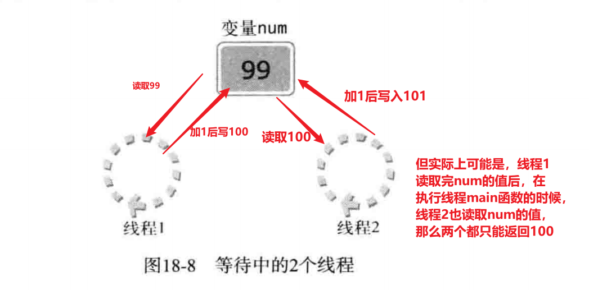

### 临界区位置

**临界区定义：**函数内同时运行多个线程时引起问题的多条语句构成的代码块

全局变量num不是临界区，因为它不是引起问题的语句，只是代表内存区域的声明而已。

临界区通常位于线程运行的函数内部

```c
void* thread_inc(void* arg)
{
    int i;
    for(i = 0; i < 50000000; i++) 
        num += 1; //临界区
    
    return NULL;
}

void* thread_dec(void* arg)
{
    int i;
    for(i = 0; i < 50000000; i++) 
        num -= 1; //临界区
    
    return NULL;
}
```

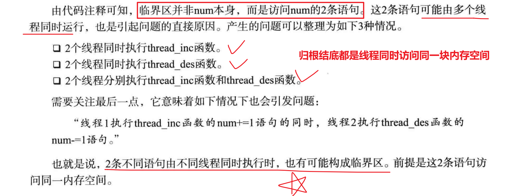

## 线程同步

> 用来解决线程访问顺序引发的问题
>
> - 同时访问同一块内存空间时发生的情况（临界区）
> - 需要指定访问同一内存空间的线程执行顺序的情况（**控制线程执行顺序**）

### 互斥量（锁机制）

互斥量是“Mutual Exclusion”的简写，表示不允许多个线程同时访问。主要用来解决`线程同步访问的问题`

**互斥量的创建及销毁函数**

```c
#include <pthread.h>

int pthread_mutex_init(pthread_mutex_t* mutex, const pthread_mutexattr_t* attr); 
int pthread_mutex_destroy(pthread_mutex_t* mutex); //成功时返回0，失败时返回其他值
/*
mutex: 创建互斥量时传递保存互斥量的变量地址值，销毁时传递需要销毁的互斥量地址值
attr: 传递即将创建的互斥量属性，没有特别需要指定的属性时传递NULL
*/

pthread_mutex_t mutex; //声明pthread_mutex_t型互斥量
//其地址值做为init和destroy的第一个参数

pthread_mutex_init(&mutex, NULL); //等价于pthread_mutex_t mutex = PTHREAD_MUTEX_INITIALIZER; 
//但推荐使用pthread_mutex_init进行初始化，因为通过宏进行初始化时很难发现发生的错误
```

**通过互斥量`锁住`或`释放`临界区时使用的函数**

```c
#include <pthread.h>

int pthread_mutex_lock(pthread_mutex_t* mutex);
int pthread_mutex_unlock(pthread_mutex_t* mutex); //成功时返回0，失败时返回其他值
```

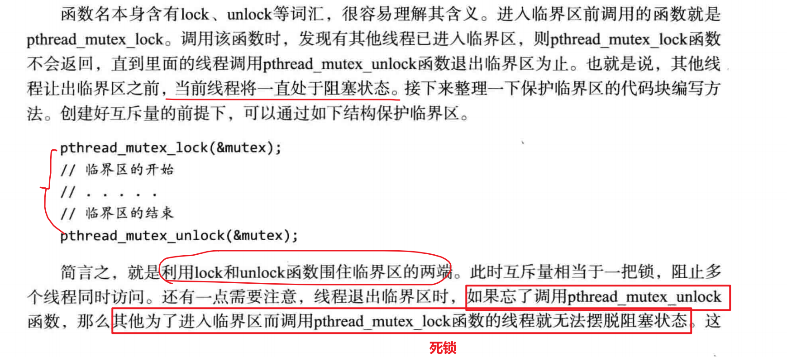

### 信号量

 **信号量创建及销毁方法**

```c
#include <semaphore.h>

int sem_init(sem_t* sem, int pshared, unsigned int value);
int sem_destroy(sem_t* sem); //成功时返回0，失败时返回其他值
/*
sem:创建信号量时传递保存信号量的变量地址值，销毁时传递需要销毁的信号量变量
pshared:传递其他值时，创建可由多个进程共享的信号量。传递0时，创建只允许1个进程内部使用的信号量。
value：指定新创建的信号量的初始值
*/

//相当于互斥量lock和unlock的函数
int sem_post(sem_t* sem);
int sem_wait(sem_t* sem); //成功时返回0，失败时返回其他值
//sem：传递保存信号量读取值的变量地址值，传递给sem_post时信号量*sem加1，传递给sem_wait时信号量减1
```

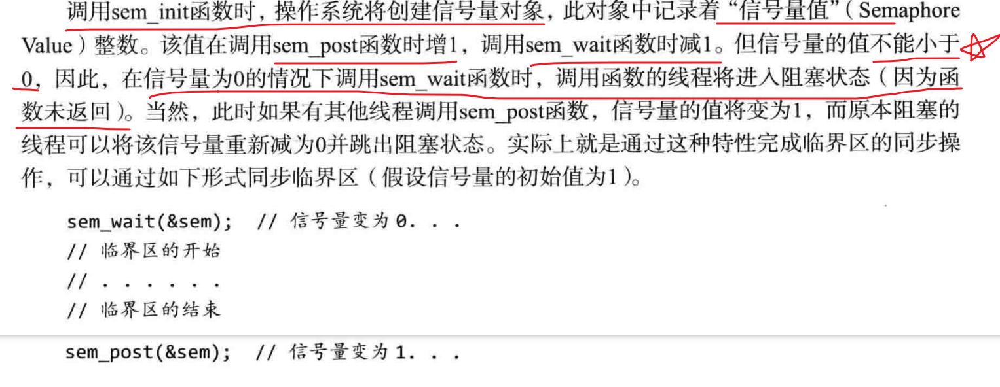 


**代码实现：**

```c
#include <stdio.h>
#include <pthread.h>
#include <semaphore.h>

void* read(void* arg);
void* accu(void* arg);

static sem_t sem_one; 
static sem_t sem_two; //两个信号量
static int num;
int main(int argc, char* argv[])
{
	pthread_t id_t1, id_t2;
	sem_init(&sem_one, 0, 0); //一个进程，初始值value=0
	sem_init(&sem_two, 0, 1); //一个进程中，初始值value = 1
	
	pthread_create(&id_t1, NULL, read, NULL);
	pthread_create(&id_t2, NULL, accu, NULL);
	
	pthread_join(id_t1, NULL);
	pthread_join(id_t2, NULL);
	
	sem_destroy(&sem_one);
	sem_destroy(&sem_two);

	return 0;
}

void* read(void* arg)
{
	int i;
	for(i = 0; i < 5; i++)
	{
		fputs("Input num: ", stdout);
		sem_wait(&sem_two);//只有sem_two不为0的时候才能够执行scanf
		scanf("%d", &num);
		sem_post(&sem_one);
	}
	return NULL;
}

void* accu(void* arg)
{
	int sum = 0, i;
	for(i = 0; i<5; i++)
	{
		sem_wait(&sem_one);
		sum+=num;
		sem_post(&sem_two); //这时候sem_two变为1
	}
	printf("Result: %d \n", sum);
	
	return NULL;
}
```

**利用两个信号量sem_one和sem_two，并通过调用sem_wait和sem_post函数，实现0,1的翻转**


## 线程的销毁和多线程并发服务器端的实现

### 销毁线程的3种方法

Linux线程并不是在首次调用的线程main函数返回时自动销毁，所以需要通过如下两种方法之一加以明确，否则由线程创建的内存空间将一直存在

1. 调用pthread_join函数

   >  调用该函数不仅会等待线程终止，还会引导线程销毁。
   >
   > **存在的问题：**调用该函数的线程将进入阻塞状态，因此通常通过`pthread_detach`函数引导线程销毁

2. 调用pthread_detach函数

   ```c
   #include <pthread.h>
   
   int pthread_detach(pthread_t thread); //成功时返回0，失败时返回其他值
   //thread：终止的同时需要销毁的线程ID
   ```

   > 调用该函数不会引起线程终止或进入阻塞状态，可以通过该函数引导销毁线程创建的内存空间。
   >
   > 调用该函数后不能再针对相应线程调用`pthread_join`函数

### 多线程并发服务器端的实现

**实现功能，涉及知识点：**

1. 线程的使用方法
   - 创建、同步、销毁
2. 临界区的处理方式

```c
#include <stdio.h>
#include <stdlib.h>
#include <sys/socket.h>
#include <string.h>
#include <arpa/inet.h>
#include <pthread.h>
#include <semaphore.h>

#define BUF_SIZE 100
#define MAX_CLNT 256 

void* handle_clnt(void* arg);
void send_msg(char* msg, int len);
void error_handling(char* msg);

int clnt_cnt = 0;
int clnt_socks[MAX_CLNT]; //管理接入的客户端套接字的变量和数组，访问这两个变量的代码将构成临界区
pthread_mutex_t mutx;

int main(int argc, char* argv[])
{
	int serv_sock, clnt_sock;
	struct sockaddr_in serv_adr, clnt_adr;
	int clnt_adr_sz;
	pthread_t t_id;

	if(argc != 2)
	{
		printf("Usage : %s <port> \n", argv[0]);
		exit(1);
	}
	
	pthread_mutex_init(&mutx, NULL);
	serv_sock = socket(PF_INET, SOCK_STREAM, 0);
	
	memset(&serv_adr, 0, sizeof(serv_adr));
	serv_adr.sin_family = AF_INET; //IPv4地址
	serv_adr.sin_port = htons(atoi(argv[1]));
	serv_adr.sin_addr.s_addr = htonl(INADDR_ANY);
	if(bind(serv_sock, (struct sockaddr*)&serv_adr, sizeof(serv_adr)) == -1)
		error_handling("bind() error");
	if(listen(serv_sock, 5) == -1)
		error_handling("listen() error");
	
	while(1)
	{
		clnt_adr_sz = sizeof(clnt_adr);
		clnt_sock = accept(serv_sock, (struct sockaddr*)&clnt_adr, &clnt_adr_sz);

		pthread_mutex_lock(&mutx);
		clnt_socks[clnt_cnt++] = clnt_sock; //临界区，因为涉及到操作全局变量
		pthread_mutex_unlock(&mutx);

		pthread_create(&t_id, NULL, handle_clnt, (void*)&clnt_sock); //创建线程向新接入的客户端提供服务，并执行handle_clnt函数，并将clnt_sock作为参数传入
		pthread_detach(t_id); //通过pthread_detach销毁线程
		printf("Connected client IP: %s \n", inet_ntoa(clnt_adr.sin_addr)); //将网络序转为字节序？
	}	
	close(serv_sock);
	return 0;
}

void* handle_clnt(void* arg)
{
	int clnt_sock = *((int*)arg);
	int str_len = 0, i;
	char msg[BUF_SIZE];

	while((str_len = read(clnt_sock, msg, sizeof(msg)))!=0)
		send_msg(msg, str_len);

	pthread_mutex_lock(&mutx);
	for(i = 0; i < clnt_cnt; i++) //remove disconnected client
	{
		if(clnt_sock == clnt_socks[i])
		{
			while(i++ < clnt_cnt-1)
				clnt_socks[i] = clnt_socks[i+1];
			break;
		}
	}
	clnt_cnt--;
	pthread_mutex_unlock(&mutx);
	close(clnt_sock);
	
	return NULL; 
}

void send_msg(char* msg, int len) //send to all
{
	int i;
	pthread_mutex_lock(&mutx);
	for(i = 0; i < clnt_cnt; i++)
	{
		write(clnt_socks[i], msg, len);
	}
	pthread_mutex_unlock(&mutx);
}

void error_handling(char* message)
{
	fputs(message, stderr);
	fputc('\n', stderr);
	exit(1);
}
```

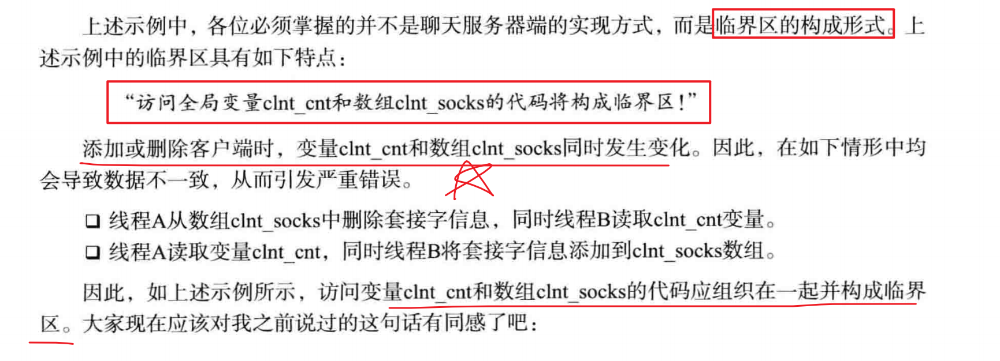

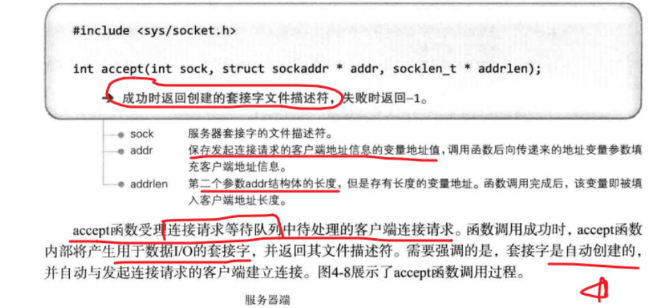

### 多线程并发客户端实现

**实现输入输出分离**

```c
#include <stdio.h>
#include <stdlib.h>
#include <sys/socket.h>
#include <arpa/inet.h>
#include <pthread.h>
#include <string.h>

#define BUF_SIZE 100
#define NAME_SIZE 20

void* send_msg(void* arg);
void* recv_msg(void* arg); //定义收发信息的函数，交由线程处理
void error_handling(char* message);

char name[NAME_SIZE] = "[DEFAULT]";
char msg[BUF_SIZE];

int main(int argc, char* argv[])
{
	int sock;
	struct sockaddr_in serv_addr;
	pthread_t snd_thread, rcv_thread; //收发数据的线程
	void* thread_return;

	if(argc != 4)
	{
		printf("Usage: %s <IP> <port> <name> \n", argv[0]);
		exit(1);
	}
	
	sprintf(name, "[%s]", argv[3]); //将argv[3]以[%s]的形式输出到name保存
	sock = socket(PF_INET, SOCK_STREAM, 0);

	memset(&serv_addr, 0, sizeof(serv_addr));
	serv_addr.sin_family = AF_INET;
	serv_addr.sin_addr.s_addr = inet_addr(argv[1]);
	serv_addr.sin_port = htons(atoi(argv[2]));

	if(connect(sock, (struct sockaddr*)&serv_addr, sizeof(serv_addr)) == -1)
		error_handling("connect() error");
	
	pthread_create(&snd_thread, NULL, send_msg, (void*)&sock);
	pthread_create(&rcv_thread, NULL, recv_msg, (void*)&sock);

	pthread_join(snd_thread, &thread_return);
	pthread_join(rcv_thread, &thread_return);

	close(sock);

	return 0;
}

void* send_msg(void* arg)
{
	int sock = *((int*)arg);
	char name_msg[NAME_SIZE + BUF_SIZE];
	
	while(1)
	{
		fgets(msg, BUF_SIZE, stdin);
		if(!strcmp(msg, "q\n") || !strcmp(msg, "Q\n"))
		{
			close(sock);
			exit(0);
		}
	
		sprintf(name_msg, "%s %s", name, msg);
		write(sock, name_msg, strlen(name_msg));
	}

	return NULL;
}

void* recv_msg(void* arg) //read thread_main
{
	int sock = *((int*)arg);
	char name_msg[NAME_SIZE + BUF_SIZE];
	int str_len;

	while(1)
	{
		str_len = read(sock, name_msg, NAME_SIZE + BUF_SIZE - 1);
		if(str_len == -1)
			return (void*)-1;
		
		name_msg[str_len] = 0;
		fputs(name_msg, stdout);
	}
	
	return NULL;
}

void error_handling(char* msg)
{
	fputs(msg, stderr);
	fputc('\n', stderr);
	exit(1);
}
```

## 问题探讨

1. 单CPU系统中如何同时执行多个进程？请解释该过程中发生的上下文切换

   > 因为系统将CPU切分成多个微小的块后分配给多个进程，为了`分时使用CPU`,需要”上下文切换“过程。
   >
   > ”上下文切换“是指，在CPU改变运行对象的过程中，`执行准备的过程将之前执行的进程数据从换出内存，并将待执行额进程数据传到内存的工作区域`

2. 为何线程的上下文切换速度相对更快？线程间数据交换为何不需要类似IPC的特别技术？

   > 因为线程进行上下文切换时不需要切换数据区和堆区。同时，可以利用数据区和堆区进行数据交换

3. 请从执行流角度说明进程和线程的区别

   - 进程：在操作系统中构成单独执行流的单位
   - 线程：在进程内构成单独执行流的单位

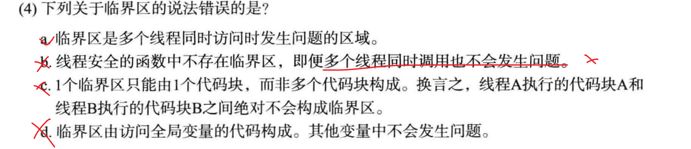

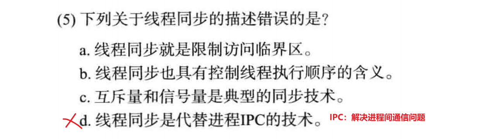

6. 请说明完全销毁linux线程的2种方法

   - `pthread_join`函数和`pthread_detach`函数

7. 利用多线程技术实现回声服务器端，并让所有线程共享保存客户端消息的内存空间（char数组）

   ```c
   //echo_thrserv.c
   #include <stdio.h>
   #include <stdlib.h>
   #include <string.h>
   #include <unistd.h>
   #include <arpa/inet.h>
   #include <sys/socket.h>
   #include <sys/select.h>
   #include <pthread.h>
   
   #define BUF_SIZE 100
   void * handle_clnt(void * arg);
   void error_handling(char *buf);
   
   char buf[BUF_SIZE];
   pthread_mutex_t mutx;
   
   int main(int argc, char *argv[])
   {
   	int serv_sock, clnt_sock;
   	struct sockaddr_in serv_adr, clnt_adr;
   	int clnt_adr_sz;
   	pthread_t t_id;
   
   	if(argc!=2) {
   		printf("Usage : %s <port>\n", argv[0]);
   		exit(1);
   	}
   
   	pthread_mutex_init(&mutx, NULL);
   	serv_sock=socket(PF_INET, SOCK_STREAM, 0);
   	memset(&serv_adr, 0, sizeof(serv_adr));
   	serv_adr.sin_family=AF_INET;
   	serv_adr.sin_addr.s_addr=htonl(INADDR_ANY);
   	serv_adr.sin_port=htons(atoi(argv[1]));
   	
   	if(bind(serv_sock, (struct sockaddr*) &serv_adr, sizeof(serv_adr))==-1)
   		error_handling("bind() error");
   	if(listen(serv_sock, 5)==-1)
   		error_handling("listen() error");
   
   	while(1)
   	{
   		clnt_adr_sz=sizeof(clnt_adr);
   		clnt_sock=accept(serv_sock, (struct sockaddr*)&clnt_adr,&clnt_adr_sz);
   		pthread_create(&t_id, NULL, handle_clnt, (void*)&clnt_sock);
   		pthread_detach(t_id);
   		printf("Connected client IP: %s \n", inet_ntoa(clnt_adr.sin_addr));
   	}
   
   	close(serv_sock);
   	return 0;
   }
   
   void * handle_clnt(void * arg)
   {
   	int clnt_sock=*((int*)arg);
   	int str_len=0;
   	
   	while(1)
   	{
   		pthread_mutex_lock(&mutx);
   		str_len=read(clnt_sock, buf, sizeof(buf));
   		if(str_len<=0)
   			break;
   		else
   			write(clnt_sock, buf, str_len);
   		pthread_mutex_unlock(&mutx);
   	}
   	
   	close(clnt_sock);
   	return NULL;
   }
   void error_handling(char *buf)
   {
   	fputs(buf, stderr);
   	fputc('\n', stderr);
   	exit(1);
   }
   ```

   > 存在的问题：
   >
   > 如果不进行线程同步，两个以上线程会同时访问内存空间，从而引发问题。
   >
   > 相反，如果同步，由于read函数中调用了临界区的参数，可能会发生无法读取其他客户端发送过来的字符串而必须等待的情况

# 总结

## 关于int main中的传入参数

```c++
int main( int argc, char** argv )
{ 
     //函数体内使用或不使用argc和argv都可
     ……
     return 0;
}
```

**一、argc、argv的具体含义** 
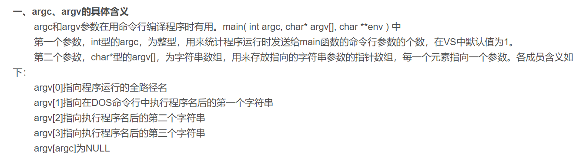

```c++
#include <stdio.h>
using namespace std;

int main(int argc, char ** argv)
{
    int i;
    printf("Argc = %d", argc);
    for (i = 0; i < argc; i++)
        printf("Argument %d is %s\n", i, argv[i]);
    return 0;
}
```

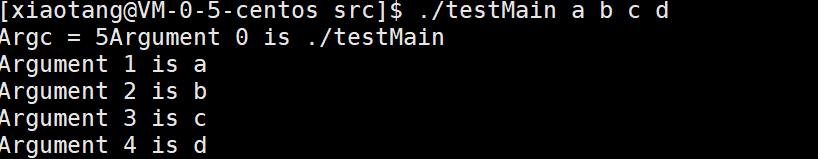

> 因为命令行中argument有五个，因此argc = 5

## socket的read和write

### write函数

一旦，我们建立好了tcp连接之后，我们就可以把得到的fd当作文件描述符来使用。
ssize_t **write**(int fd, const void*buf,size_t nbytes);
**write**函数将buf中的nbytes字节内容写入文件描述符fd.成功时返回写的字节数.失败时返回-1. 并设置errno变量. 在网络程序中,当我们向套接字文件描述符写时有两可能.
1)**write**的返回值大于0,表示写了部分或者是全部的数据. 这样我们用一个while循环来不停的写入，但是循环过程中的buf参数和nbyte参数得由我们来更新。也就是说，网络写函数是不负责将全部数据写完之后在返回的。
2)返回的值小于0,此时出现了错误.我们要根据错误类型来处理.
如果错误为EINTR表示在写的时候出现了中断错误.
如果为EPIPE表示网络连接出现了问题(对方已经关闭了连接).

> **从write函数返回的时间点：**
>
> write函数和windows的send函数`并不会在完成向对方主机的数据传输时返回，而是在数据移到输出缓冲时。`但TCP会保证对输出缓冲数据的传输，所以write函数在数据传输完成时返回。

### 读函数read

ssize_t read(int fd,void *buf,size_t nbyte)
read函数是负责从fd中读取内容.当读成功 时,read返回实际所读的字节数,如果返回的值是0 表示已经读到文件的结束了,小于0表示出现了错误.如果错误为EINTR说明读是由中断引起 的, 如果是ECONNREST表示网络连接出了问题.

### fread()和fwrite()

```c
FILE* fp;
char buf[BUF_SIZE];
fp = fopen("fileName.type", "rb");

read_cnt = fread((void *)buf, 1, BUF_SIZE, fp);
fwrite((void*)buf, 1, read_cnt, fp);

fclose(fp);
```

### readv和writev函数

**适用条件：**如果要传输的数据分别位于不同的缓冲（数组）时，需要调用多次`write`函数。此时可以通过一次writev函数来替代。

> 从C语言的角度来看，减少函数调用次数能够相应提高性能。其更大的意义在于能够减少数据包的个数。假设为了提高效率而在服务器端明确阻止了Nagle算法。那么writev函数在不采用Nagle算法时更有价值
>
> 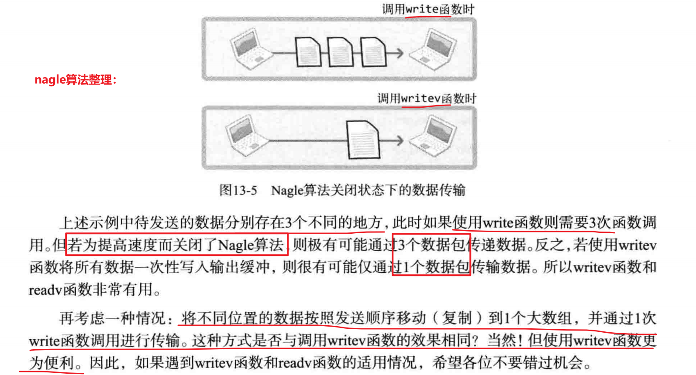


## TCP三次握手

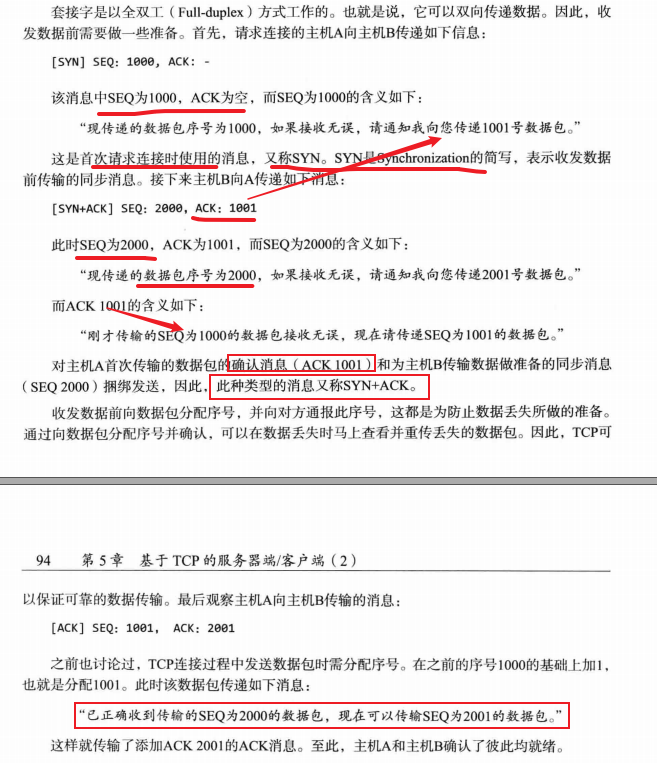

### ACK增量

> ACK号的增量为传输的数据字节数，假设每次ACK号不加传输的字节数，这样虽然可以确认数据包的传输，但是无法确定是否全部字节都正确传递，还是存在丢失情况
>
> 因此：ACK号 = SEQ号 + 传递的字节数 + 1；
>
> 最后加1是为了告知对方下次要传递的SEQ号

## TCP四次挥手：断开套接字的连接


## 函数指针

https://www.runoob.com/cprogramming/c-fun-pointer-callback.html

## sigaction的信号

 - SIGALRM：已到通过调用alarm函数注册的时间
 - SIGINT： 输入ctrl + c
 - SIGCHLD: 子进程终止
 - SIGURG：收到`MSG_OOB`紧急消息

## Nagle算法

**纳格算法**是以减少数据包发送量来增进[TCP/IP](https://zh.wikipedia.org/wiki/TCP/IP)网络的性能。

纳格的文件[[注 1\]](https://zh.wikipedia.org/wiki/納格算法#cite_note-1)描述了他所谓的“小数据包问题”－某个应用程序不断地提交小单位的资料，且某些常只占1[字节](https://zh.wikipedia.org/wiki/位元组)大小。因为[TCP](https://zh.wikipedia.org/wiki/傳輸控制協議)数据包具有40[字节](https://zh.wikipedia.org/wiki/位元组)的标头信息（TCP与IPv4各占20字节），这导致了41字节大小的数据包只有1字节的可用信息，造成庞大的浪费。这种状况常常发生于[Telnet](https://zh.wikipedia.org/wiki/Telnet)工作阶段－大部分的键盘操作会产生1字节的资料并马上提交。更糟的是，在慢速的网络连线下，这类的数据包会大量地在同一时点传输，造成[壅塞碰撞](https://zh.wikipedia.org/w/index.php?title=壅塞碰撞&action=edit&redlink=1)。

纳格算法的工作方式是合并（[coalescing](https://zh.wiktionary.org/wiki/en:Coalesce)）一定数量的输出资料后一次提交。特别的是，只要有已提交的数据包尚未确认，发送者会持续缓冲数据包，直到累积一定数量的资料才提交。

## [epoll的本质](https://zhuanlan.zhihu.com/p/63179839)


## 课后参考

https://blog.csdn.net/nail_candy/article/details/88957409

https://blog.csdn.net/nail_candy/article/details/88957438

